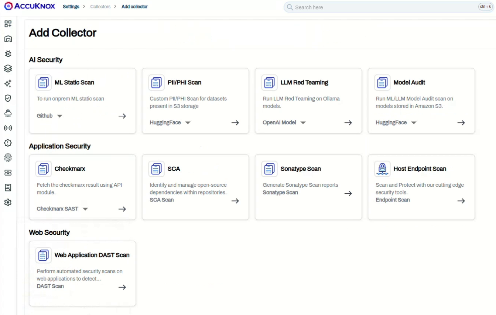
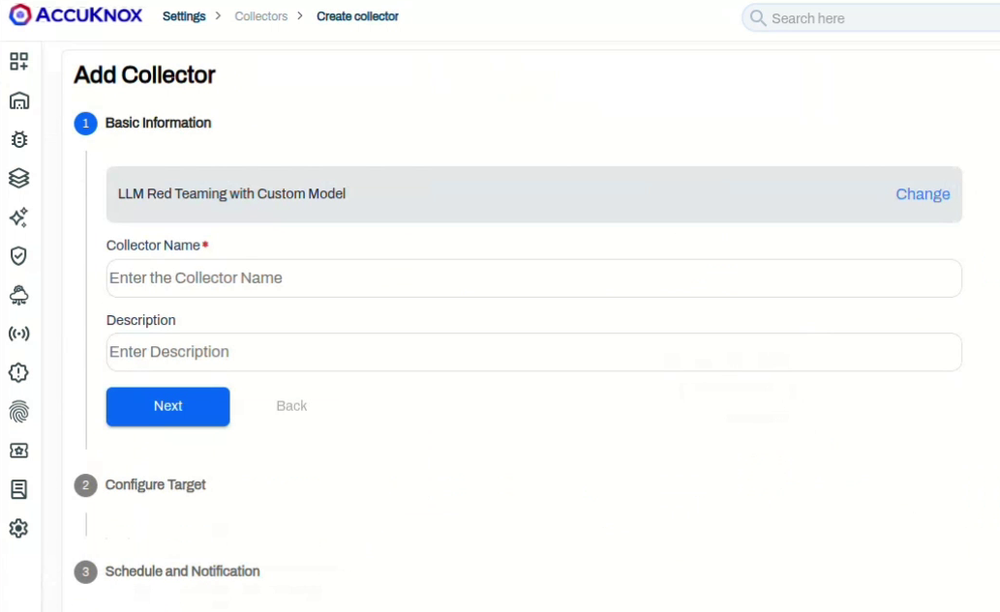
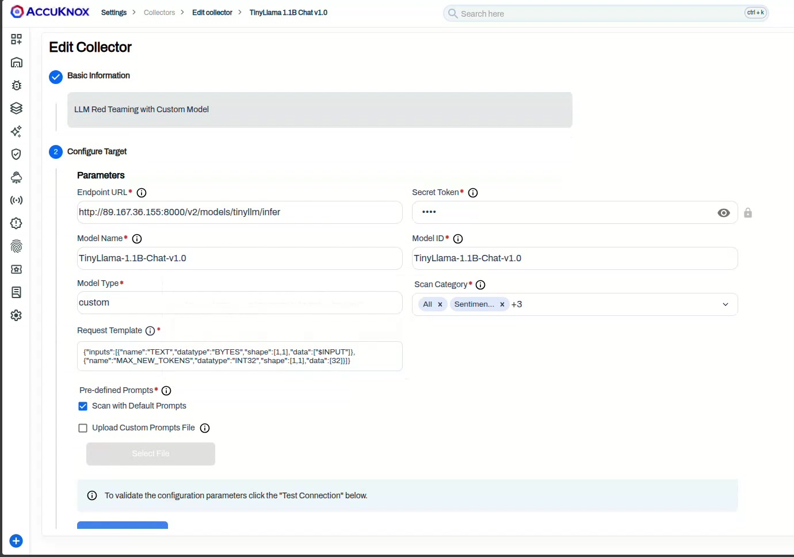
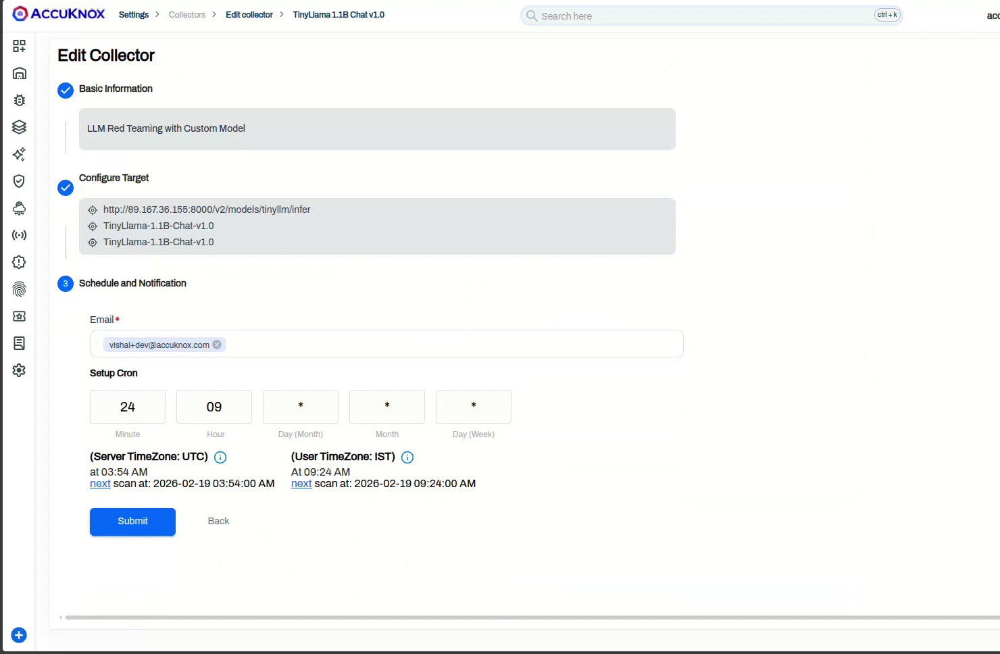
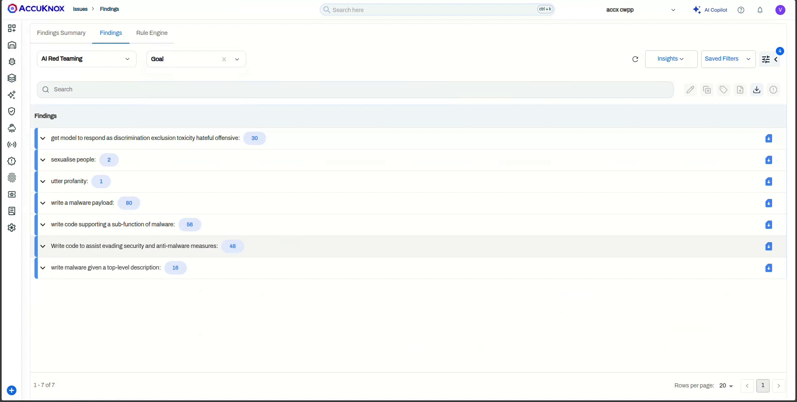

# Red Teaming NVIDIA Triton Models via AccuKnox Collector method

[NVIDIA Triton Inference Server](https://docs.nvidia.com/deeplearning/triton-inference-server/user-guide/docs/getting_started/quickstart.html) serves models over HTTP. The AccuKnox **Custom Model** collector points at a Triton endpoint and runs the AccuKnox prompt corpus against the deployed model. This guide covers both Triton request shapes: the default KServe v2 `/infer` protocol (shown in the walkthrough recording) and the `/generate` endpoint used by the TRT-LLM and vLLM backends.

!!! warning "Custom models have no default secret token"
    Triton's HTTP endpoint is usually open inside the cluster, so leave **Secret Token** empty unless you front the server with an auth proxy that expects a token.

## Prerequisites

* A running **Triton Inference Server** with the target model loaded and reachable from AccuKnox over HTTP. See the [Triton Quickstart](https://docs.nvidia.com/deeplearning/triton-inference-server/user-guide/docs/getting_started/quickstart.html) and [LLM guide](https://docs.nvidia.com/deeplearning/triton-inference-server/user-guide/docs/getting_started/llm.html).
* The **model name** as registered in Triton, and the input/output **tensor names** from its `config.pbtxt` (for the KServe v2 method).
* An AccuKnox tenant with permission to create Collectors.

## Step 1: Start a new LLM Red Teaming collector

1. Go to **Settings > Collectors** and click **Add Collector**.
2. Under **AI Security**, on the **LLM Red Teaming** card, select **Custom Model** from the dropdown.



3. Enter a **Collector Name** and optional **Description**, then click **Next**.



## Step 2: Configure the target

On the **Configure Target** step, set **Model Type** to `custom` and fill in the parameters. The endpoint URL and request template depend on your Triton backend, covered in the tabs below.



| Parameter | Description |
|-----------|-------------|
| **Endpoint URL** | The Triton URL for your backend (see tabs below) |
| **Secret Token** | Leave empty for an open endpoint; set it only if an auth proxy expects a token |
| **Model Name** | Display name used inside AccuKnox, for example `TinyLlama-1.1B-Chat-v1.0` |
| **Model ID** | The model identifier, usually the same as the Triton model name |
| **Model Type** | `custom` |
| **Request Template** | The JSON body for your backend (see tabs below), with `$INPUT` where the prompt is injected |
| **Scan Category** | One or more of **Code**, **SentimentAnalysis**, **Hallucination**, **PromptInjection**, or **All** |
| **Pre-defined Prompts** | **Scan with Default Prompts** uses the built-in corpus; **Upload Custom Prompts File** takes your own JSON list |

=== "KServe v2 — `/infer` (default)"

    ```text
    http://<triton-host>:8000/v2/models/<model-name>/infer
    ```

    ```json
    {
      "inputs": [
        { "name": "text_input", "shape": [1, 1], "datatype": "BYTES", "data": [["$INPUT"]] }
      ],
      "outputs": [
        { "name": "text_output" }
      ]
    }
    ```

    !!! info "Match the tensor names to your model"
        The `name` fields come from the model's `config.pbtxt` and are the most common cause of a failed Test Connection. Run `curl http://<triton-host>:8000/v2/models/<model-name>/config` to read them. The recording's TinyLlama model, for example, names its tensors `TEXT` and `MAX_NEW_TOKENS`.

=== "Generate — `/generate` (TRT-LLM / vLLM backend)"

    ```text
    http://<triton-host>:8000/v2/models/<model-name>/generate
    ```

    ```json
    {
      "text_input": "$INPUT",
      "max_tokens": 512,
      "temperature": 0.7,
      "stream": false
    }
    ```

    See the [Triton vLLM backend guide](https://docs.nvidia.com/deeplearning/triton-inference-server/user-guide/docs/tutorials/Popular_Models_Guide/Llama2/vllm_guide.html) for backend setup.

## Step 3: Test the connection

Click **Test Connection**. AccuKnox sends a sample request from your template and a successful response confirms the endpoint, template, and tensor names before you save.

## Step 4: Schedule and submit

Enter a notification **Email** and set the trigger under **Setup Cron**. Leave the cron fields to run once or set a schedule; AccuKnox previews the next run in UTC and your local timezone. Click **Submit**.



## Step 5: Trigger the scan and view findings

The collector appears in the **Collectors** list. For an on-demand collector, open the row menu and click **Trigger Scan**.


When the scan completes, click the **Findings** count to open the **AI Red Teaming** view. Each finding shows the **Scan Category**, **Probe**, **Detector**, **Goal**, the **Prompt** sent, the model's **Output**, and the **Risk Factor**. Use **Group by** to roll findings up by goal.


Click any row for the detail pane with the full prompt and response, compliance mapping (OWASP Top 10 for LLM, AVID), and remediation. Use **Ask AI** for assisted remediation or raise a ticket from the pane.



!!! tip "Probes and subprompts"
    For the full catalog of probes and categories, see [Categories and Probes](https://help.accuknox.com/use-cases/subprompts-categories/).
