# API Security Scan Onboarding

AccuKnox scans your APIs by two paths, and both start from an OpenAPI file you upload. This page runs
each one from the upload to the findings page.

---

## Choose a path

| Path | Where you start | What it needs | What it reports |
| --- | --- | --- | --- |
| Specification scan | **API Security** > **Scan** | An OpenAPI file in JSON or YAML | Shadow API, Orphan API and Zombie API classification against the specification |
| API Scan collector | **Settings** > **Collectors** | A reachable target URL, plus a specification, a collection or a specification URL | Active security test results against the running API |

Run both if you have a live target. One path finds undocumented endpoints, the other finds vulnerable ones.

## Prerequisites

- An OpenAPI or Swagger file in `.json`, `.yaml` or `.yml` format, up to 3 MB.
- A label. Create one with [Create Labels](how-to-create-labels.md).
- For the collector path, a target URL that the AccuKnox scanner can reach.

!!! tip "Live traffic is optional"
    Neither path needs a traffic connector. A connector adds continuous endpoint discovery on top of
    the scans. See [Watch live API traffic](#watch-live-api-traffic).

---

## Path 1: Scan an uploaded specification

### Step 1: Upload the specification

**1.** Go to **API Security** > **API Specification**.

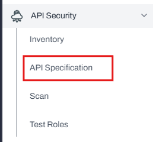

**2.** Click **Upload** at the top right of the page.

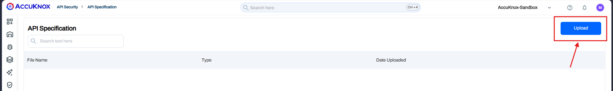

**3.** Click **Click to upload**, or drag the file into the dashed area. Then click **DONE**.

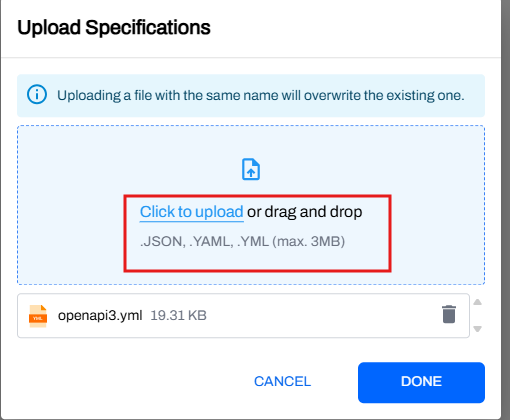

!!! warning "A same-name upload overwrites"
    A file uploaded with the name of an existing file replaces that file. Rename the new file first if
    you want to keep both versions.

### Step 2: Create the scan

**1.** Go to **API Security** > **Scan**.

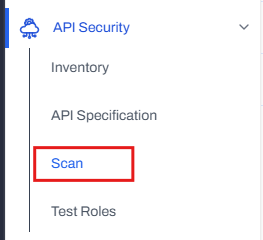

**2.** Click **NEW SCAN** at the top right.

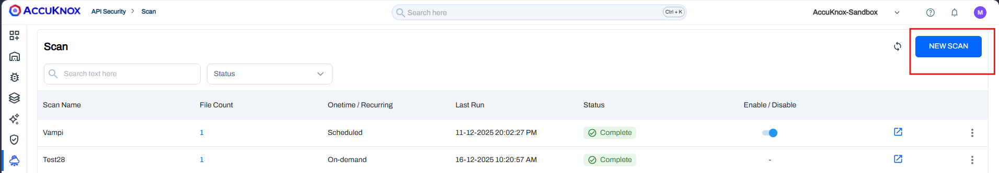

**3.** Fill in the form:

| Field | Required | What to enter |
| --- | --- | --- |
| **Scan Name** | Yes | A name you can find later in the scan list |
| **Description** | No | Free text about the scan target |
| **Label** | Yes | The label that groups the findings |
| **Files** | Yes | Select the specification you uploaded, or upload one here |
| **Select Endpoints** | Yes | **All Endpoints**, or **Specific Collections** to scan one collection |

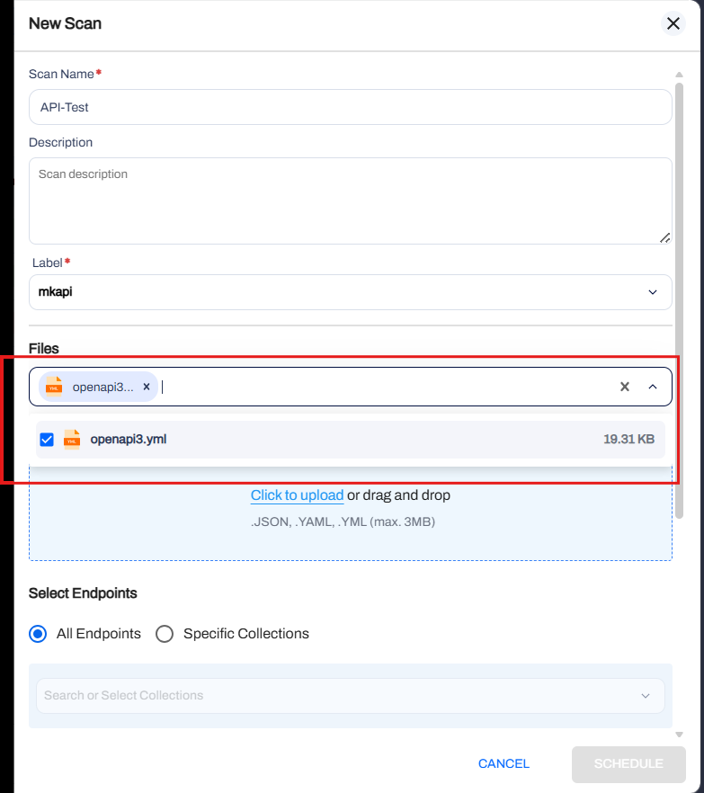

**4.** Scroll down, set the scan type to **On-demand** or **Scheduled**, then submit the form.

### Step 3: Open the findings

**1.** Watch the **Status** column on the **Scan** page. Wait for **Complete**.

**2.** Click the arrow icon at the right of the scan row.

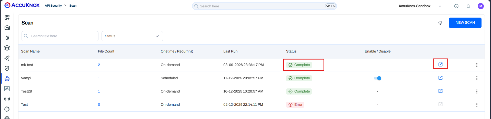

The arrow opens **Issues** > **Findings**, filtered to **API Security Findings**. Each row names the
vulnerability, the asset such as `PUT /users/v1/test1/email`, the risk factor, and the scan that found it.

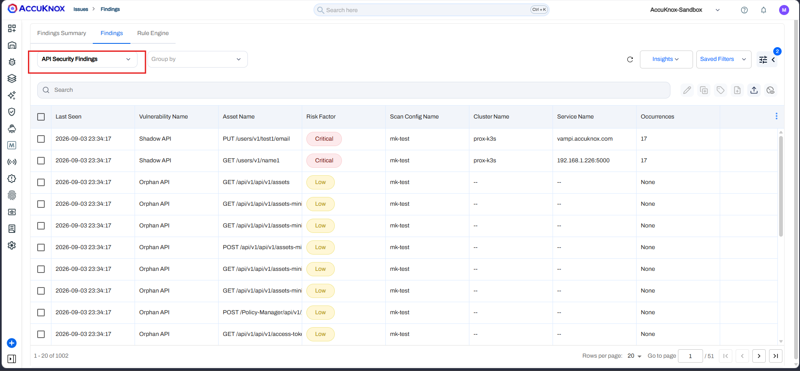

---

## Path 2: Scan with the API Scan collector

This collector runs active security tests against a running API. To scan against a file, upload it
first with [Step 1](#step-1-upload-the-specification).

### Step 1: Add the collector

**1.** Go to **Settings** > **Collectors**.

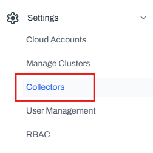

**2.** Click **Add Collector**.

**3.** Scroll to **Web Security**. In the **Web Application DAST Scan** card, set the dropdown to
**API Scan**, then click the arrow.

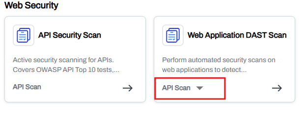

### Step 2: Configure the target

**1.** Enter the **Target URL** of the API you want to test.

**2.** Choose the **API Spec Source**:

| Source | Use it when |
| --- | --- |
| **OpenApi Spec File** | You uploaded the specification under **API Security** > **API Specification** |
| **Collection** | You want to scan an existing API collection instead of a file |
| **OpenApi Spec File URL** | The specification is served at a URL the scanner can reach |

**3.** For **OpenApi Spec File**, pick the file from the dropdown.

**4.** Under **Identifiers**, select a **Label**. Add **Tags** if you want to filter on them later.

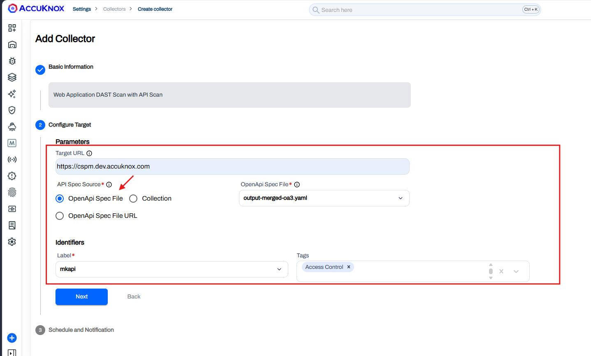

**5.** Click **Next**, set the schedule and the notification email, then save the collector.

### Step 3: Open the findings

**1.** Go back to **Settings** > **Collectors**.

**2.** Wait for the **Findings** column of your collector row to show a count.

**3.** Click that count.

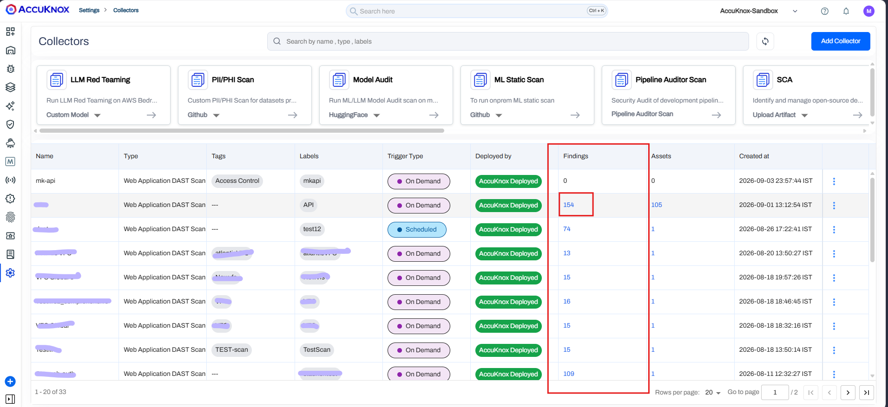

The count opens **Issues** > **Findings**, filtered to **API Security Findings**.

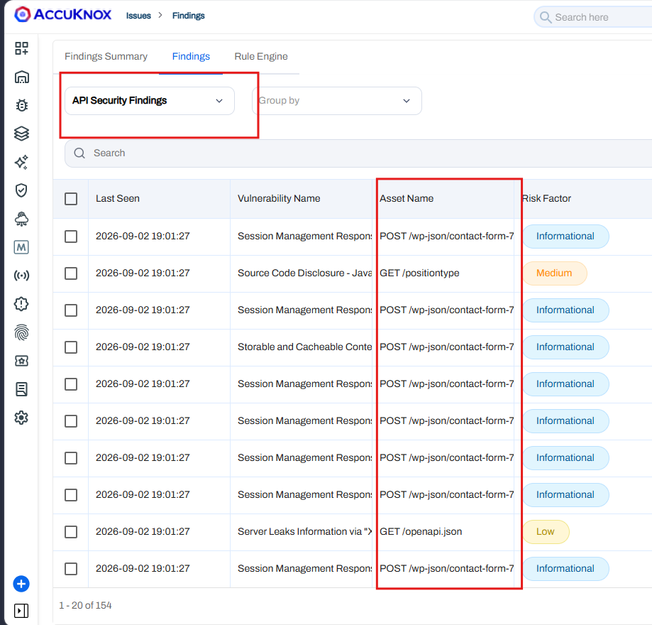

!!! info "The two paths report different things"
    A specification scan reports endpoints that do not match the specification. A collector scan
    reports weaknesses in a live response, such as a source code disclosure or a missing cache header.

---

## Watch live API traffic

A traffic connector adds continuous discovery to either scan path. Once logs reach the control plane,
endpoints appear on their own.

**1.** Connect a source. See [API Security Integrations](../integrations/api-overview.md) for
AWS API Gateway, the Kubernetes API proxy, Istio, NGINX Ingress, Kong and F5.

**2.** Go to **API Security** > **Inventory**.

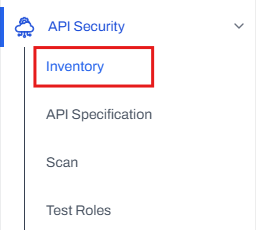

**3.** Click any endpoint to open its telemetry.

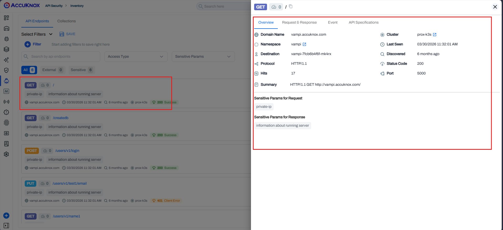

---

## Related

- [API Security Use Case](../use-cases/api-security.md), collections, finding types and rate limiting
- [API Security Integrations](../integrations/api-overview.md), the traffic connectors
- [DAST Scan Types](dast-scan-types.md), the scan depth options for web application targets
- [Create Labels](how-to-create-labels.md), the label a scan and a collector both need
