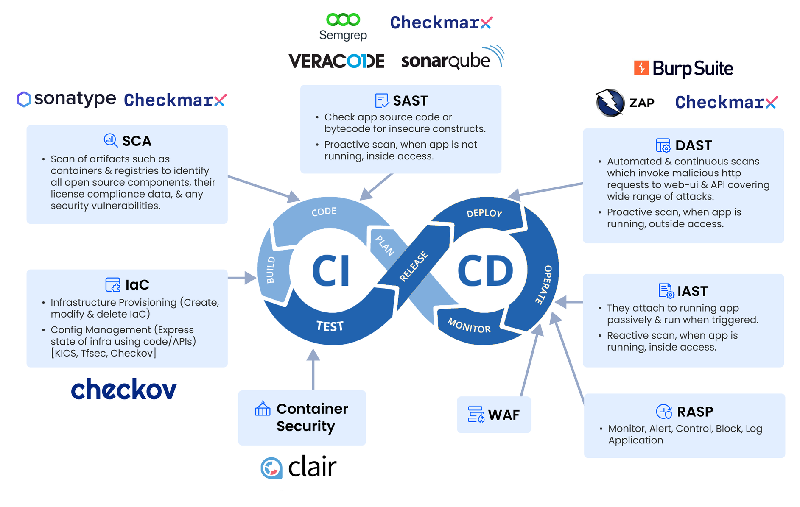

# ASPM Overview

## What is ASPM?

**Application Security Posture Management (ASPM)** is a framework designed to help organizations identify and address security vulnerabilities in their applications throughout the software development lifecycle (SDLC). By providing real-time visibility into vulnerabilities and misconfigurations, ASPM ensures a secure and reliable software development process.

ASPM seamlessly integrates with **CI/CD pipelines**, enabling the detection of vulnerabilities during the development and staging phases. This proactive approach prevents vulnerabilities from progressing to production, significantly reducing security risks and enhancing application reliability.

## How ASPM Works?

ASPM leverages a range of security tools, such as:

- **SAST** (Static Application Security Testing)

- **DAST** (Dynamic Application Security Testing)

- **SCA** (Software Composition Analysis)

- **IaC** (Infrastructure as Code) scanning

- **Secret scanning tools**

These tools are integrated at various stages of the **DevOps lifecycle**, ensuring comprehensive security coverage. The diagram above illustrates how ASPM aligns with the different phases of CI/CD to deliver continuous application security.

For more details on incorporating security into the DevOps lifecycle, visit the [**DevSecOps page**](https://help.accuknox.com/getting-started/devsecops/ "https://help.accuknox.com/getting-started/devsecops/").

## Integrating AccuKnox ASPM

AccuKnox ASPM supports integration with popular CI/CD platforms, such as:

- **Azure DevOps**

- **GitHub Actions**

- **GitLab CI/CD**

- And many others.

AccuKnox offers plugins for various CI/CD platforms, which can be found in the [**CI/CD support matrix**](https://help.accuknox.com/support-matrix/cicd-support-matrix/ "https://help.accuknox.com/support-matrix/cicd-support-matrix/") **page**. To integrate AccuKnox ASPM with your specific CI/CD platform, refer to the [**CI/CD Integrations page**](https://help.accuknox.com/integrations/cicd-overview/ "https://help.accuknox.com/integrations/cicd-overview/") for step-by-step guidance.

By integrating AccuKnox ASPM, organizations can ensure their CI/CD pipelines are fortified with cutting-edge application security tools, reducing vulnerabilities and improving overall software quality.
