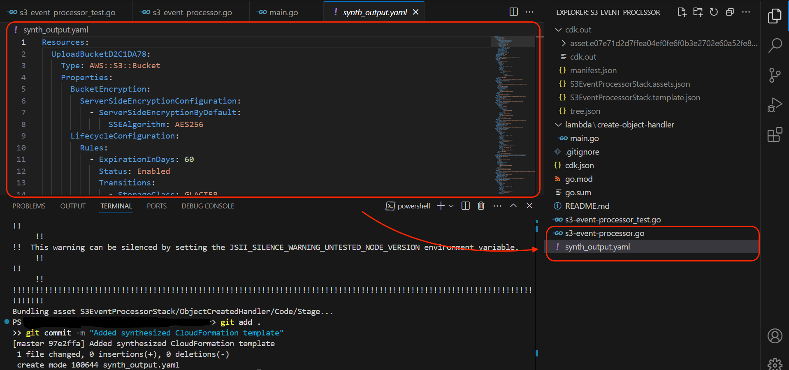
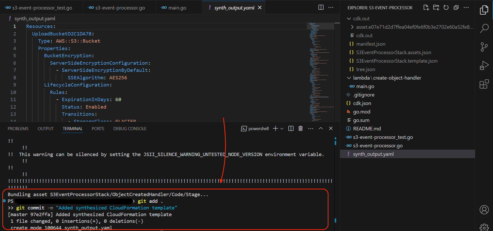

# AWS CDK Scan with AccuKnox

## Overview
This document provides a step-by-step guide on scanning AWS CDK projects using the AccuKnox platform. The process involves generating the template using AWS CDK, pushing the code to GitHub, configuring AccuKnox for scanning, and reviewing security findings.

## Prerequisites
- AWS CDK installed  
- A GitHub repository  
- An active AccuKnox account  

## Installing AWS CDK (Skip if already installed)
To install AWS CDK, run the following command:

```sh
npm install -g aws-cdk
```
Verify the installation:

```sh
cdk --version
```
This command should return the installed version of AWS CDK.
    

## Steps

### 1. Navigate to Your CDK Folder Path
Ensure you are in the directory where your AWS CDK project is located.

### 2. Generate the CloudFormation Template

#### What is `cdk synth`?
The `cdk synth` command synthesizes the AWS CloudFormation template from your AWS CDK application, generating a YAML file that represents the defined infrastructure.

Run the following command:

```sh
cdk synth > synth_output.yaml
```
    
### 3. Confirm the YAML File is Generated
Verify that synth_output.yaml is created in the project directory.
    
### 4. Push Code to GitHub
Follow these steps to push your code:

```sh
git add .
git commit -m "Added synthesized CloudFormation template"
git push origin main
```
    
Ensure your repository is linked to GitHub before executing these commands.

### 5. Log in to AccuKnox
Navigate to [AccuKnox](https://app.accuknox.com/) and log in with your credentials.

### 6. Configure Code Scan
1. Go to **Settings** → **Integrations**  
2. Under **Code Scan Configuration**, click **Add Configuration**  
    
3. Fill in the required details  
    

### 7. Configure IaC Scan
1. Go to **IaC Configuration**  
2. Click **Add Configuration**  
    
3. Enter **Integration Name**  
4. Set **Framework** as **CloudFormation**  
5. Select the **Repository** from the dropdown  
6. In **Conditions**, set **Include pattern**:

    ```sh
    .*/synth_output\.yaml$
    ```
    This ensures that only `synth_output.yaml` is scanned.
    
7. Click **Save**.

### 8. View Findings
1. Navigate to **Findings** under the **Issues** tab  
2. Select **Finding Type** as **IaC Findings**  
3. View all security findings in your source code  
    
## Conclusion
Following these steps, you can successfully scan AWS CDK-generated CloudFormation templates using the AccuKnox platform. This process ensures that your infrastructure-as-code adheres to security best practices before deployment.

For further assistance, reach out to [support@accuknox.com](mailto:support@accuknox.com).
