# AWS Account Onboarding

In this section we can find the steps to onboard an AWS cloud account to the AccuKnox SaaS platform.

## **AWS IAM User Creation**

Follow these steps to provide a user with appropriate read access:

**Step 1:** Navigate to IAM → IAM Users and click on Create user

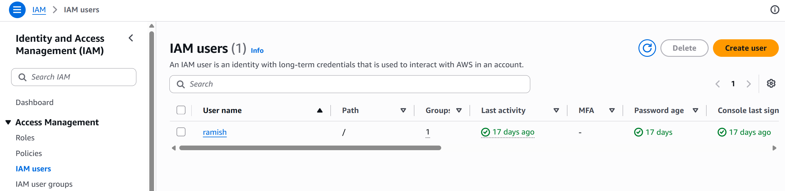

**Step 2:** Give a username to identify the user

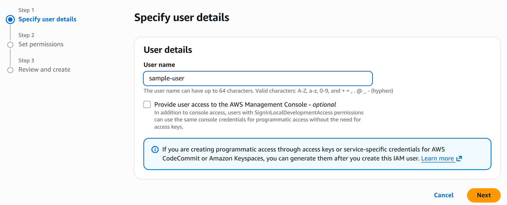

**Step 3:** In the "Set Permissions" screen:

a. Select "Attach policies directly"

b. Search "ReadOnly", Filter by Type: "AWS managed - job function" and select the policy

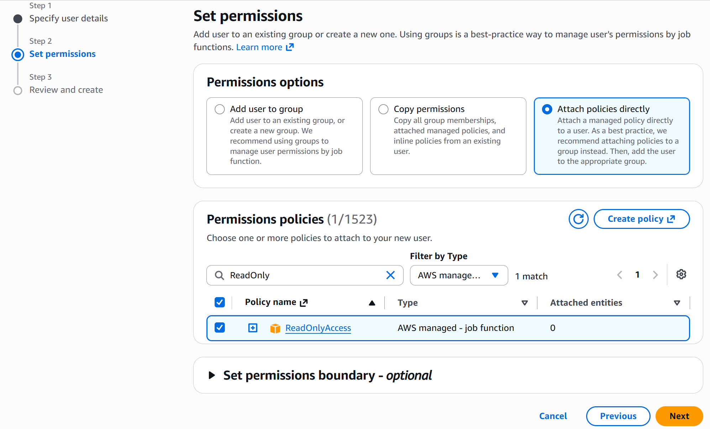

c. Search "SecurityAudit", Filter by Type: "AWS managed - job function" and select the policy

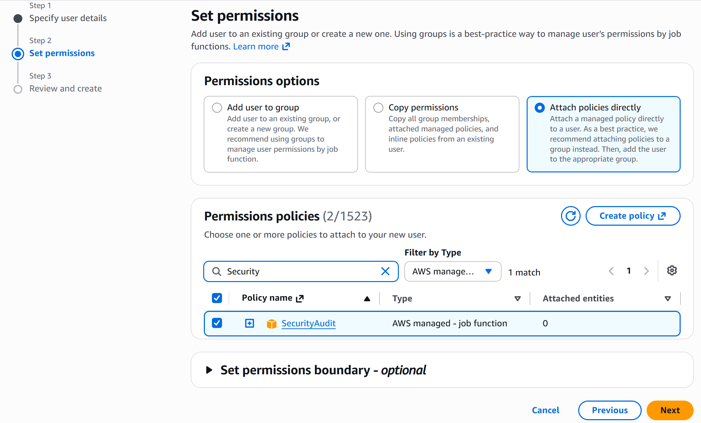

**Step 4:** Finish creating the user. Click on the newly created user and create the Access key and Secret Key from the Security Credentials tab to be used in the AccuKnox panel

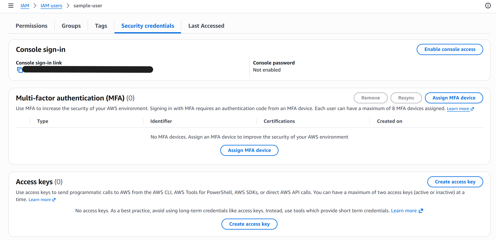

## **AWS Onboarding**

In this example we are onboarding AWS account using the Access Keys method.

**Step 1:** To onboard Cloud Account Navigate to *Settings → Cloud Accounts*

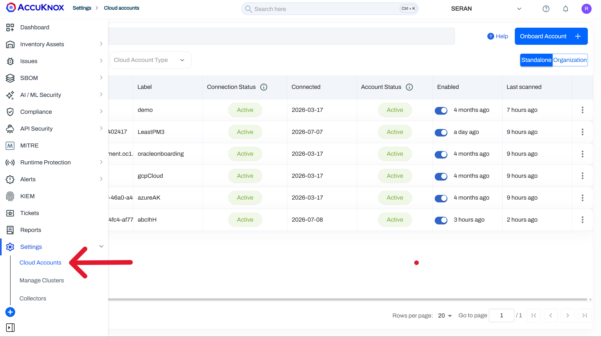

**Step 2:** In the Cloud Account Page select *Onboard Account* option

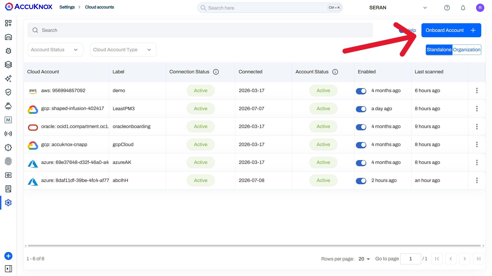

**Step 3:** Select the AWS option

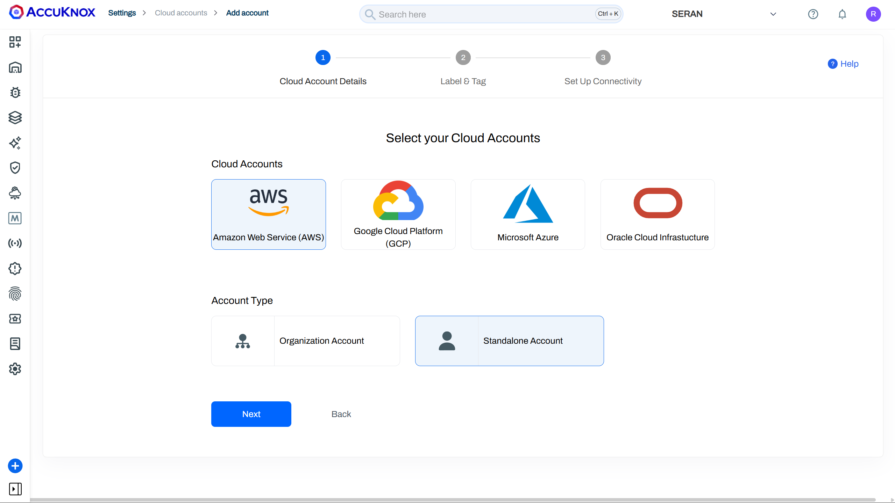

**Step 4:** In the next Screen select the labels and Tags field from the dropdown Menu.

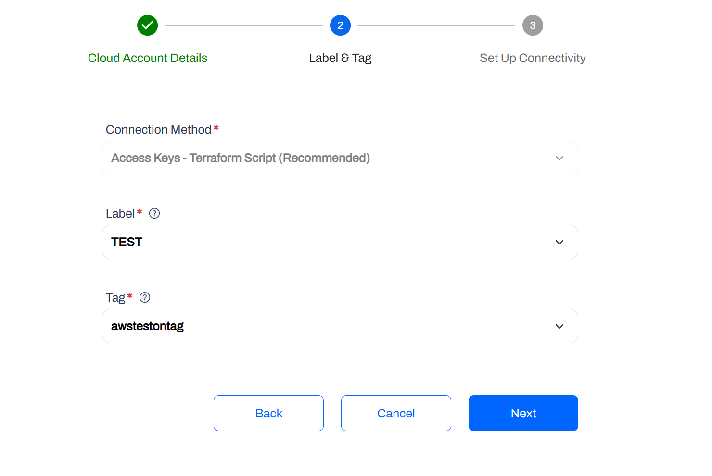

**Step 5:** After assigning a label and tag, on the next screen provide the AWS account’s Access Key and Secret Access Key ID and select the region of the AWS account.

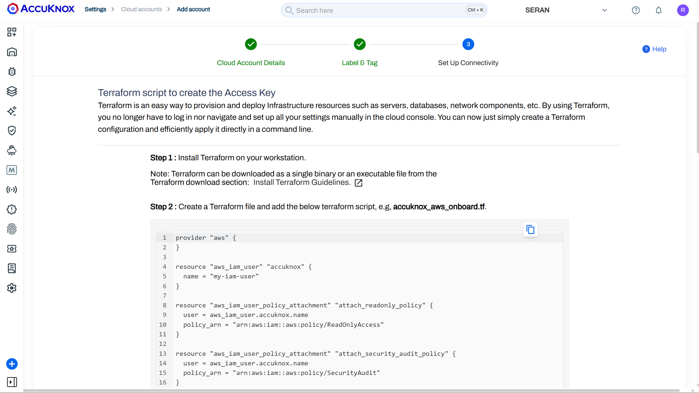
**Follow the given instruction to the bottom...**
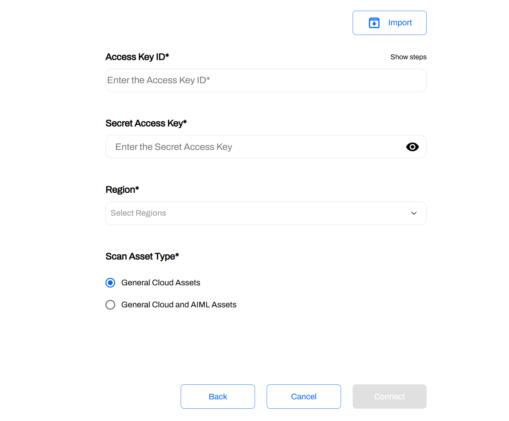

**Step 6:** The AWS account should have been added to AccuKnox using the Access Key method. You can view the onboarded cloud account by navigating to Settings → Cloud Accounts.

- - -
[SCHEDULE DEMO](https://www.accuknox.com/contact-us){ .md-button .md-button--primary }
