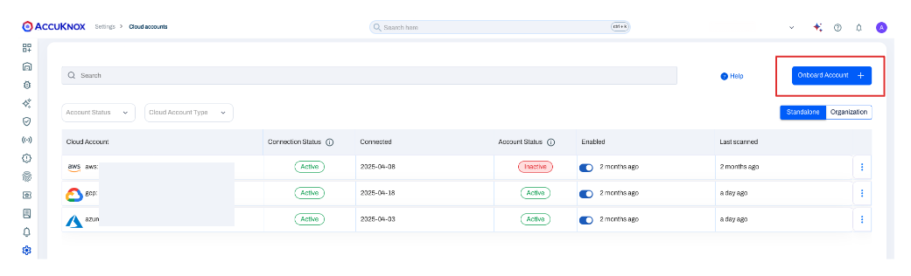
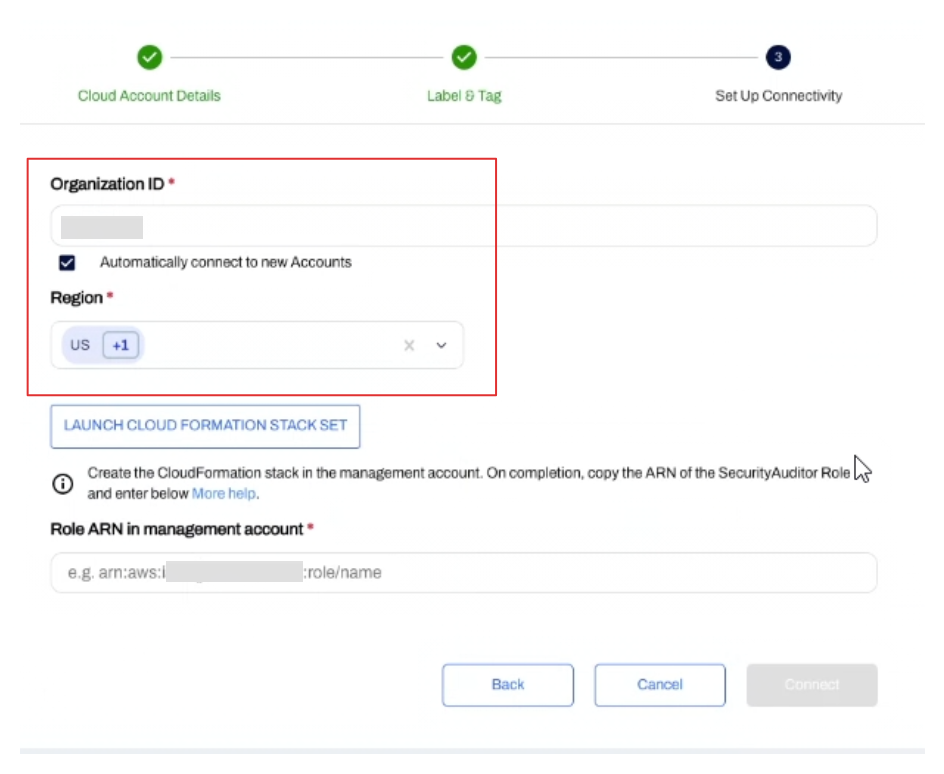

# Onboarding AWS Organization Accounts to AccuKnox

Managing security across multiple AWS accounts is complex. **AWS Organizations** simplifies this by grouping accounts under one structure. **AccuKnox** enhances this by enabling organization-level onboarding—removing the need to add accounts individually. This ensures centralized visibility, consistent policy enforcement, and automatic coverage for new accounts.

This guide explains how to onboard your **AWS Organization root account** to AccuKnox.

## Prerequisites

- You must have administrative access to your AWS Management Account and have permissions to deploy CloudFormation StackSet across the Organization.
- You need the AWS Organization ID of your root organization.
- **Trusted Access must be activated for AWS CloudFormation StackSets ([ref link](https://docs.aws.amazon.com/AWSCloudFormation/latest/UserGuide/stacksets-orgs-activate-trusted-access.html))**:
    - Sign in as an administrator to the AWS Management Account.
    - Open the CloudFormation console: [https://console.aws.amazon.com/cloudformation](https://console.aws.amazon.com/cloudformation)
    - From the navigation pane, choose **StackSets**.
    - If trusted access is not enabled, a banner will appear — click **Activate trusted access**.
      
    - Once enabled, you will see a confirmation banner: _“Trusted access is successfully activated.”_
      

## Step-by-Step Onboarding Process

Follow these steps to connect your AWS Organization to AccuKnox:

### 1. Initiate Account Onboarding

In the AccuKnox platform, navigate to **Cloud Security** → **Cloud Accounts** from the left-hand navigation menu.
Select the **Organization** button, and then select **Onboard Account**.

### 2. Configure Organization Account Type and Labels

Select **Organization Account** as the account type.

Next, select existing labels or create new ones to associate with all assets that will be discovered within this AWS Organization.

### 3. Enter AWS Organization Details

- Log in to the **AWS Console** → go to **AWS Organizations**.
- Copy your **Organization ID** (e.g., `r-xxxxxxxxxx`).
  

- You must use the **root organization account**.
- In AccuKnox, paste the ID into the **AWS Organization ID** field.
- Select the AWS regions where your assets are located.
  

!!! note
At present, all assets discovered under this organization will inherit these selected labels.
Granular labeling for individual assets will be an enhancement in future updates.

### 4. Enable Auto-Connect & Launch StackSet

- Toggle **Automatically connect to new accounts** (optional).
- Click **Launch CloudFormation StackSet** to open the AWS Console.

### 5. Create the Stack in AWS

- Scroll down, check the box:
  **"I acknowledge that AWS CloudFormation might create IAM resources..."**
- Click **Create stack**.

### 6. Wait for StackSet Deployment

- Wait until the status shows **CREATE_COMPLETE**.

### 7. Copy Role ARN

- Go to the **Outputs** tab of the StackSet.
- Copy the value of `RoleArnInManagementAccount`.

### 8. Connect in AccuKnox

- Paste the ARN in the **Role ARN** field.
- Click **Connect**.

### 9. Confirm Onboarding

- You’ll be redirected to the **Cloud Accounts** page.
- Refresh the page to see your AWS Organization listed.

## Post-Onboarding

Once your AWS Organization is successfully onboarded:

- **Asset Discovery:**
  AccuKnox will start an inventory discovery process across all member accounts in the selected regions.

- **Security Scans:**
  Automated security scans will be scheduled to assess your cloud resources for misconfigurations, vulnerabilities, and compliance violations.

- **Dashboard Population:**
  Data will begin to populate your AccuKnox dashboards, providing insights into your organization's security posture.
  This may take some time depending on the size and complexity of your AWS environment.

You have now successfully onboarded your **AWS Organization** to **AccuKnox**, enabling comprehensive, centralized cloud security management.
