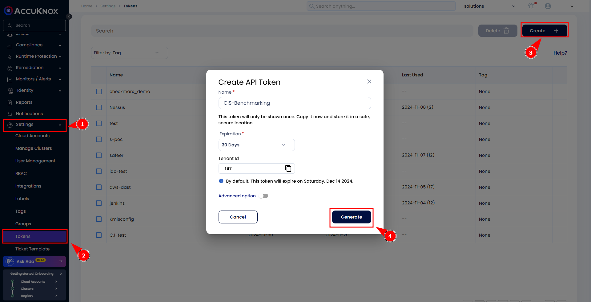
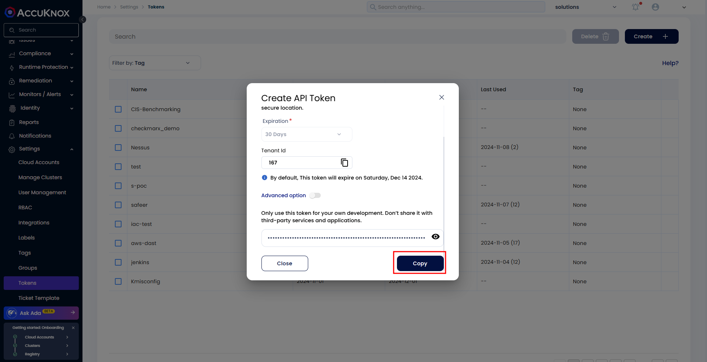
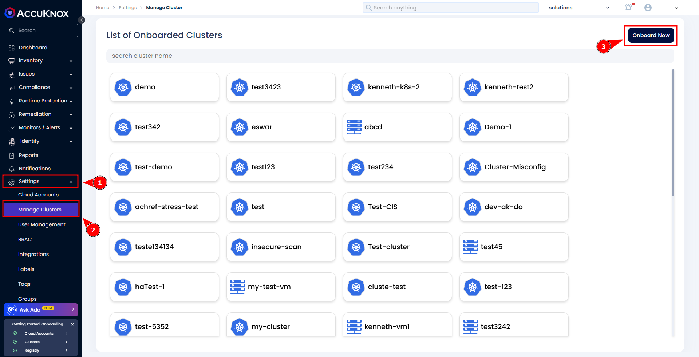
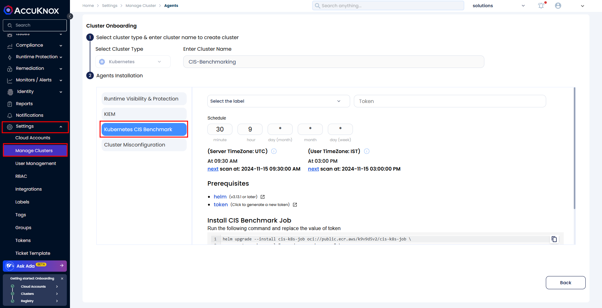
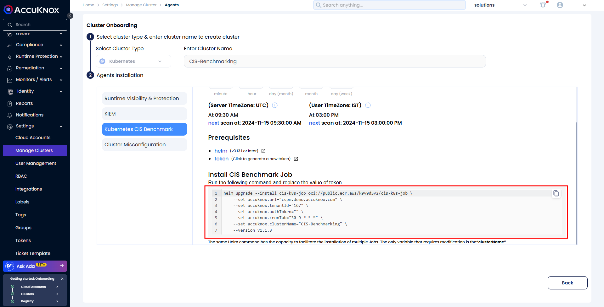
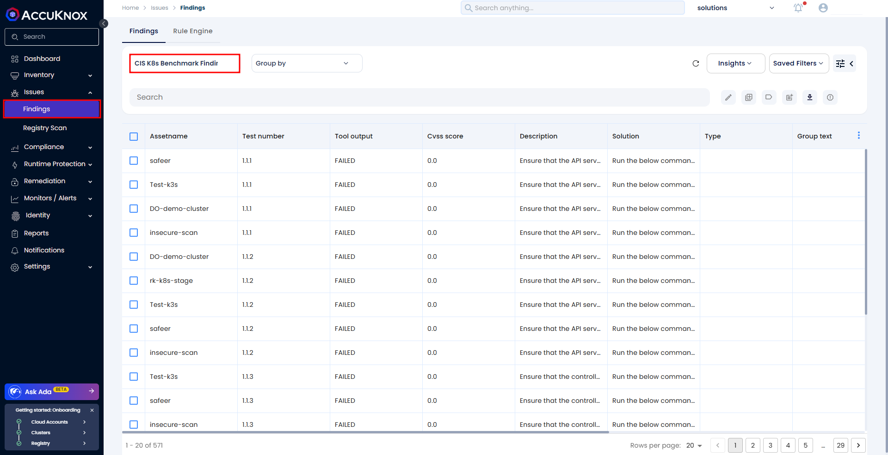
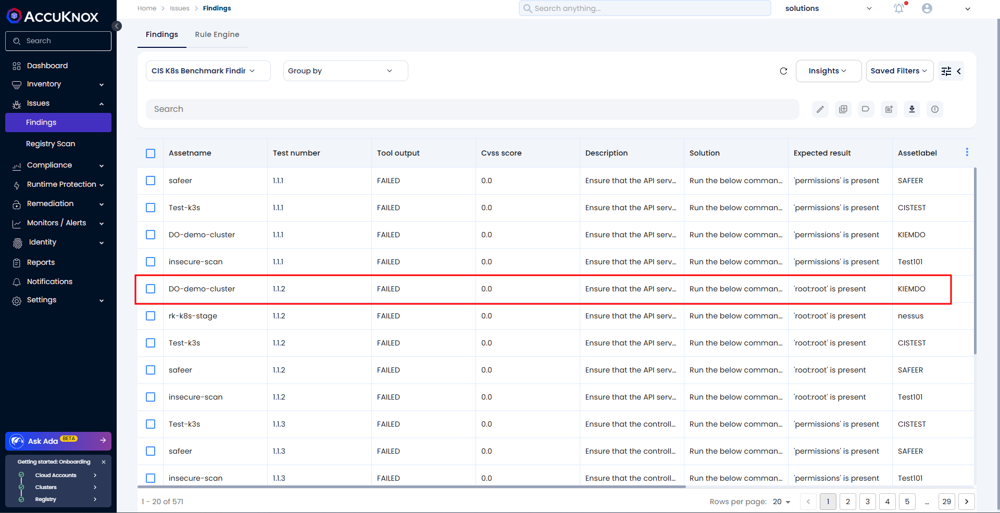
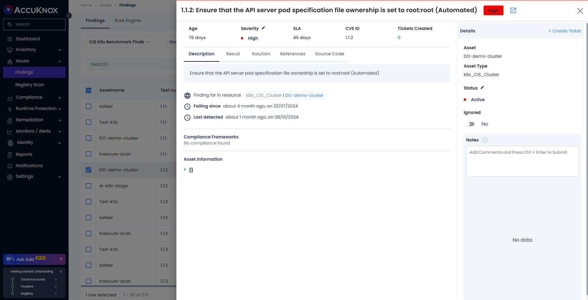

# CIS Benchmarking Compliance Scan Onboarding

This guide details the steps to onboard a Kubernetes cluster to Accuknox SaaS for CIS Benchmarking compliance scanning, enabling you to monitor and improve cluster security in line with CIS standards.

## Step 1: Generate an Access Token

To begin, create a token that will authenticate your cluster for scanning. Follow these steps:

1. Navigate to **Settings** > **Tokens** in the Accuknox platform and Click on the **Create** button, give your token a descriptive name (e.g., "CIS-Compliance-Token"), and click **Generate**.

1. Once the token is generated, copy it and securely save it for later use.

## Step 2: Onboard Your Cluster

1. Go to **Settings** > **Manage Clusters** and Click **Onboard Now** or select an existing cluster if you're updating a previously onboarded cluster.

1. Enter a name for your cluster to identify it in Accuknox. From the scan type, choose **CIS Benchmarking.**

2. Select a label for easy identification and paste the token you generated in Step 1. Set a scan schedule based on your requirements. Accuknox will automatically run scans according to the selected schedule.

## Step 3: Deploy the Scanner Using Helm

1. Scroll down to the **Helm Command** section and copy the provided command.

1. Run this command in your terminal on a machine that has access to your Kubernetes cluster. The command will schedule the scan for CIS Benchmarking compliance.

2. Once the Helm installation is complete, return to the Accuknox platform and click **Finish**.

## Step 4: View Compliance Findings

After the initial scan is completed, you can view the compliance results:

1. Go to **Issues** > **Findings** in Accuknox.

2. Use the **Findings** dropdown to filter and select CIS k8s Benchmarking finding results.

1. Each result will provide details on specific CIS controls and any non-compliant configurations detected.

This completes the onboarding process for CIS Benchmarking compliance scanning. You can review findings regularly to maintain and improve your cluster's CIS compliance.
