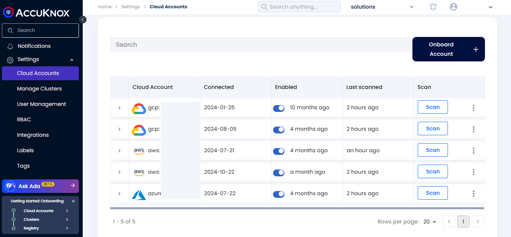
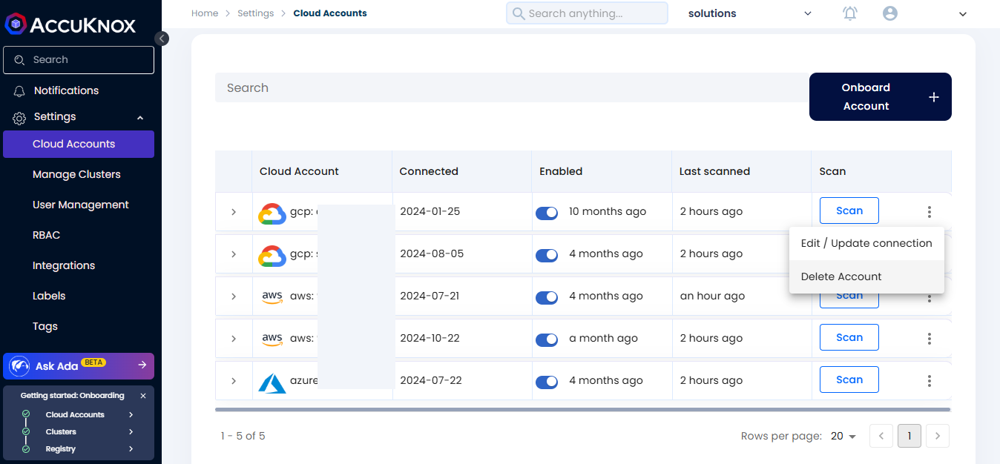

# How to Deboard a Cloud Account

This guide outlines the steps for offboarding a cloud account from AccuKnox SaaS.

**Step 1:** Login to AccuKnox SaaS and Go to Cloud Accounts under Settings.

**Step 2:** Select the cloud account and click “Delete” to delete the account from SaaS.

This will delete the cloud account from AccuKnox SaaS.