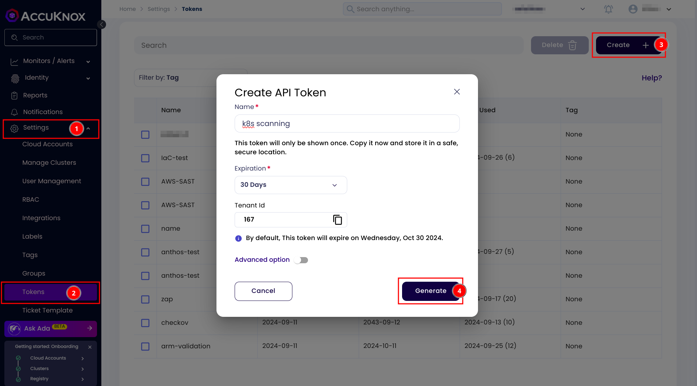
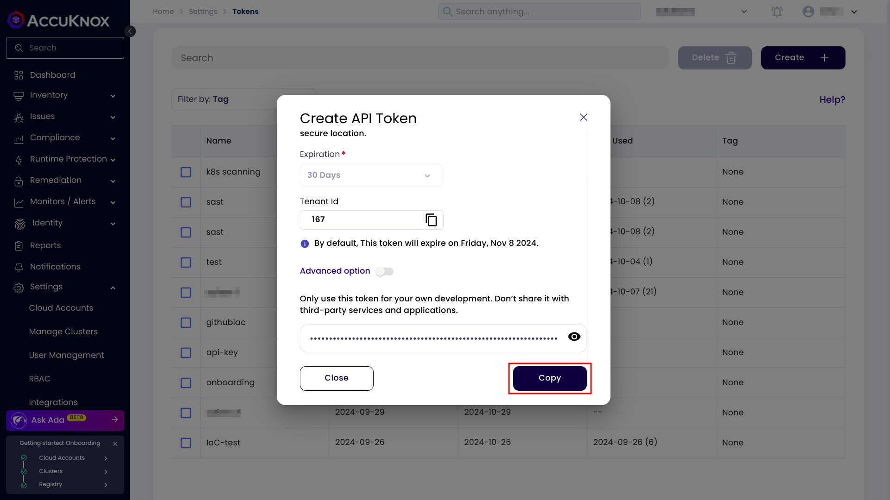
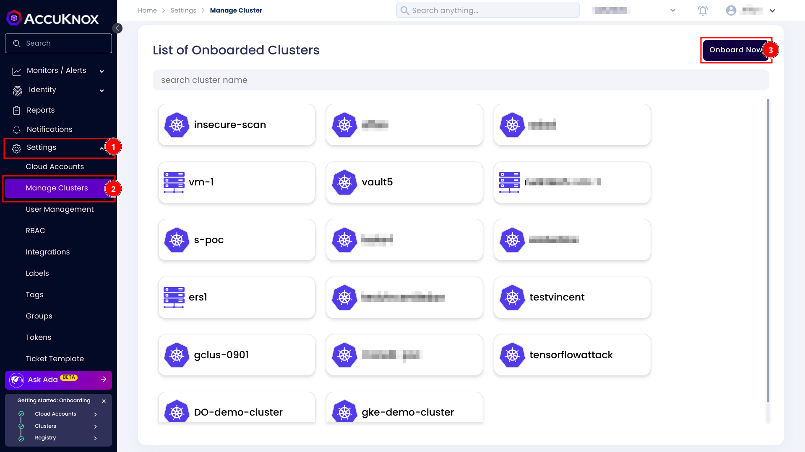
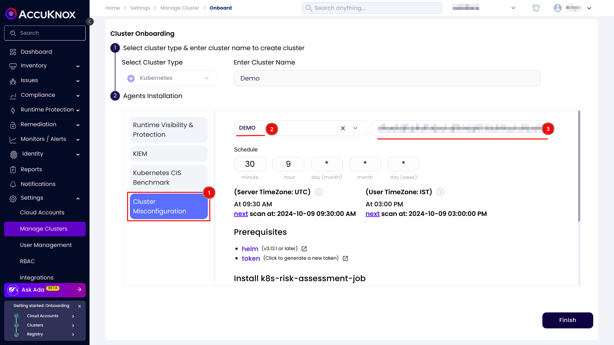
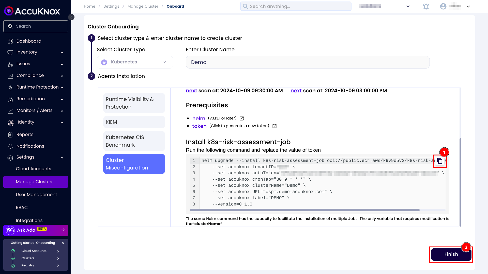
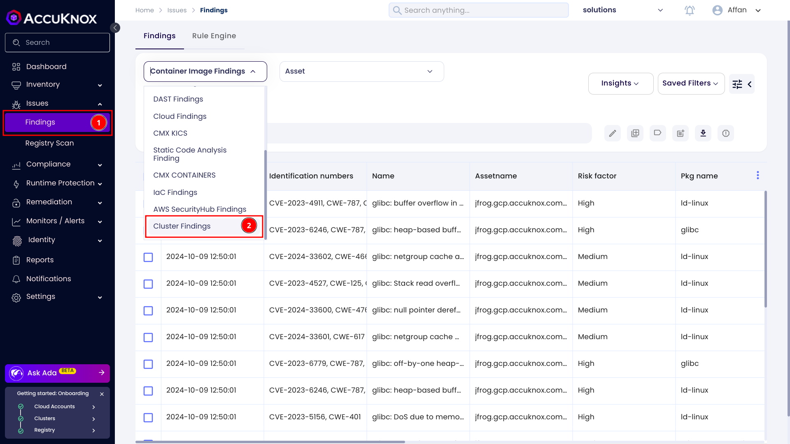
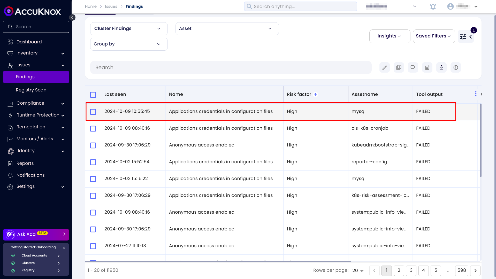
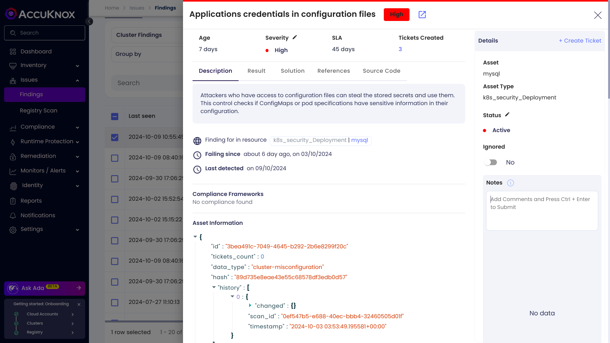

# Onboard Cluster for Misconfiguration Scanning

This guide outlines the steps for onboarding a cluster to AccuKnox SaaS for scanning cluster misconfigurations.

For onboarding a cluster and for scanning for misconfigurations you need to create a token first. For creating follow these steps

1. Go to `Settings > Tokens`.
2. Click on the create button.
3. Give your token a name.
4. Click on generate button.

Once the token is generated, copy it and take a note of it.

Now go to `Settings > Manage Clusters`, click on onboard now button or select an existing cluster.

Give your cluster a name. Under the Agents Installation section select Cluster Misconfiguration. Select a label and paste your token.

You can also change the schedule as per your requirement. Then next scan will happen based on the schedule. Scroll down and copy the helm command and run it inside a terminal. Then click on Finish button.

Once the scan is completed you can see the results on the findings page.

1. Go to the `Issues > Findings` page.

2. Select the Cluster Finding from the drop down.

Click on any of the findings to see more details.

