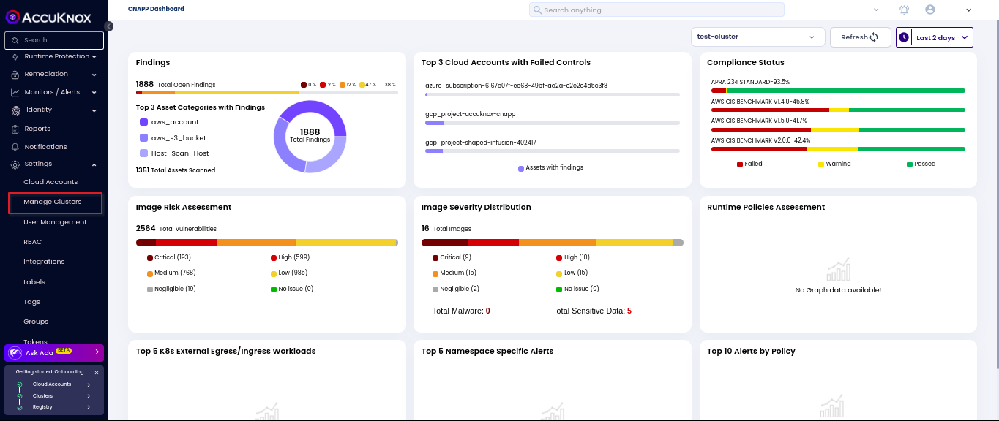
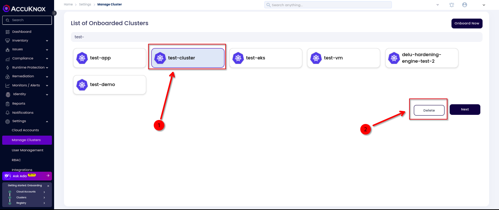

# Cluster Offboarding

This guide outlines the steps for offboarding a cluster from AccuKnox SaaS. The process involves uninstalling the agents from the cluster and deleting the cluster from AccuKnox SaaS.

Below, you will find detailed instructions for agent uninstallation from your cluster CLI and deleting the cluster from AccuKnox SaaS. These steps apply to all clusters.

## Agents Uninstallation

Uninstall AccuKnox agents using the following commands:

```bash
helm uninstall agents -n agents && kubectl delete ns agents;

helm uninstall cis-k8s-job;

helm uninstall kiem-job;

helm uninstall k8s-risk-assessment-job
```

### Sample for Uninstalling Runtime Visibility & Protection agents

```bash
 (Accuknox㉿kali)-[~]

└─$ helm uninstall agents -n agents && kubectl delete ns agents

WARNING: Kubernetes configuration file is group-readable. This is insecure. Location: /etc/rancher/k3s/k3s.yaml

WARNING: Kubernetes configuration file is world-readable. This is insecure. Location: /etc/rancher/k3s/k3s.yaml

release "agents" uninstalled

namespace "agents" deleted
```

## Cluster Deletion

**Step 1**: Login to AccuKnox SaaS and Go to Manage Cluster under Settings



**Step 2**: Select the cluster and click Delete to delete the cluster from SaaS.



This will delete the cluster from AccuKnox SaaS.

  - - -
[SCHEDULE DEMO](https://www.accuknox.com/contact-us){ .md-button .md-button--primary }
