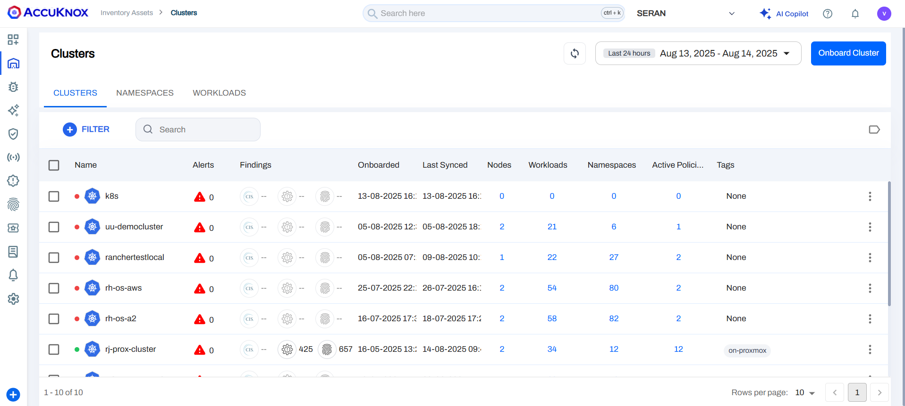

# Cluster Onboarding with Access Keys

Streamlining cluster onboarding is made easy with access keys, allowing users to onboard multiple clusters using the same key. Additionally, users can set expiration times for these keys and specify the number of clusters each key can onboard. This process can be performed directly from the CLI if the access key is already created, offering enhanced flexibility and convenience

**Pre-requisite:**

1. Kubernetes (managed/un-manager) cluster

2. AccuKnox CNAPP login access

3. One or more clusters to onboard

4. Access Key ( see how to [create](https://help.accuknox.com/how-to/create-access-keys/ "https://help.accuknox.com/how-to/create-access-keys/"))

## Onboarding

In the case of the Access key onboarding method, the User can directly onboard the VMs from the CLI, To Onboard a new cluster follow the below steps:

### Step1: Install KubeArmor

`curl -sfL http://get.kubearmor.io/ | sudo sh -s -- -b /usr/local/bin`

`karmor install`

Output:

```cmd
$curl -sfL http://get.kubearmor.io/ | sudo sh -s -- -b /usr/local/bin
kubearmor/kubearmor-client info checking GitHub for latest tag
kubearmor/kubearmor-client info found version: 1.3.0 for v1.3.0/linux/amd64
kubearmor/kubearmor-client info installed /usr/local/bin/karmor
kubearmor/kubearmor-client info karmor is installed in /usr/local/bin
kubearmor/kubearmor-client info invoke /usr/local/bin/karmor or move karmor to your desired PATH

$ karmor install
🛡       Installed helm release : kubearmor-operator
😄      KubeArmorConfig created
⌚️     This may take a couple of minutes
🥳      KubeArmor Snitch Deployed!
🥳      KubeArmor Daemonset Deployed!
🥳      Done Checking , ALL Services are running!
⌚️     Execution Time : 58.615464051s

🔧      Verifying KubeArmor functionality (this may take upto a minute)...

        🛡️      Your Cluster is Armored Up!
```

### Step2: Install AccuKnox Agents

**AccuKnox-Agents:**

The AccuKnox Agent is a K8s operator that installs the following agents:

- Feeder service: It collects KubeArmor feeds.

- Shared-informer-agent: This agent authenticates with your cluster and collects information regarding entities like nodes, pods, and namespaces.

- Policy-enforcement-agent: This agent authenticates with your cluster and enforces labels and policies.

- Discovery Engine: Discovery Engine discovers the security posture for your workloads and auto-discovers the policy set required to put the workload in least-permissive mode. The engine leverages the rich visibility provided by KubeArmor to auto-discover systems and network security postures.

The agent-operator also manages the agents' resource limits. The operator is in charge of spawning the agents based on the size of the cluster. If the cluster size changes, i.e., new nodes are added or existing nodes are deleted, then the operator scales up or down the resources accordingly.

AccuKnox Agents can be installed using the following command:

```cmd
helm upgrade --install agents oci://registry-1.docker.io/accuknox/accuknox-agents \
        --version "v0.5.11" \
        --set spireHost="spire.demo.accuknox.com" \
        --set ppsHost="pps.demo.accuknox.com" \
        --set knoxGateway="knox-gw.demo.accuknox.com:3000" \
        --set tokenURL="cwpp.demo.accuknox.com" \
        --set clusterName="accuknoxcluster" \
        --set accessToken="<token>" \
        -n accuknox-agents --create-namespace
```

!!! info "Note"
    In the commands above, substitute **--set clusterName** with the desired cluster name, and replace the token with the **Access Keys** generated from UI.

!!! info "Note"
    Please check for the --version "v0.0.0" from the UI steps of cluster onboarding to make sure you are using the latest image tags


#### Output

```cmd
Release "agents" does not exist. Installing it now.
Pulled: registry-1.docker.io/accuknox/accuknox-agents:v0.5.11
Digest: sha256:6b7870020c0470741b7a89f47fd6f4e85882521721ce50407351d231508c6aaf
NAME: agents
LAST DEPLOYED: Thu Jan  2 19:05:38 2025
NAMESPACE: accuknox-agents
STATUS: deployed
REVISION: 1
TEST SUITE: None
```

To verify please use

`kubectl get po -n accuknox-agents`

After installing all the AccuKnox agents the cluster is onboarded successfully into the SaaS application. We can see the workload details of the onboarded cluster by Navigating to Inventory-> Clusters



#### View the workloads


!!! info "Note"
    You can repeat the same command with different **"cluster-names"** to onboard multiple cluster using access keys
