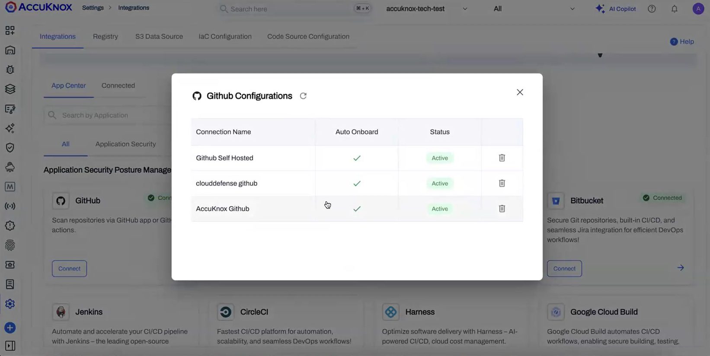
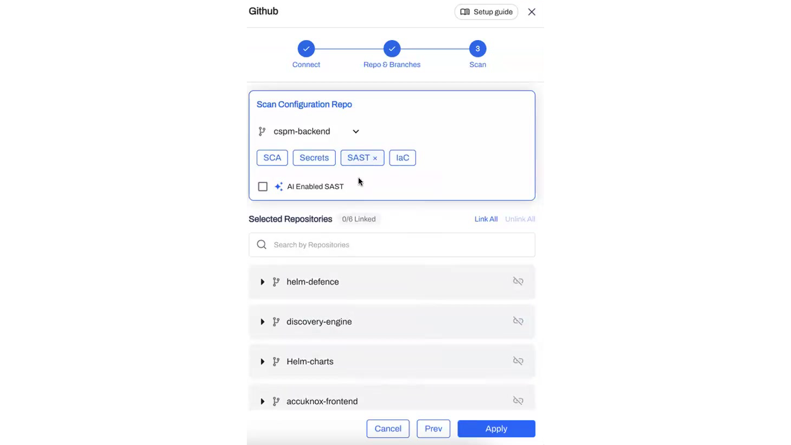

# Connect Source Code for Security Scanning

AccuKnox can scan your repositories directly, without adding a scan step to your CI/CD pipeline. You install the AccuKnox app on your source code manager once, choose which repositories and branches to cover, and pick the scan types. Every scan runs on the AccuKnox platform.

This works for **GitHub**, **GitLab**, and **Bitbucket** using the same flow.

## How it works

1. Install the AccuKnox app on your source code organization and grant read access.
2. AccuKnox lists the repositories it can see.
3. For each repository and branch, you choose the scan types to run.
4. Scans run on the platform, on a daily schedule and on demand.
5. Findings appear in the ASPM dashboard and the Findings pages.

Nothing runs inside your pipeline, and nothing is installed in your repositories beyond the app.

## Prerequisites

- Admin rights on the GitHub, GitLab, or Bitbucket organization, so you can install an app.
- Access to your AccuKnox tenant with permission to manage integrations.

## Step 1: Install the AccuKnox app

Start the connection from **Settings → Integrations → Code Source Configuration** and follow the prompt to install the app on your source code manager.

During install, choose the scope:

- **All repositories** applies to every current and future repository owned by the organization.
- **Only select repositories** limits the app to the repositories you pick.

The app requests **read-only** access to the metadata it needs to fetch and scan code.

!!! tip "Choosing a scope"
    Pick **All repositories** if you want new repositories to be scannable automatically as they are created. Pick **Only select repositories** if you want to keep the app scoped to a known list. See [Automatic repository sync](#automatic-repository-sync) for how each scope behaves.

## Step 2: Confirm the connection

Back in AccuKnox, the connection shows under **Settings → Integrations → Code Source Configuration**. Each connected source lists its status, and you can manage more than one connection from here.

## Step 3: Configure scans per repository and branch

Open the connection and use the setup wizard: **Connect → Repo & Branches → Scan**. For each repository and branch, choose which scan types to run.

Four scan types are available:

| Scan type | What it checks |
|---|---|
| **SCA** | Open-source dependencies and their known vulnerabilities |
| **Secrets** | Hardcoded credentials, tokens, and keys in the codebase |
| **SAST** | Insecure code patterns in your source |
| **IaC** | Misconfigurations in infrastructure-as-code, by framework |

Select **AI Enabled SAST** to add AI-assisted analysis on top of the standard static scan.

Scan choices are made per branch, so you can run the full set on `main` and a lighter set on feature branches. Choose the repositories to apply the configuration to, then **Apply**.

## Step 4: Choose your scan token (optional)

For AI-enabled scanning you decide whose token is used. Under your **tenant profile** you can run scans with the **AccuKnox-managed token** or supply **your own token**. Use your own when you want the scan to run under your organization's account and quota.

## Step 5: Run scans

Every configured repository runs on a **daily scheduled scan**. You can also start an **on-demand scan** at any time, scoped to a specific repository and branch.

Expand a repository to see its branches, the current severity breakdown, and the per-branch scan action.

## Automatic repository sync

New repositories can be picked up without reconfiguring the connection. Behavior depends on the scope you chose at install:

- **All repositories:** a daily sync adds any repository created in the last 24 hours, so it becomes scannable automatically.
- **Only select repositories:** new repositories are not added automatically, since you limited what the app can see. Add them by editing the connection.

For real-time updates, a webhook can notify AccuKnox the moment a repository or branch changes, so new work becomes scannable immediately instead of on the next daily sync.

## Review findings

Findings roll up into the ASPM dashboard and the Findings pages. Secret findings point to the exact place the secret was found: repository, branch, file path, and the precise line and column range.

The location resolves down to the character range within the file, so you can open the finding at the right line in your source code manager instead of searching for it.

## Disconnect a source

There are two independent places a connection lives: the app on your source code manager, and the connection inside AccuKnox. To fully disconnect, handle both.

- **Remove the connection in AccuKnox.** The app still exists on your source code manager after this, so AccuKnox cannot delete it for you.
- **Uninstall the app on your source code manager.** On GitHub, open the app's settings and use **Uninstall** under the Danger zone. **Suspend** blocks access without removing the app.

If you delete the app on the source code manager while the AccuKnox connection is still in place, the connection shows as **Disconnected** with the reason. This status is picked up by a background check, so it may take a short time to appear rather than showing instantly.

## Supported scan types

!!! note "Phased rollout"
    The initial release covers SCA, Secrets, SAST, and IaC. SBOM, CBOM, and container image scanning join the same flow in a later phase. Quality gates, pull-request decoration, and IDE integration are on the roadmap.

## Related

- [ASPM Overview](/how-to/aspm-overview/)
- [AccuKnox v3.6 Release Notes](/getting-started/3.6-release/)
