# Connect GitHub, GitLab, or Bitbucket for Source Code Scanning

AccuKnox scans your repositories directly. You install the AccuKnox app on your source code manager once, pick the repositories and branches you care about, choose the scan types, and every scan runs on the AccuKnox platform.

Nothing goes into your pipeline. There is no workflow file to add, no runner to install, and no build to keep green.

This is the **App Based** integration. AccuKnox also supports **CI/CD** and **CLI** integrations for the same scanners, and you can run more than one at a time.

## How it works

1. You install the AccuKnox app on your GitHub organization, GitLab group, or Bitbucket workspace and grant read access.
2. AccuKnox discovers every repository the app can see, along with its branches.
3. You choose which repositories and branches to onboard, and which scan types to run on each.
4. Scans run on the AccuKnox platform and rerun as your code changes.
5. Findings land in the ASPM dashboard and the Findings pages.

## What you can connect

| Source | Cloud | Self-hosted |
|---|---|---|
| **GitHub** | Supported, using the AccuKnox app | Supported, using a personal access token |
| **GitLab** | Supported, using the AccuKnox app | Supported, using a personal access token |
| **Bitbucket** | Supported, using the AccuKnox app | Not supported |

Bitbucket Data Center and Bitbucket Server are not covered by the app-based flow. Use the [Bitbucket CI/CD integration](/integrations/bitbucket-overview/) for those.

## Scan types

The same five scan types are available on all three sources.

| Scan type | What it finds |
|---|---|
| **SCA** | Known vulnerabilities in your open-source dependencies |
| **Secrets** | Hardcoded credentials, tokens, and keys committed to the repository |
| **SAST** | Insecure patterns in your own source code |
| **SBOM** | The software bill of materials for the repository |
| **IaC** | Misconfigurations in infrastructure-as-code, selectable by framework |

**AI Enabled SAST** is a separate checkbox that layers AI-assisted analysis on top of the standard static scan.

## Prerequisites

- Permission to install an app on your GitHub organization, GitLab group, or Bitbucket workspace. On GitHub this means organization owner or an equivalent role.
- An AccuKnox account with permission to manage integrations.
- For a self-hosted GitHub or GitLab instance, a personal access token with read scope on the repositories you want to scan, plus network access from AccuKnox to that instance.

## Step 1: Start the integration

Go to **Settings → Integrations**, open the **Integrations** tab, and select **Application Security**. The **Application Security Posture Management (ASPM)** section lists GitHub, GitLab, Bitbucket, and the CI/CD platforms.

Find your source and click **Connect**.

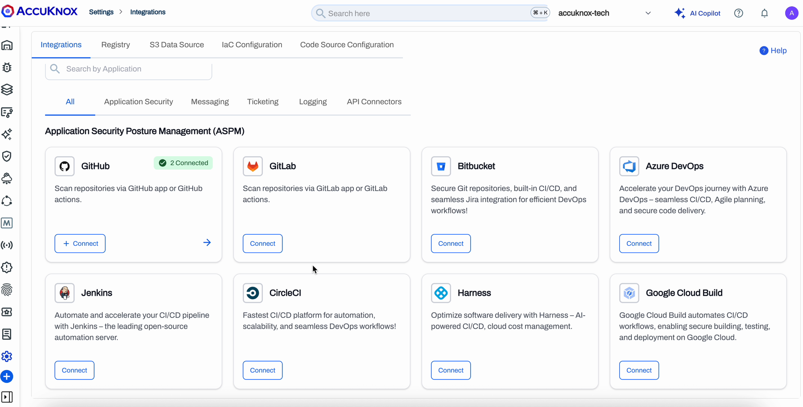

A card that already has connections shows a green **Connected** badge with the count. Clicking **Connect** on that card adds another connection rather than replacing the existing one.

## Step 2: Choose the integration type

The **Select Integration Type** dialog asks how you want to connect. Pick **App Based** and click **Continue**.

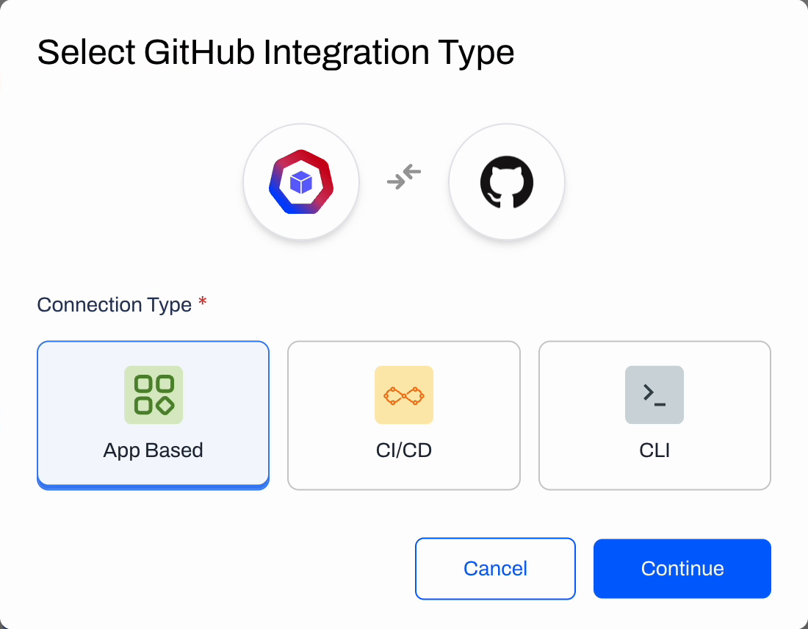

| Type | When to use it |
|---|---|
| **App Based** | You want AccuKnox to fetch and scan the code itself. No pipeline work. This is the flow this page covers. |
| **CI/CD** | You want scans to run as a step inside your existing pipeline. |
| **CLI** | You want to run the scanner manually or from a script. |

A three-step wizard opens: **Connect → Repo & Branches → Scan**.

## Step 3: Connect the source

=== "GitHub"

    Under **Connection Type**, choose how AccuKnox reaches your instance.

    - **GitHub Cloud (Using Application)** for repositories on github.com.
    - **GitHub Self-Hosted (Using PAT)** for GitHub Enterprise Server. Supply the instance URL and a personal access token with read scope.

    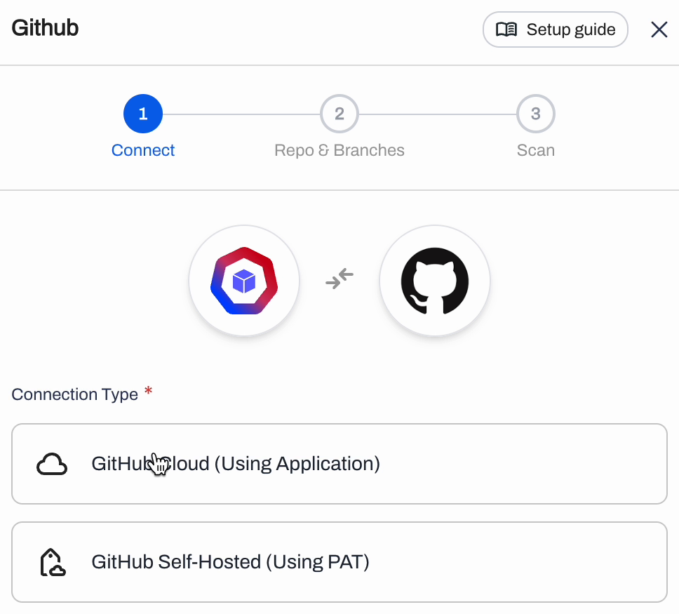

    For GitHub Cloud, click **Install on GitHub**. AccuKnox opens the app installation page on GitHub in a new tab.

    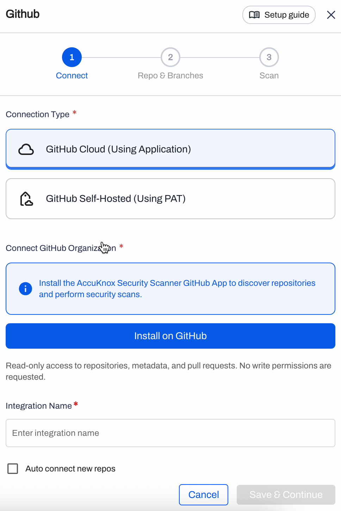

    The access AccuKnox asks for is read-only. No write permissions are requested.

    On GitHub, pick the organization to install into and choose the repository scope:

    - **All repositories** covers every current and future repository owned by that organization.
    - **Only select repositories** limits the app to the repositories you pick.

    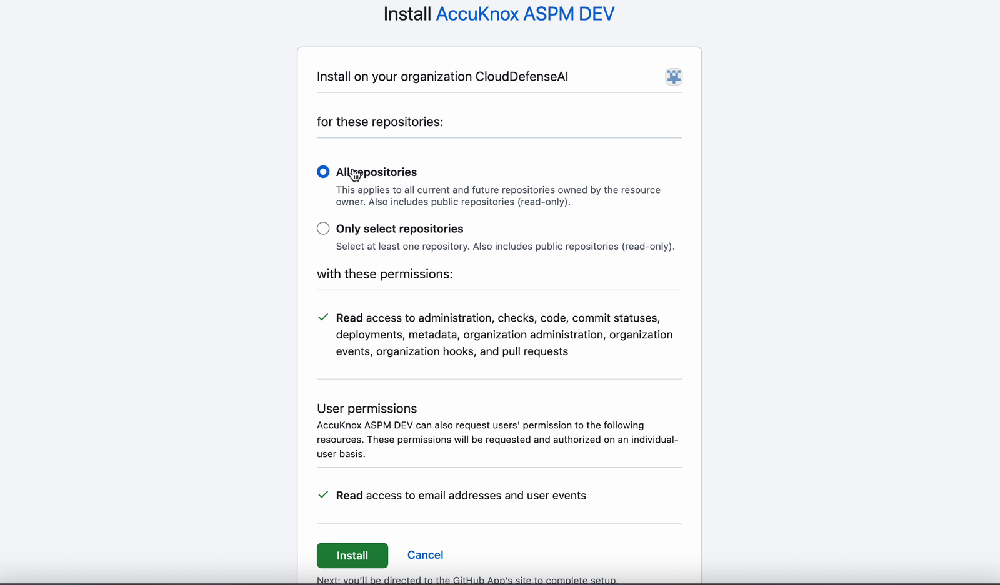

    Review the permission list and click **Install**. GitHub sends you back to AccuKnox.

    !!! tip "Which scope should you pick"
        Choose **All repositories** if you want new repositories to become scannable on their own. Choose **Only select repositories** if you want the app scoped to a known list. See [Auto connect new repos](#auto-connect-new-repos) for how each scope behaves afterwards.

    Back in AccuKnox the button turns green and reads **Installed on GitHub**. Give the connection an **Integration Name**, tick **Auto connect new repos** if you want new repositories onboarded automatically, and click **Save & Continue**.

    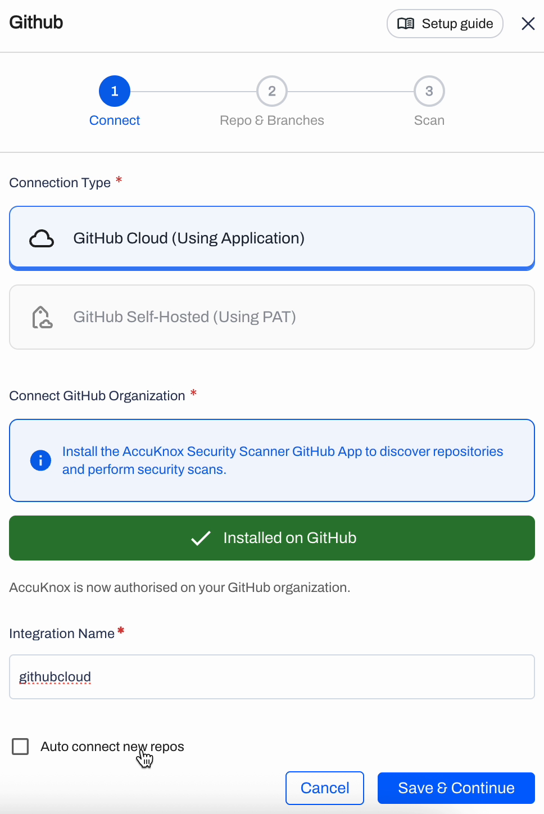

=== "GitLab"

    Under **Connection Type**, choose how AccuKnox reaches your instance.

    - **GitLab Cloud** for projects on gitlab.com. AccuKnox installs its app against your GitLab group and you authorize it in GitLab.
    - **GitLab Self-Managed** for a GitLab instance you run yourself. Supply the instance URL and a personal access token with `read_api` and `read_repository` scope.

    For GitLab Cloud, start the install from the wizard, sign in to GitLab if prompted, and authorize AccuKnox against the group whose projects you want to scan. The access requested is read-only.

    GitLab returns you to AccuKnox once the authorization succeeds. Give the connection an **Integration Name**, tick **Auto connect new repos** if you want new projects onboarded automatically, and click **Save & Continue**.

    !!! note "Projects and repositories"
        GitLab calls them projects and AccuKnox calls them repositories. They are the same thing in this wizard, and GitLab subgroups appear under the group you authorized.

=== "Bitbucket"

    Bitbucket connects through **Bitbucket Cloud** only.

    Start the install from the wizard, sign in to Bitbucket if prompted, and grant AccuKnox access to the **workspace** whose repositories you want to scan. The access requested is read-only.

    Bitbucket returns you to AccuKnox once the grant succeeds. Give the connection an **Integration Name**, tick **Auto connect new repos** if you want new repositories onboarded automatically, and click **Save & Continue**.

    !!! warning "Bitbucket Data Center is not supported here"
        The app-based flow covers Bitbucket Cloud. For Bitbucket Data Center or Bitbucket Server, run scans through the pipeline instead. See [Bitbucket integrations](/integrations/bitbucket-overview/).

!!! info "Screenshots on this page show GitHub"
    The wizard is the same for all three sources. Only the connect step and the vocabulary differ: GitHub organization, GitLab group, Bitbucket workspace.

## Step 4: Select repositories and branches

Step 2 of the wizard is **Select Repositories & Branches**. Open the **Select repositories** dropdown and pick the repositories to onboard. The list is searchable, which matters on a large organization.

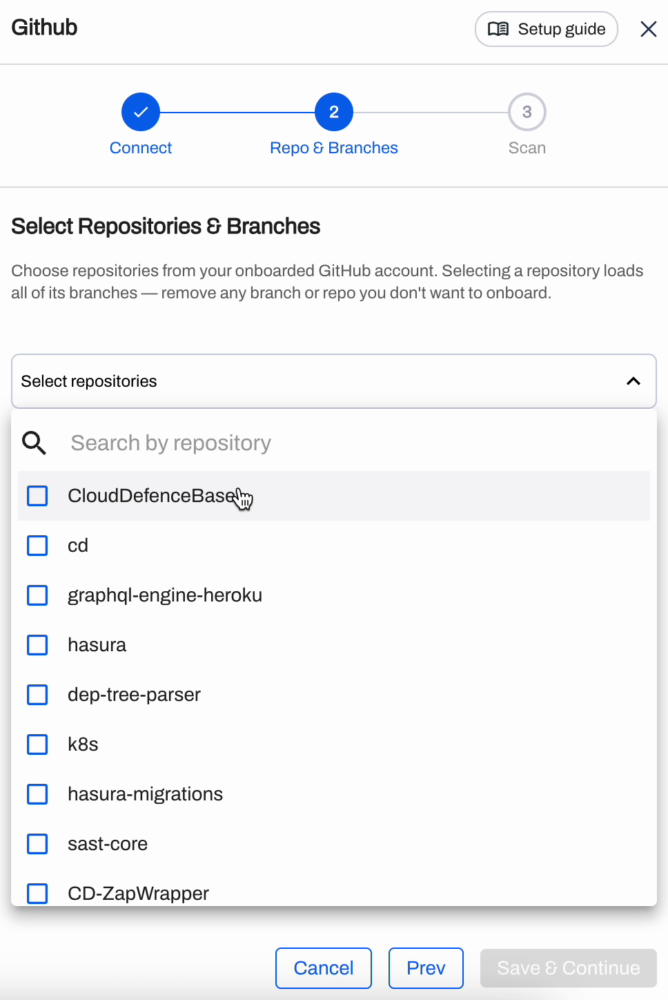

Selecting a repository loads all of its branches. Each repository then appears under **Selected Repositories** with its own branch dropdown.

The default branch is selected for you. Add more branches from the dropdown, or remove any branch you do not want scanned by clicking the **×** on its chip. The trash icon removes the whole repository from the selection.

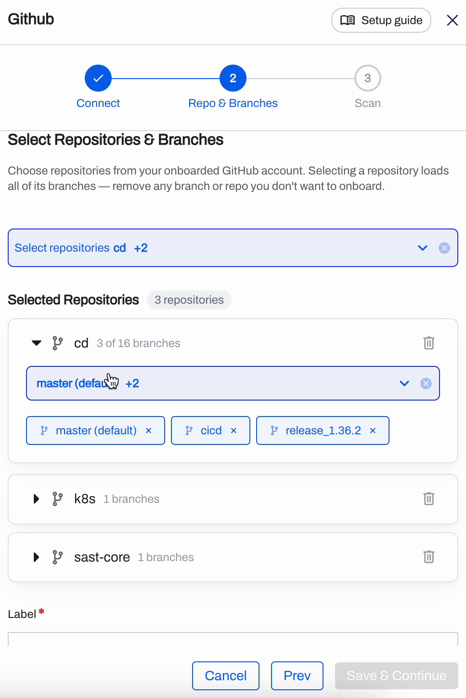

Below the repository list, pick a **Label**. One label applies to every repository in this connection and is how you group and filter these repositories later.

Click **Save & Continue**.

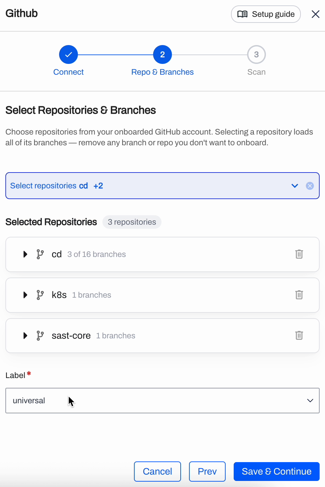

## Step 5: Configure the scans

Step 3 is **Scan Configuration**. Rather than setting up every repository by hand, you configure one repository and link the rest to it.

Pick a repository under **Scan Configuration Repo** and select its scan types. Click a chip to add or remove that scan type.

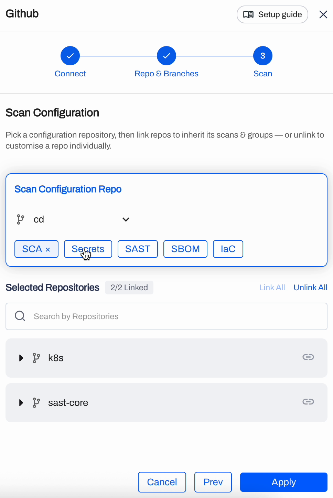

Two options need a second look:

- **IaC** carries its own dropdown for frameworks. Leave it on **All**, or narrow it to the frameworks your repository actually uses.
- **AI Enabled SAST** is a checkbox under the chips. Turning it on applies AI-assisted static analysis to every linked repository.

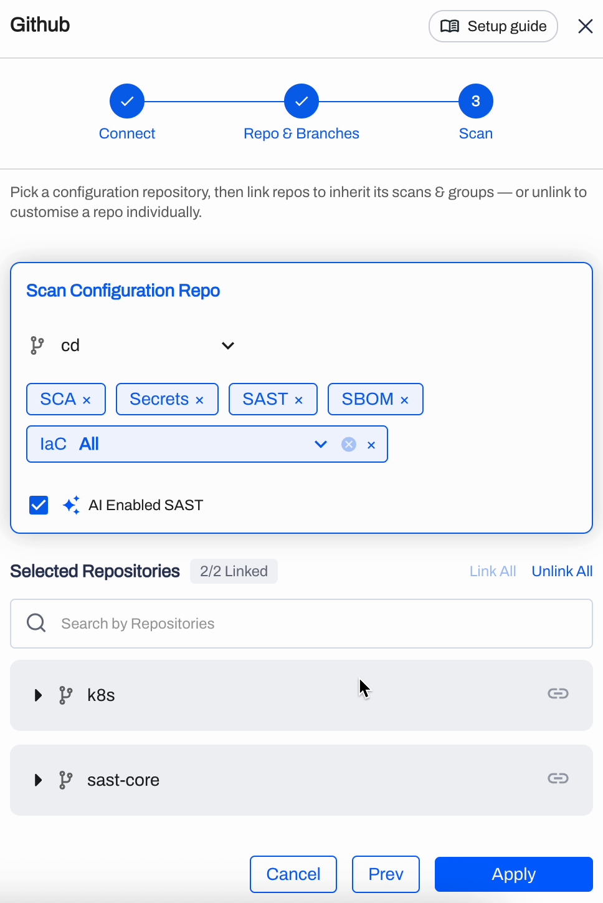

Under **Selected Repositories**, the counter shows how many repositories inherit that configuration, for example **2/2 Linked**. Every linked repository runs exactly what the configuration repository runs.

### Give one repository a different configuration

Click the link icon next to a repository to unlink it. Its own set of scan-type chips appears, and you set them independently. The counter drops to **1/2 Linked**.

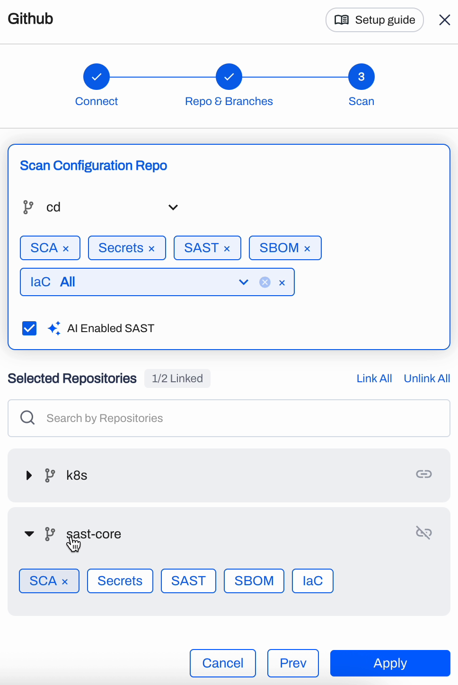

Use **Link All** and **Unlink All** to switch every repository at once.

Click **Apply** to finish. Scanning starts on the repositories you onboarded.

## Read the results

Open the connection from **Settings → Integrations** to see what the scans found. The connection header shows its status, and **Edit / Add Repo** takes you back into the wizard.

The table nests three levels: repository, then branch, then scan type. Every row carries a Critical, High, Medium, and Low count, and each scan type row shows when it last ran.

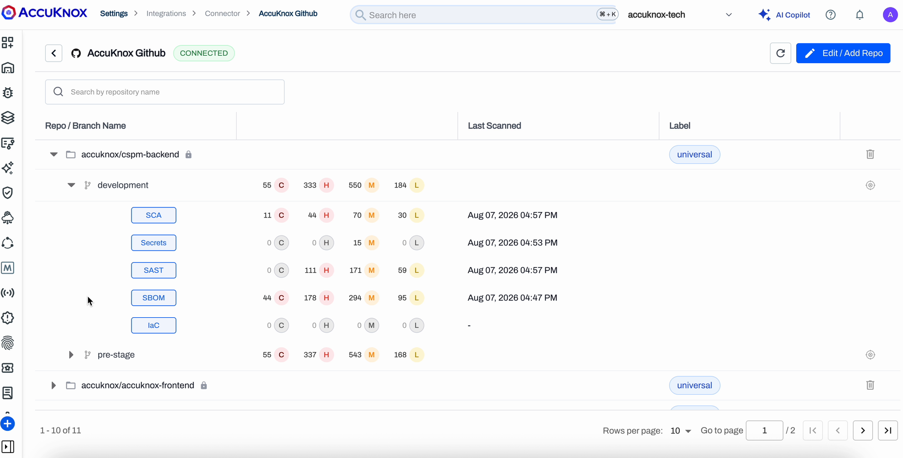

A dash under **Last Scanned** means that scan type has not run yet on that branch.

Click through from a row to reach the Findings page filtered to that scan type, repository, and branch.

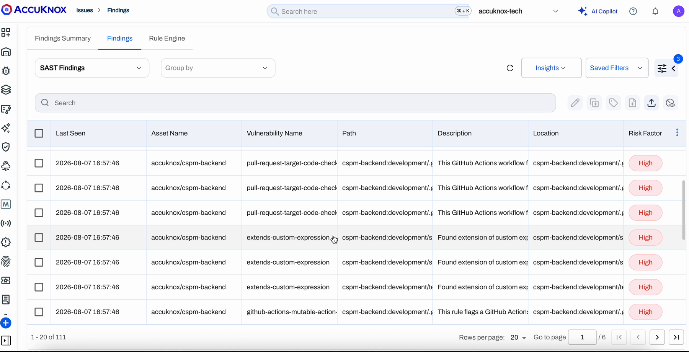

Findings also roll up into the ASPM view on the dashboard.

## Auto connect new repos

**Auto connect new repos** is the checkbox on the Connect step. What it can do depends on the scope you gave the app when you installed it.

- App scoped to **all repositories**: a daily sync picks up repositories created in the last 24 hours and onboards them against the connection's configuration.
- App scoped to **selected repositories**: new repositories are invisible to AccuKnox, because you limited what the app can see. Grant the app access on your source code manager first, then add them through **Edit / Add Repo**.

Leave the checkbox off if you would rather review every new repository before it starts consuming scans.

## Change or remove a connection

To change what a connection covers, open it and click **Edit / Add Repo**. The wizard reopens on the repository step with your current selection intact.

Removing a connection takes two actions, because the connection lives in two places:

1. **In AccuKnox**, delete the connection. This stops the scans.
2. **On your source code manager**, uninstall the AccuKnox app. AccuKnox cannot do this for you. On GitHub, open the app under your organization's settings and use **Uninstall**. **Suspend** blocks access without removing the app.

If you remove the app on the source code manager while the AccuKnox connection is still there, the connection reports itself as disconnected with the reason. A background check picks this up, so give it a few minutes.

## Troubleshooting

**The repository dropdown is empty.** The app installed but has no repositories in scope. Check the app's repository access on your source code manager, then reopen the wizard.

**A repository you expect is missing.** Either the app is scoped to selected repositories and this one was not among them, or it was created after the last sync. Add it to the app's access list, then use **Edit / Add Repo**.

**A scan type shows a dash under Last Scanned.** That scan type has not completed a first run on that branch yet. Large repositories take longer on the first pass.

**Self-hosted connection fails.** Confirm the instance URL is reachable from AccuKnox and that the personal access token still has read scope and has not expired.

## Related

- [ASPM Overview](/how-to/aspm-overview/)
- [GitHub integrations](/integrations/github-overview/)
- [GitLab integrations](/integrations/gitlab-overview/)
- [Bitbucket integrations](/integrations/bitbucket-overview/)

<!--
## Pending Stakeholder Input

- **GitLab and Bitbucket connect step.** Written from the flow confirmed in the 2026-08-07 walkthrough, which demonstrated GitHub only. Confirm the exact Connection Type labels for GitLab (cloud vs self-managed) and Bitbucket, the exact PAT scopes for GitLab self-managed, and whether Bitbucket exposes a Connection Type selector at all when only Cloud is supported. Then add screenshots for both.
- **Production GitHub app name.** The install screenshot shows "AccuKnox ASPM DEV" from the dev environment. Reshoot on production if the app name differs.
- **Auto connect sync interval.** Documented as a daily sync. Confirm the interval and whether a webhook path is customer-configurable.
- **Scheduled scan cadence.** The earlier draft stated a daily scheduled scan. Confirm the current cadence and whether an on-demand trigger is exposed per branch, then document it.
- **Label field.** Confirm whether labels are created elsewhere first, or can be created inline in this wizard.
-->
