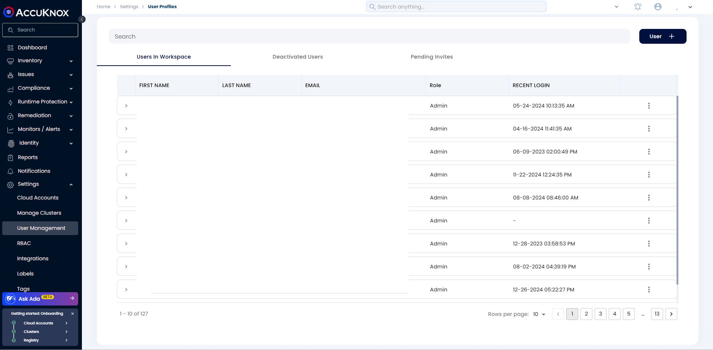
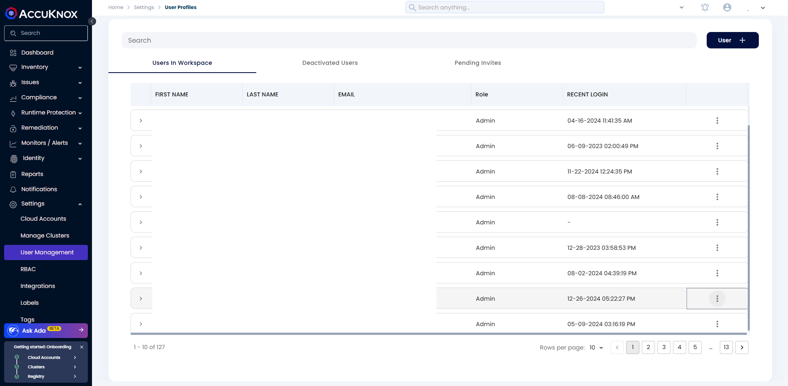
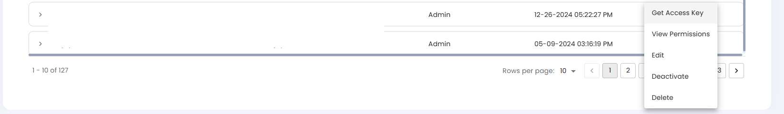
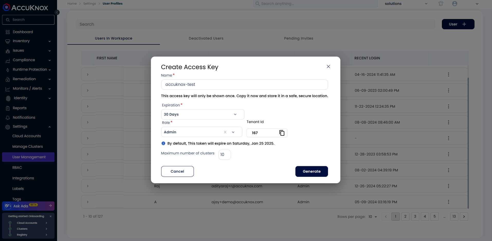
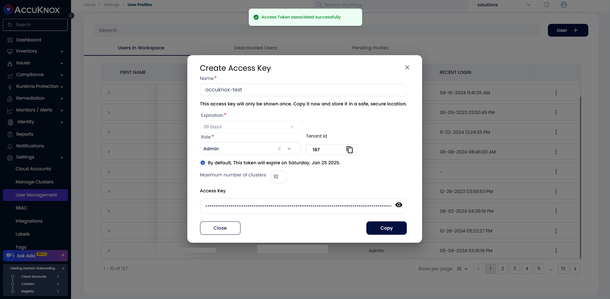

# How to Create Access Keys

This guide on how to create an access key in the AccuKnox SaaS platform helps you to authenticate and authorize your resources securely. Access Keys are used to authenticate and authorize the users to access the AccuKnox SaaS platform. You can create access keys for different users and manage them effectively.

!!!warning
    Access Keys are authentication credentials used to securely interact with various services and systems. They are crucial for operations such as querying information on CSPM, CWPP, and ASPM, Automating workflows from CLI, and Managing bundle operations from CLI.

Access keys are created for users and carry the same permissions as the user who created them. If an administrator creates an access key, they can perform nearly any operation in the CNAPP directly from the CLI, which can be critical. Users must ensure that these access keys are kept private and secure and should never share them to avoid potential damage.

**Step 1:** Go to Settings and then select User-Management

**Step 2:** On the User Management page, click three vertical dots as shown in the below image.

**Step 3:** Click on Get Access Key

**Step 4:** In the input field, enter the name, select the expiration time, assign a role, and input the maximum number of clusters to be onboarded using the access key. Click on **Generate**

**Step 5:** Copy the access key and store it securely to perform different operations on CNAPP

