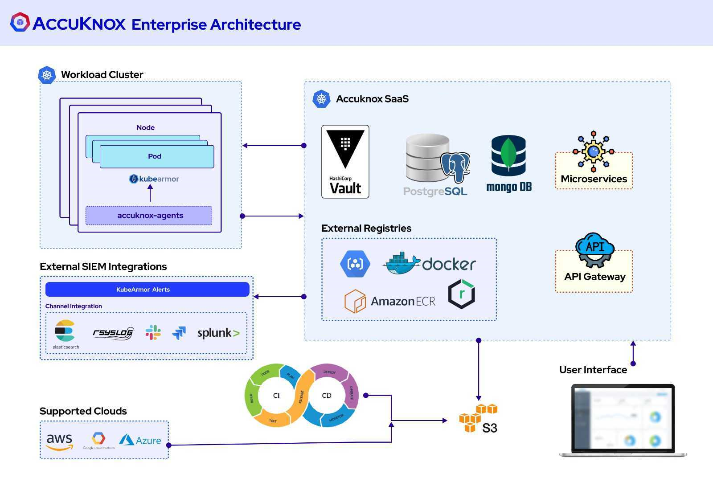
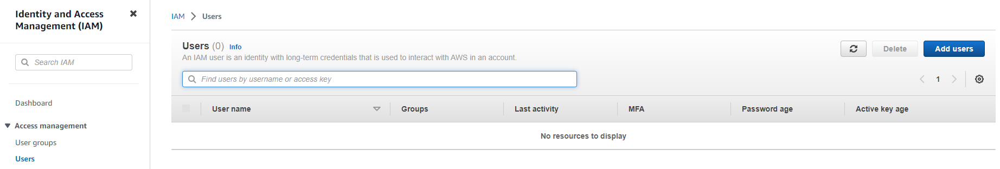
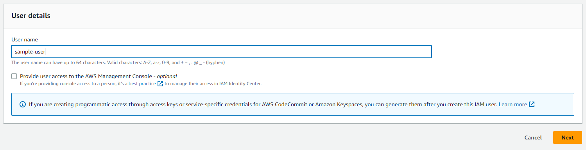
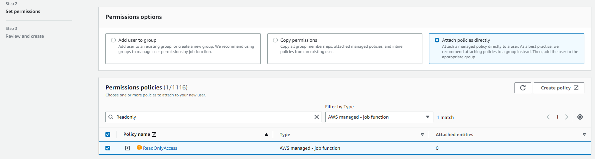
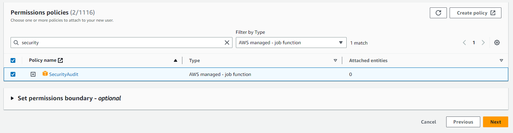
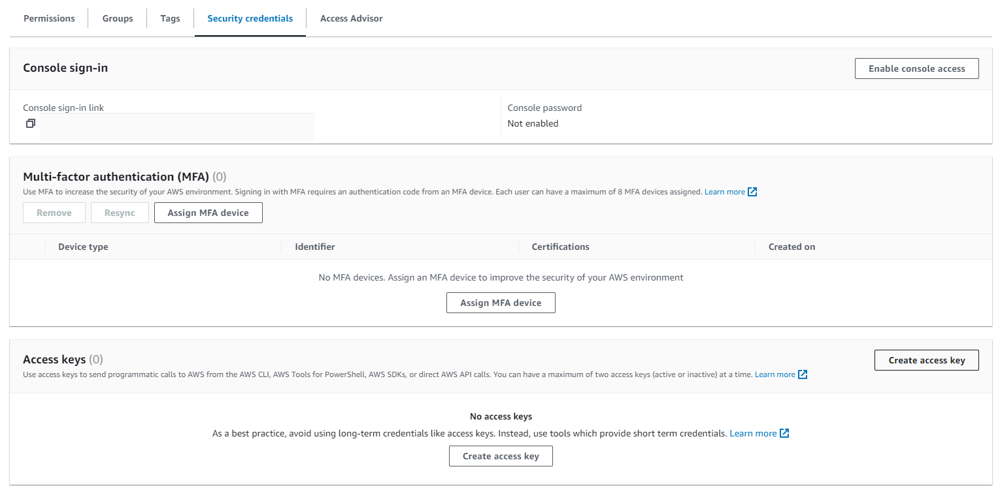

# CSPM Pre-requisite for AWS

In SaaS model of deployment the AccuKnox CNAPP will be hosted in our cloud environment and scan will be done using the Cloud account Readonly Access permission.

AWS onboarding requires creation of an IAM user. Please follow the following steps to provide a user with appropriate read access:

**Step 1:** Navigate to IAM → Users and click on Add Users

**Step 2:** Give a username to identify the user

**Step 3:** In the "Set Permissions" screen:

a. Select "Attach policies directly"

b. Search "ReadOnly", Filter by Type: "AWS managed - job function" and select the policy

c. Search "SecurityAudit", Filter by Type: "AWS managed - job function" and select the policy

**Step 4:** Finish creating the user. Click on the newly created user and create the Access key and Secret Key from the Security Credentials tab to be used in the AccuKnox panel

- - -
[SCHEDULE DEMO](https://www.accuknox.com/contact-us){ .md-button .md-button--primary }
