# Pre-requisite for AWS Cloud Account Onboarding

## CSPM Pre-requisite for AWS

When the AccuKnox control plane is hosted in a cloud environment, scanning is performed using Cloud account Readonly Access permissions.

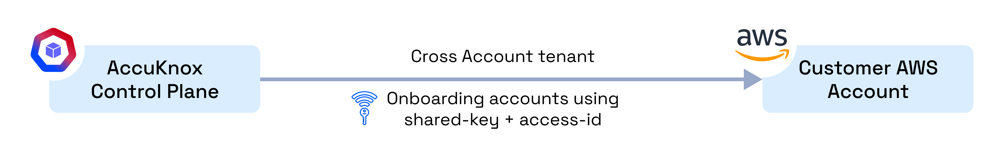

AWS onboarding requires creation of an IAM user. Please follow the following steps to provide a user with appropriate read access:

**Step 1:** Navigate to IAM → Users and click on Add Users

**Step 2:** Give a username to identify the user

**Step 3:** In the "Set Permissions" screen:

a. Select "Attach policies directly"

b. Search "ReadOnly", Filter by Type: "AWS managed - job function" and select the policy

c. Search "SecurityAudit", Filter by Type: "AWS managed - job function" and select the policy

**Step 4:** Finish creating the user. Click on the newly created user and create the Access key and Secret Key from the Security Credentials tab to be used in the AccuKnox panel

## AI/ML Security Prerequisites for AWS Cloud Accounts

Permissions for AI Asset Scanning (AWS):

- **General Scan Permission (Required):**
    - Create an **IAM User** and attach the following managed policies:
        - `ReadOnly` (AWS managed – job function)
        - `SecurityAudit` (AWS managed – job function)

- **Permissions for AI Asset Scanning:**
    - Create an **IAM User** and attach the following managed policies:
        - `ReadOnly` (AWS managed – job function)
        - `SecurityAudit` (AWS managed – job function)

    - Create an **inline policy** with the following permissions:

        - **AWS Bedrock:**
            - `bedrock:InvokeModel`
            - `bedrock:ListImportedModels`
            - `bedrock:ListModelInvocationJobs`

        - **AWS SageMaker:**
            - `sagemaker:InvokeEndpoint`

### Steps to Configure IAM User for AI Asset Scanning (AWS)

Navigate to **IAM > Users > Create User**.

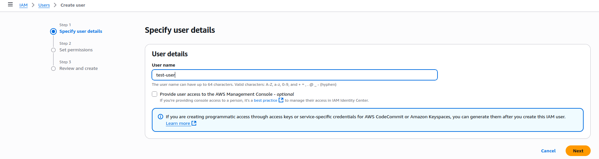

Select the AWS managed policies **ReadOnlyAccess** and **SecurityAudit** to attach to the user.

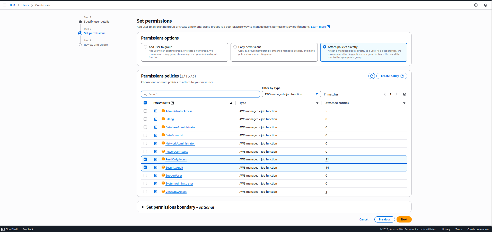

Go to **Add Permissions > Create inline policy**. For **Bedrock Permissions**, select the service **Bedrock**, allow the actions **InvokeModel**, **ListImportedModels**, and **ListModelInvocationJobs**, and choose **All** under resources.

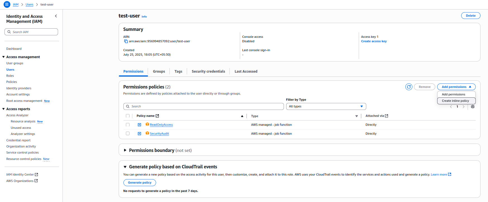
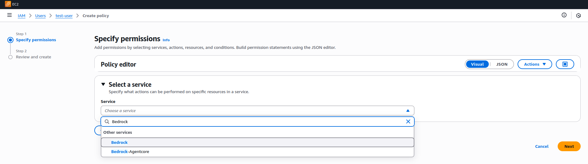

For **SageMaker Permissions**, add another set of permissions by selecting the service **SageMaker**, allowing the action **InvokeEndpoint**, and choosing **All** under resources.

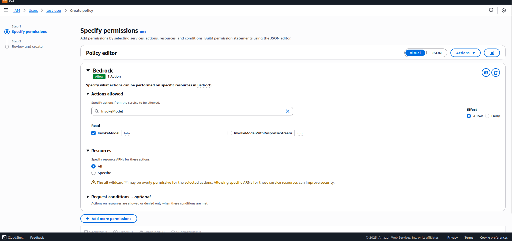
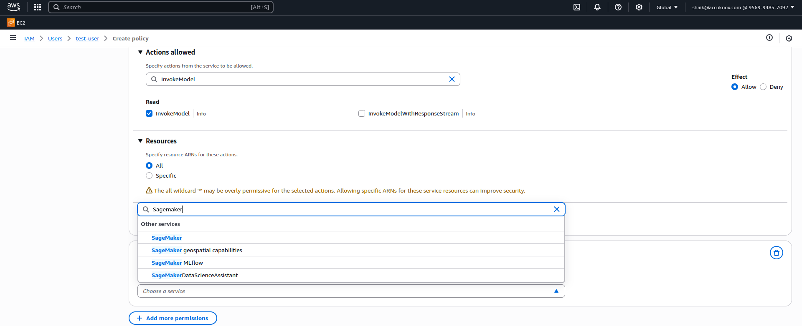
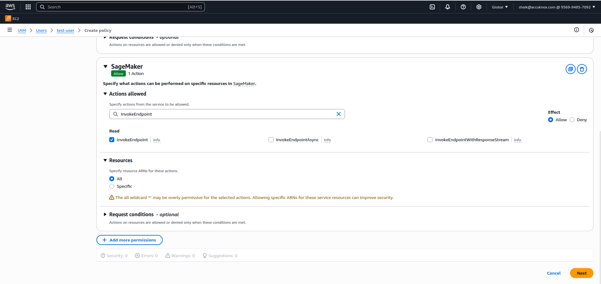

Finally, review and create the policy to attach it to the IAM user.

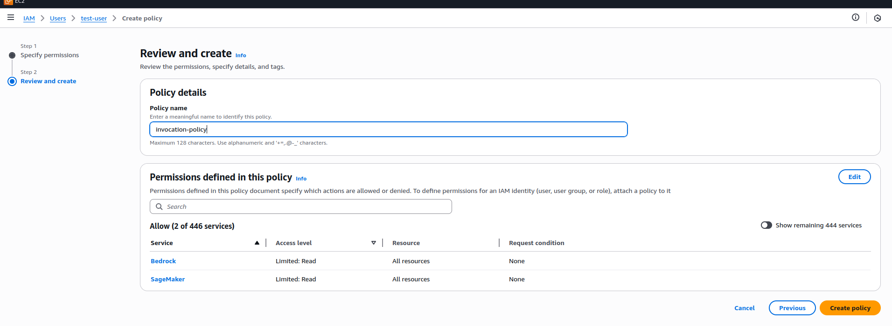
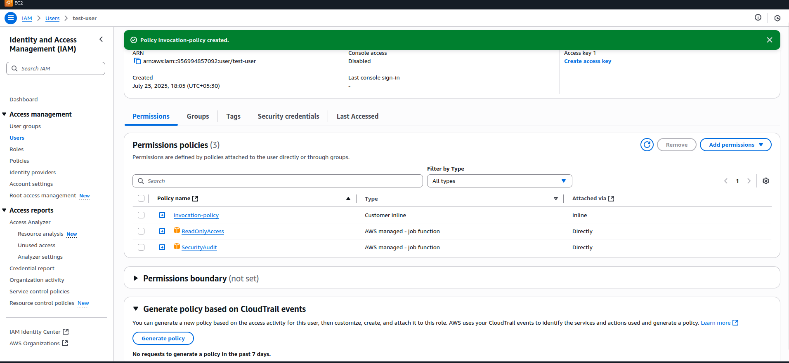
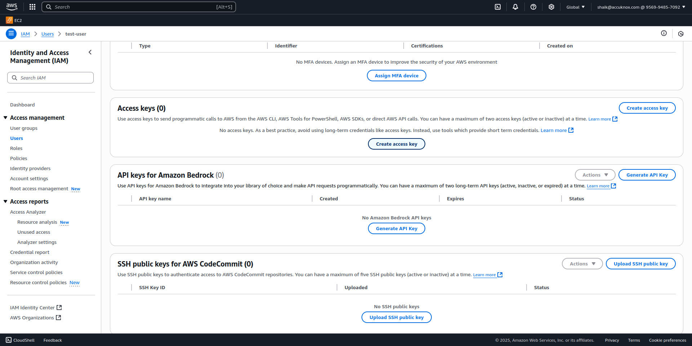

- - -
[SCHEDULE DEMO](https://www.accuknox.com/contact-us){ .md-button .md-button--primary }
