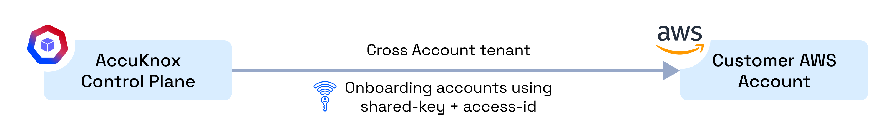

# Pre-requisite for AWS Cloud Account Onboarding

## CSPM Pre-requisite for AWS

When the AccuKnox control plane is hosted in a cloud environment, scanning is performed using Cloud account Readonly Access permissions.



AWS onboarding requires creating an IAM user. Follow these steps to provide the user with appropriate read access:

**Step 1:** Navigate to IAM → Users and click on Add Users


**Step 2:** Give a username to identify the user


**Step 3:** In the "Set Permissions" screen:

a. Select "Attach policies directly"

b. Search "ReadOnly", Filter by Type: "AWS managed - job function" and select the policy


c. Search "SecurityAudit", Filter by Type: "AWS managed - job function" and select the policy


**Step 4:** Finish creating the user. Click on the newly created user and create the Access key and Secret Key from the Security Credentials tab to be used in the AccuKnox panel


## Permissions for AI Asset Scanning (AWS)

### Required Managed Policies

Create an **IAM User** and attach the following managed policies:

- `ReadOnlyAccess` (AWS managed — job function)
- `SecurityAudit` (AWS managed — job function)

### Required Inline Policy

Create an **inline policy** with the following JSON. This covers Bedrock, SageMaker, Bedrock AgentCore, and AWS Marketplace access in a single policy:

```json
{
    "Version": "2012-10-17",
    "Statement": [
        {
            "Sid": "AccuKnoxAIMLPermissions",
            "Effect": "Allow",
            "Action": [
                "bedrock:InvokeModel",
                "bedrock:InvokeAgent",
                "sagemaker:InvokeEndpoint",
                "sagemaker:ListTags",
                "bedrock-agentcore:InvokeAgentRuntime",
                "bedrock-agentcore:StopRuntimeSession",
                "aws-marketplace:Subscribe",
                "aws-marketplace:ViewSubscriptions"
            ],
            "Resource": "*"
        }
    ]
}
```

!!! note
    `aws-marketplace:Subscribe` and `aws-marketplace:ViewSubscriptions` are required for invoking certain models (e.g., Claude Opus 4.5) that are distributed through AWS Marketplace.

### Setup Steps

1. Navigate to **IAM > Users > Create User**.
2. Attach the managed policies **ReadOnlyAccess** and **SecurityAudit**.
3. Go to **Add Permissions > Create inline policy**, paste the JSON above, and create the policy.
4. After creating the user, go to **Security Credentials** and create an **Access Key** and **Secret Key** to use during AccuKnox onboarding.

- - -
[SCHEDULE DEMO](https://www.accuknox.com/contact-us){ .md-button .md-button--primary }
