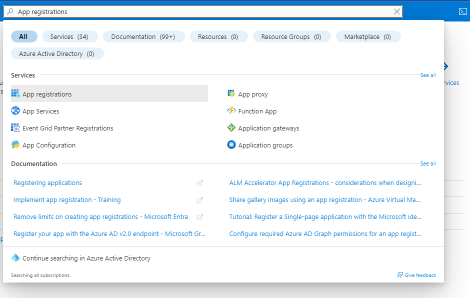
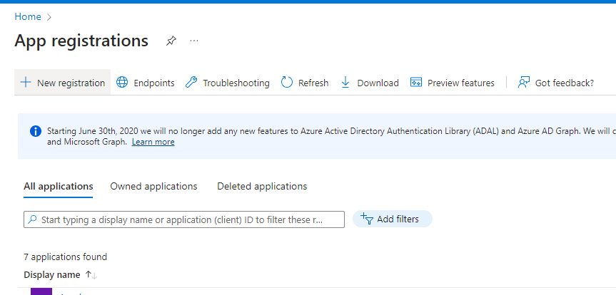
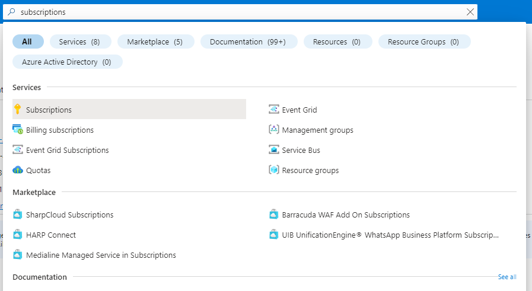
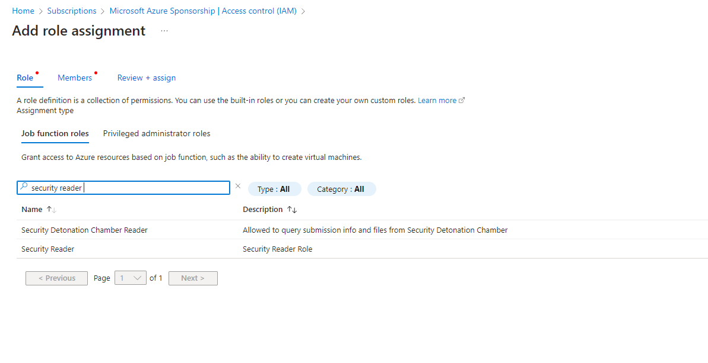
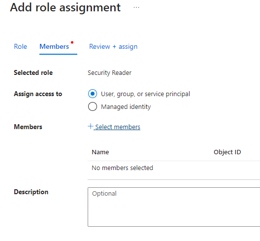
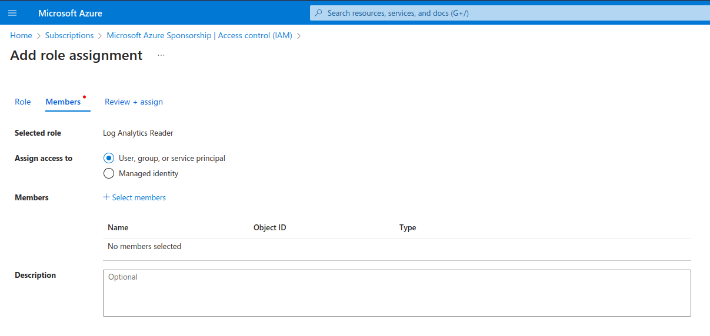

# CSPM Pre-requisite for Azure

In SaaS model of deployment the Accuknox CNAPP will be hosted in our cloud environment and scan will be done using the Cloud account Readonly Access permission.

For Azure Onboarding it is required to register an App and giving Security read access to that App from the Azure portal.

**Step 1:** Go to your Azure Portal and search for *App registrations* and open it

**Step 2:** Here click on *New registration*

**Step 3:** Give your application a name, remember this name as it will be used again later, For the rest keep the default settings

**Step 4:** Now your application is created,  save *Application ID* and *Directory ID* as they will be needed to for onboarding on Accuknox Saas and then click on ‘Add a certificate or secret’

**Step 5:** Click on new client secret and enter the name and expiration date to get *secret id* and *secret value*, save this secret value as this will also be needed for onboarding.

**Step 6:** Next, go to *API permissions* tab and click on 'Add  permission'

**Step 7:** On the screen that appears, click on 'Microsoft Graph'

**Step 8:** Next, select Application Permissions and then search for Directory.Read.All and click on Add permissions

**Step 9:** Select ‘Grant Admin Consent’ for Default Directory and click on ‘Yes’

**Step 10:** Now we need to give Security read permissions to this registered Application , to do that go to subscriptions

**Step 11:** First save the subscription ID and click on the subscription name , here it is “Microsoft Azure Sponsorship“

**Step 12:** Navigate to Access control(IAM) and go to Roles , here select Add and Add role assignment

**Step 13:** Search for “Security Reader” Job function Role, select it and press *next*

**Step 14:** In the member section click on Select *members* it will open a dropdown menu on the right hand side

**Step 15:** Here search for the Application that you registered in the beginning , select the application and click on *review and assign*.

**Step 16:** Similarly, we have to add another role. This time, search for *Log Analytics Reader*. Select it and click *next*

**Step 17:** Now, click on *Select members*, select the application that was created similar to the previous role. Finally, click on *Review and Assign*.

- - -
[SCHEDULE DEMO](https://www.accuknox.com/contact-us){ .md-button .md-button--primary }