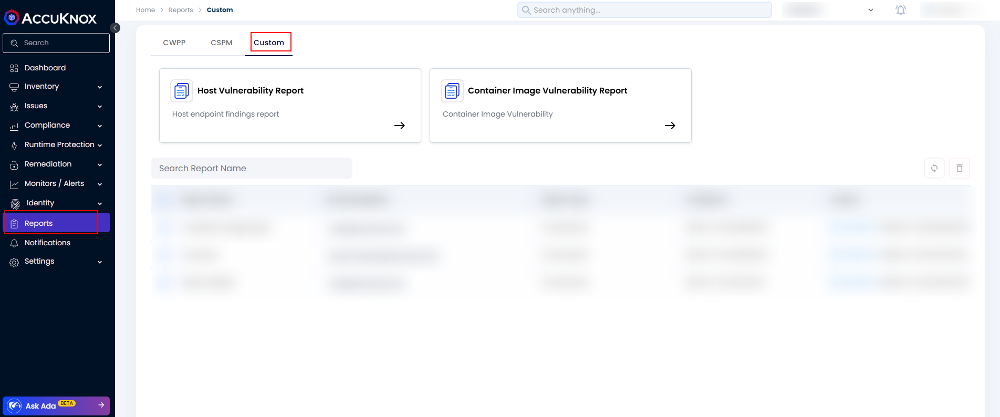
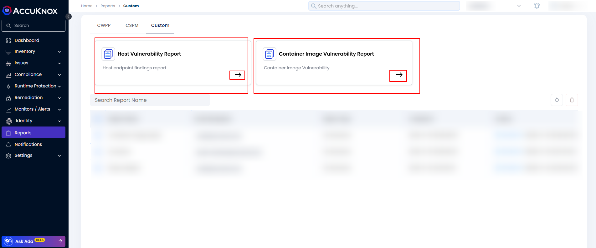
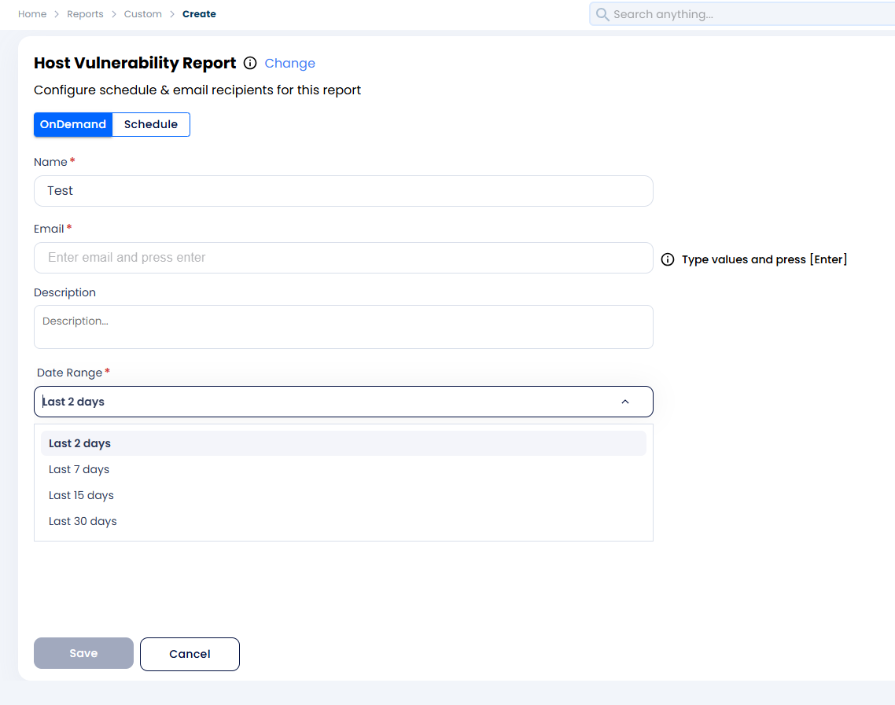
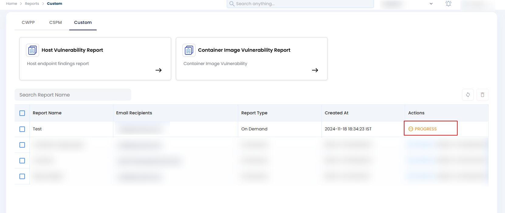
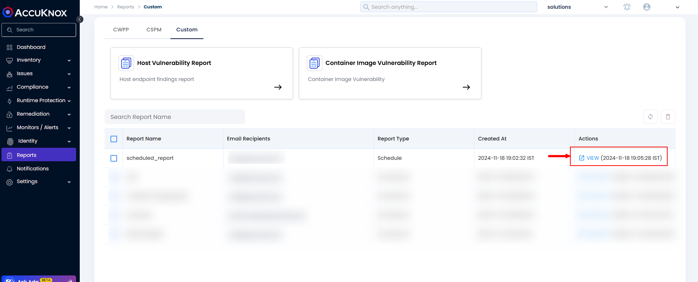
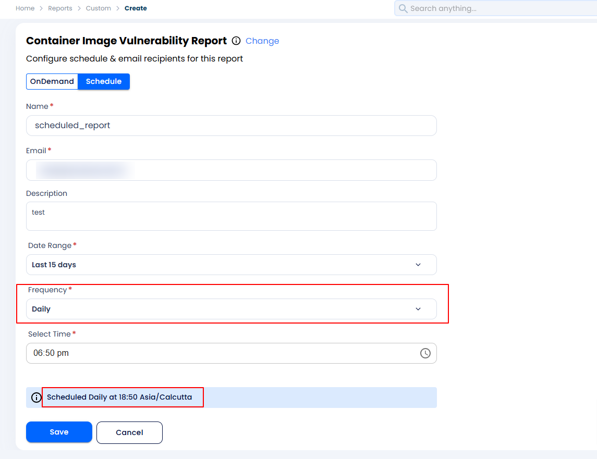
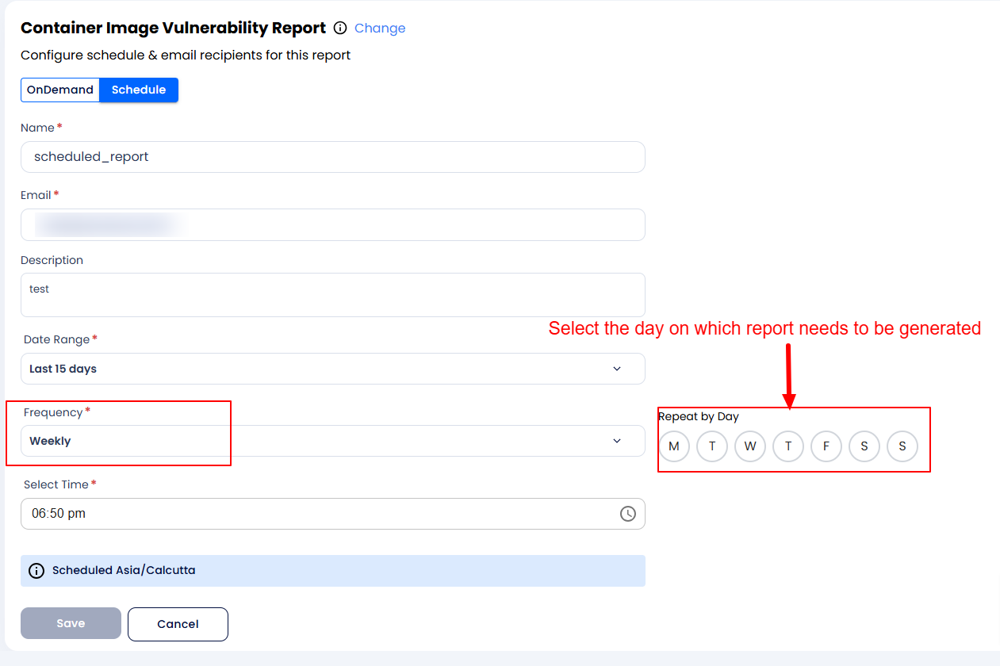
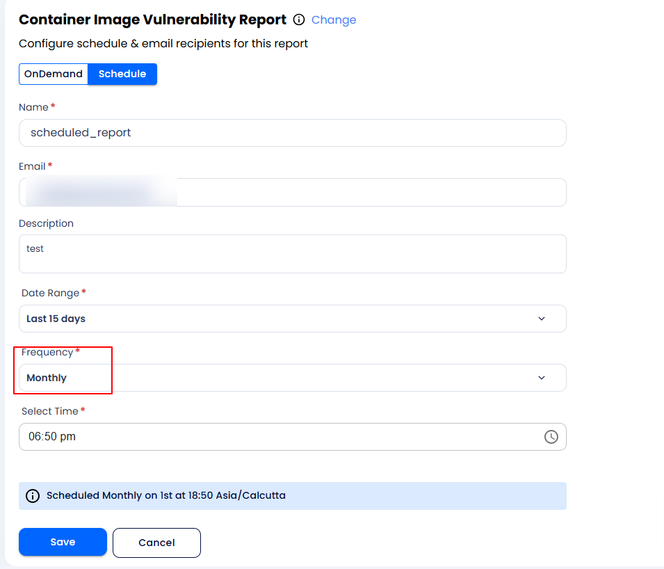

# How to Configure Custom Reports

AccuKnox's latest feature update provides new custom reporting feature capabilities that can help users get the reports customized as per their requirements.

!!!info "NOTE"
    For this feature to be enabled the customers need to inform the Support team(<support@accuknox.com>) regarding their requirements for custom reporting. Then the AccuKnox Support team can configure the report template from the backend. After which the users can generate an on-demand report or configure a scheduled report.

To generate an on-demand or scheduled report, users must follow the steps below.

## On-demand custom Report generation

**Step 1:** Users will need to navigate to the Reports->Custom Reports Section.

**Step 2:** Now the users will need to select any one report which they want to configure from the customized reports that are shown in the UI.

**Step 3:** Users can configure the report as a scheduled report or generate it as an on-demand one. Users can select any one option and fill out the necessary details. Like if it is an on-demand report the users will need to fill in the following fields

Like the report name, an email address where the report needs to be sent, and the duration for which the report needs to be generated from the drop-down list options shown in the UI. After filling out these options the save button will be enabled and users can save it.

**Step 4:** Once the on-demand report is saved the users can see the report in the UI with the progress state mentioned

**Step 5:** After the report generation is completed you can see the Generate option in the UI as well as the report will be mailed to the email address. If the user wants to see the report in the UI they can click on the Generate report.

## Scheduling Custom Report

**Step 1:** Users will need to navigate to the Reports->Custom Reports Section.

**Step 2:** Now the users will need to select any one report which they want to configure from the customized reports that are shown in the UI.

**Step 3:** Now the users will have the option to configure the report as a scheduled report or generate it as an on-demand one. Users can select any one option and fill out the necessary details. If the users want to schedule a custom report then they will have to fill out the following details like name, duration, and scheduling frequency. AccuKnox provides 3 scheduling frequency options.

1. Daily Report: users can select the frequency as daily to receive the report every day at the configured time.

1. Weekly: Users can also schedule the report weekly and select the day on a week when the report needs to be generated.

1. Monthly: Users can also configure the report duration as monthly where they will be getting the report on the 1st of every month. It will soon be configurable as the user-defined date as well.

**Step 4:** Once the report generation is completed you can see the View option in the UI as well as the report will be mailed to the email address. If the user wants to see the report in the UI they can click on the View.

