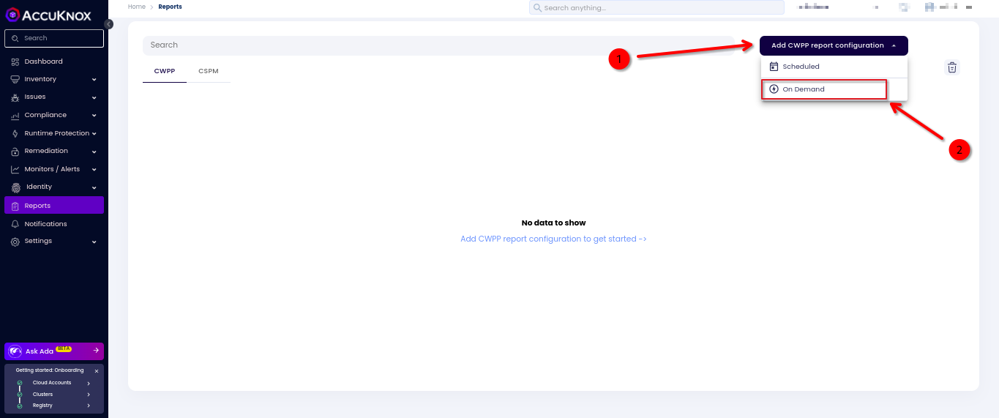
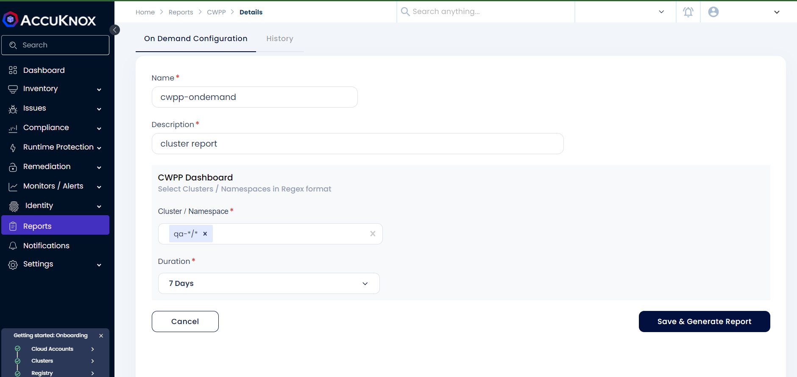
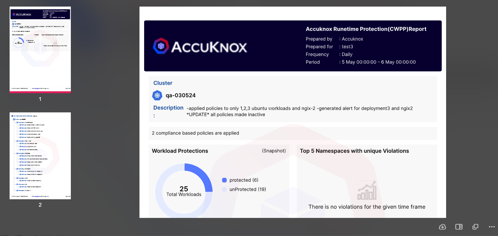
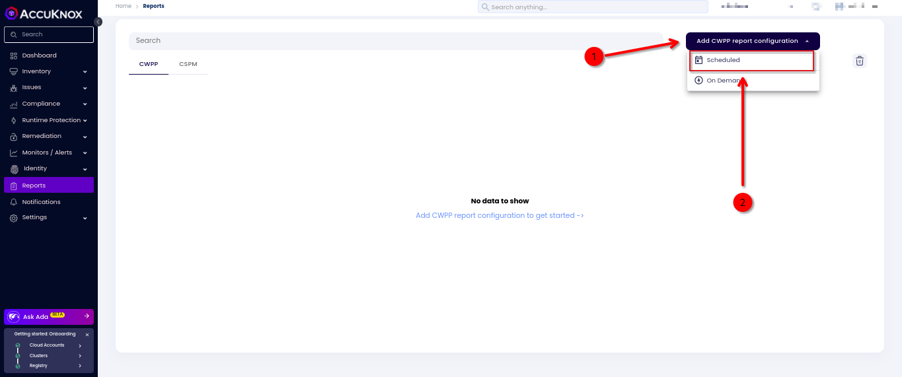
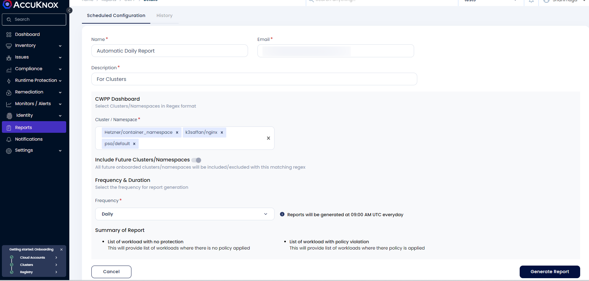
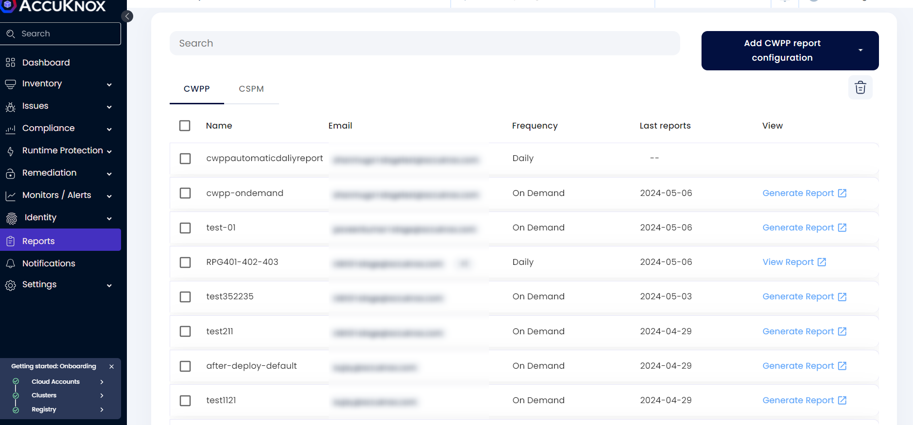
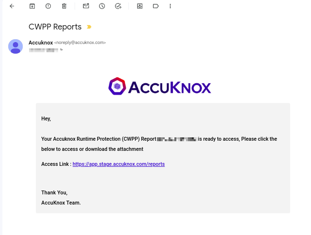

# CWPP Report Generation

**Understand the Regex to Select the Cluster Name and Namespace**

The CWPP report generation utilizes regular expressions (regex) to specify and filter cluster names and namespaces. The syntax for regex follows a particular pattern to ensure accurate selection.

## Regex

**Regex Syntax Format**: Cluster Name Selection / Namespace Selection

### Rules for Regular Expression

**Excluding**

- To exclude a specific cluster or namespace, prefix it with a hyphen (-).

!!! info "NOTE"
    To exclude any cluster or namespace, it must be included in the selection first.

**Select all**

- Use an asterisk (*) to select all clusters or namespaces.

**Delimiter**

- A forward slash (/) is used to delimit the cluster name selection from the namespace selection.

### Examples

- `cluster1/ns1`: Include only namespace ns1 from cluster cluster1.
- `cluster1/*`: Include all namespaces from cluster cluster1.
- `cluster1/ns*`: Include namespaces starting with ns from cluster cluster1.
- `-cluster1/ns3`: Exclude namespace ns3 from cluster cluster1.
- `*/ns1`: Include namespace ns1 from all clusters.
- `*/*`: Include all namespaces from all clusters.

## Reports Configuration

Reports can be configured in two ways: On Demand and Scheduled.

### 1. On Demand Report Configuration

In On Demand Report, you can generate the report for the clusters shortly after the configuration is completed.

To generate On Demand reports:

**Step 1:** Add CWPP Report Configuration

- Go to the Reports section in AccuKnox SaaS.
- Choose "On Demand" from the drop-down menu.

**Step 2**: In the Configuration user needs to provide the details about Name, Description and Cluster and NameSpace.

!!! info "NOTE"
    The cluster field drop-down will show all the clusters that are active during the report generation.

By clicking Save and Generate Report it will generate the report in the PDF format as per the selected duration.

### 2. Scheduled Report Configuration

To get the report of the clusters automatically as per the frequency that choosen .i.e by weekly or by monthly or daily this is the go to way.

**Step 1**: To Add CWPP report configuration as Scheduled and choose the Scheduled option from the drop down.

**Step 2**: In the Configuration user needs to provide the details about their Name, Email, Selecting the Cluster, Namespace in the regex format and Frequency of the report then click the Generate Report.

**Step 3**: After finishing the configuration the report would be scheduled to be sent to you in the email. Users can reconfigure the past configurations by clicking on them to edit the configuration.

!!! info "NOTE"
    The report will be sent to the Email-ID daily at 09.00AM UTC.
