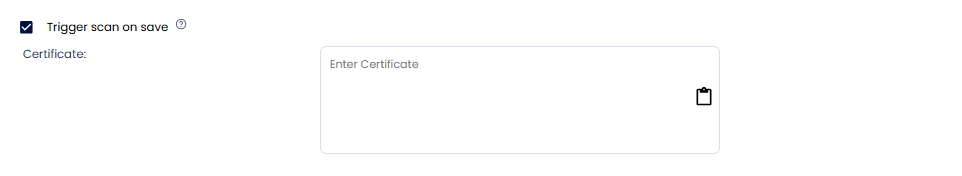

# Docker Trusted Registry Onboarding

Docker Trusted Registry is a private image storage solution that allows enterprises to securely manage and distribute Docker images within their organization. It integrates seamlessly with Docker and provides advanced features such as image signing, role-based access control, and vulnerability scanning.

## **Prerequisites**

### Docker Trusted Registry

- Requires:

    - **Registry URL**

    - Toggle **Self-Signed Certificate** if applicable

    - **Username**

    - **Password**

    - **Kubernetes Cluster** (In case of Isolated Registry)

- **Explanation**:

    - Docker Trusted Registry (DTR) is a private Docker image storage solution designed for enterprises. It provides advanced security features, allowing the storage of Docker images on-premises or in a private cloud. The self-signed certificate option ensures secure communication if DTR is configured with custom SSL certificates.

    - **Isolated Registry**:

        - If you want to run scans on the registry directly from your Kubernetes cluster, enable this option.

        - If not, leave it unchecked.

## **Setting Up Kubernetes Cluster for Isolated Registry (Optional)**

### 1. Navigate to Cluster Management

- Go to **Settings > Manage Cluster > Onboard Now**.

### 2. Enable Scanner for Isolated Registry Scan

- Enter the **Cluster Name**.

- Click **Save and Next**

- Toggle the option **Enable Scanner for Isolated Registry Scan**.

### 3. Install Agent

- Copy the agent installation command provided.

- Run the commands on the machine with access to the Kubernetes cluster.

## **Steps to Add a Registry**

### 1. Navigate to the Registry Scan Section

- Go to **Issues > Registry Scan**.

### 2. Add a New Registry

- Click on **Add Registry**.

### 3. Provide Registry Details

- **Registry Name**: Enter a name for your registry.

- **Label**: Add a label to associate findings to a particular label.

- **Description**: Provide additional information about the registry.

- **Registry Type**: Select **Docker Hub** from the dropdown menu.

### 4. Authentication Type

- Choose **Docker Trusted Registry**:

    - Provide the **Registry URL**.

    - Toggle the **Self-Signed Certificate** option if applicable.

    - Enter **Username** and **Password**.

    - **Isolated Registry**:

        - An isolated registry refers to a private environment where the registry is accessible only through specific network configurations, such as VPNs or private networks.

        - If you want to run scans on the registry directly from your Kubernetes cluster, enable this option.

        - If not, leave it unchecked.

### 5. Configure Advanced Settings

#### Image Updated Within Last:

- Choose one of the following options:

    - **X Days**: Scans only images updated within the last X days.

    - **All**: Scans all images, regardless of the update time.

#### Image Pulled Within Last:

- Choose one of the following options:

    - **X Days**: Scans only images pulled within the last X days.

    - **All**: Scans all images, regardless of the pull time.

#### **Name/Tag Pattern:**

Specify patterns to include or exclude images for scanning. Use the `-` symbol to explicitly exclude patterns.

- By default, images are excluded unless explicitly included through patterns.

- To exclude specific images, use the `-` symbol. For example:

    - To exclude `cwpp/ubuntu:v1`, use the pattern `-*:v1`.

    - To include `cwpp/ubuntu:latest`, specify a pattern like `*:latest`.

**Note**: Only images matching the pattern will be scanned. For instance, using `*:latest` ensures only images with the latest tags are scanned.

#### Schedule and Certificate:

- Set the scan schedule using a CRON expression. For example:

    - **CRON Expression**: `18 minute 07 hour * day (month) * month * day (week)`.

- Toggle **Trigger Scan on Save** to directly initiate the scan for the first time without waiting for the scheduled time.

- Finally add **Self-Signed Certificate**.

## **Viewing Registry Scan Details**

Once the configuration is complete, your registry is ready for scanning. Scans will occur based on the defined schedule and criteria. Ensure all advanced settings align with your organizational requirements for optimal results.

To view the scan results:

1. Navigate to **Issues > Registry Scan**.

2. Find your repository to view the findings.

1. Alternatively, select **Scan Queue** to check the scan status.

