# Dockerhub Registry Onboarding

**Docker Hub** is a cloud-based repository for storing, sharing, and managing Docker container images. It's like a library for container images, where you can find and download pre-built images or upload your own.

## Prerequisites

### Personal Account

- Requires:

    - **Username**

    - **Password**

- **Explanation**:
A personal account is used by individual users who own or manage their own Docker Hub repositories. These credentials authenticate access to the user's personal space in Docker Hub.

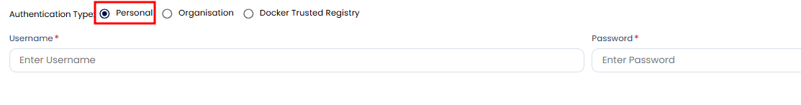

### Organization Account

- Requires:

    - **Organization Name**

    - **Username**

    - **Password**

- **Explanation**:
An organization account is suitable for teams and enterprises managing shared Docker Hub repositories. It allows multiple users to collaborate under a unified organization while maintaining individual user roles and permissions.

**Note:** Users must have pull permissions to access images stored in the enterprise repositories.

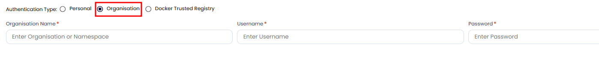

## Steps to Add a Registry

### 1. Navigate to the Registry Scan Section

- Go to **Issues > Registry Scan**.
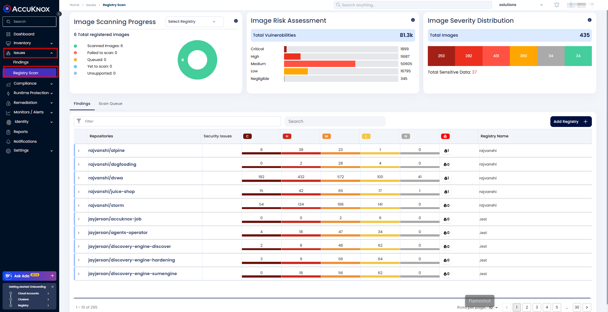

### 2. Add a New Registry

- Click on **Add Registry**.
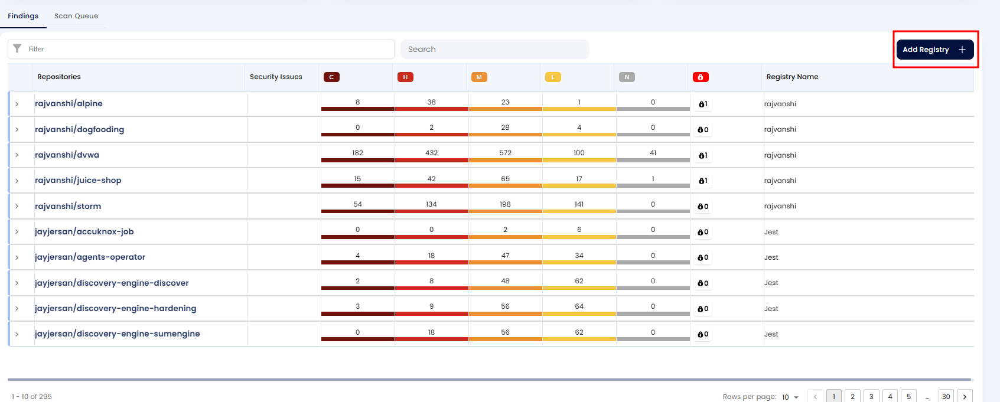

### 3. Provide Registry Details

- **Registry Name**: Enter a name for your registry.

- **Label**: Add a label to associate findings to a particular label.

- **Description**: Provide additional information about the registry.

- **Registry Type**: Select **Docker Hub** from the dropdown menu.

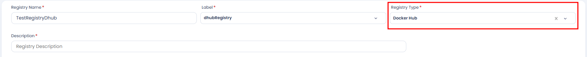

### 4. Authentication Type

- Choose an appropriate authentication type based on your Docker Hub configuration:

- **Personal**:
Requires your Docker Hub **Username** and **Password**.

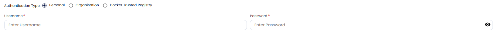

- **Organization**:
Requires your **Organization Name**, **Username**, and **Password**.

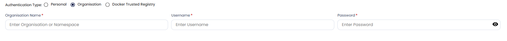

### 5. Configure Advanced Settings

#### Image Updated Within Last

Choose one of the following options:

- **X Days**: Scans only images updated within the last X days.

- **All**: Scans all images, regardless of the update time.

#### Image Pulled Within Last

Choose one of the following options:

- **X Days**: Scans only images pulled within the last X days.

- **All**: Scans all images, regardless of the pull time.

#### **Name/Tag Pattern:**

Specify patterns to include or exclude images for scanning. Use the `-` symbol to explicitly exclude patterns.

By default, images are excluded unless explicitly included through patterns.

To exclude specific images, use the `-` symbol. For example:
    - To exclude `cwpp/ubuntu:v1`, use the pattern `-*:v1`.
    - To include `cwpp/ubuntu:latest`, specify a pattern like `*:latest`.

**Note**: Only images matching the pattern will be scanned. For instance, using `*:latest` ensures only images with the latest tags are scanned.

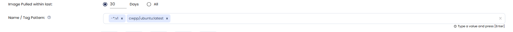

#### Schedule and Certificate

Set the scan schedule using a CRON expression. For example:
    - **CRON Expression**: `18 minute 07 hour * day (month) * month * day (week)`.

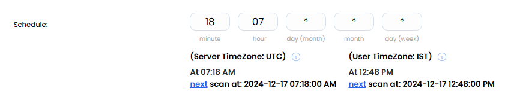

Toggle **Trigger Scan on Save** to directly initiate the scan for the first time without waiting for the scheduled time.

## **Viewing Registry Scan Details**

Once the configuration is complete, your registry is ready for scanning. Scans will occur based on the defined schedule and criteria. Ensure all advanced settings align with your organizational requirements for optimal results.

To view the scan results:

1. Navigate to **Issues > Registry Scan**.

2. Find your repository to view the findings.
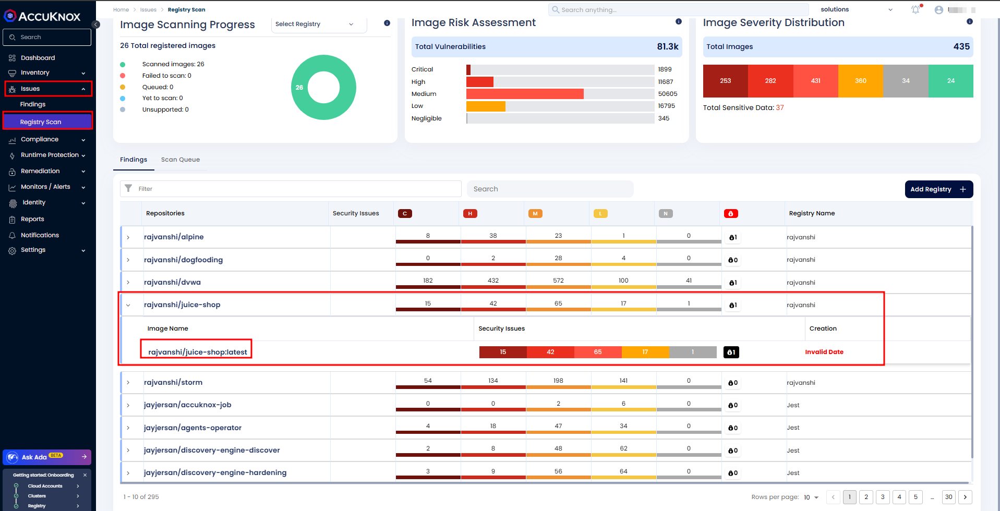

3. Alternatively, select **Scan Queue** to check the scan status.
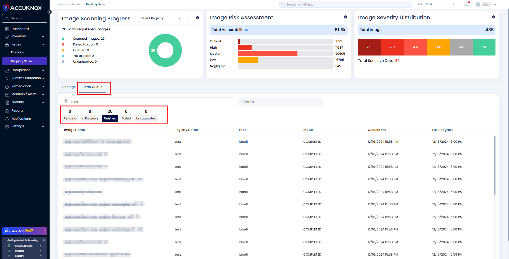
