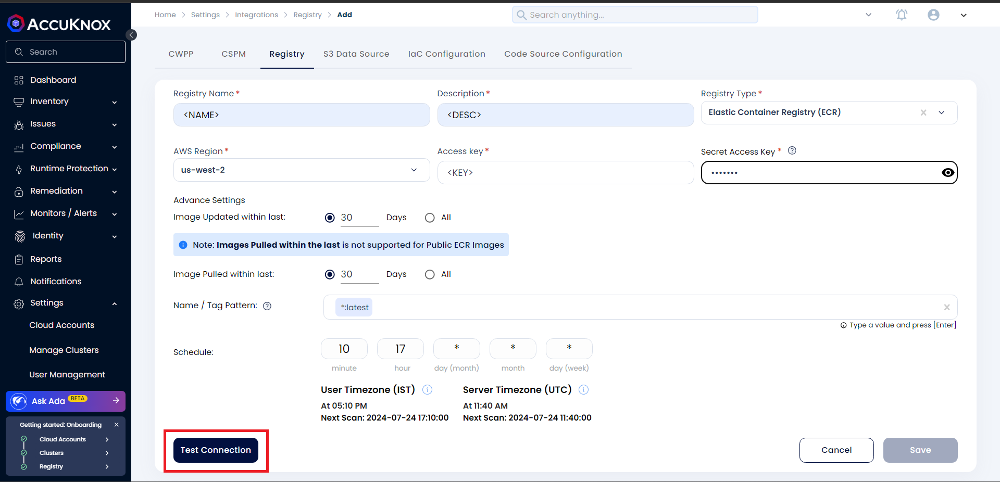
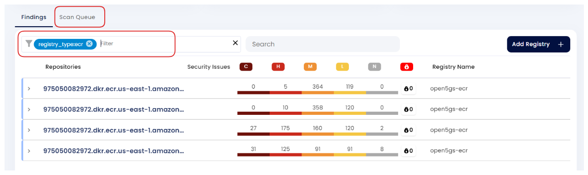

# Elastic Container Registry (ECR) Onboarding

AccuKnox CSPM security tool scans images that are present in the onboarded [Amazon Elastic Container Registry](https://aws.amazon.com/ecr/) and identifies any known vulnerabilities and risks associated with those images. These are then categorized based on their severity. User will be getting comprehensive view of these risks and vulnerabilities in the dashboard which can be remediated.

### **Steps to create IAM User in AWS for onboarding ECR**

**Step 1:** Open the AWS Management Console and sign in with your AWS account credentials.

**Step 2:** Go to the IAM console by selecting **Services** in the top left corner, then under **Security, Identity, & Compliance,** click on **IAM**


**Step 3:** Click on **Policies** in the left navigation pane to view the list of existing policies. Click the **Create policy** button.


**Step 4:** Select **JSON** from Policy Editor and insert the following JSON

```sh
{
  "Version": "2012-10-17",
  "Statement": [
    {
      "Effect": "Allow",
      "Action": [
        "ecr-public:DescribeImages",
        "ecr-public:GetAuthorizationToken",
        "ecr-public:DescribeRepositories",
        "ecr:DescribeImages",
        "ecr:GetAuthorizationToken",
        "ecr:DescribeRepositories",
        "sts:GetServiceBearerToken",
        "ecr:BatchGetImage",
        "ecr:GetDownloadUrlForLayer"
      ],
      "Resource": "*"
    }
  ]
}
```


**Step 5:** On the next page, enter the Policy name and click on **Create policy**


**Step 6:** Click on **Users** in the left navigation pane to view the list of existing users. Select the user whom you want to add the policies to


**Step 7:** Click on **Add permissions** button in the user and select the **Attach policies directly** option to select the custom policies that is created


**Step 8:** Switch to **Security credentials** and click on **Create access keys**


Select **Third Party Service** and complete creating the Access Keys


Copy the Access and Secret Access Keys for onboarding the registry on AccuKnox SaaS.


### **Steps to onboard the registry on AccuKnox SaaS**

**Step 1:** Login to the AccuKnox SaaS and Navigate to Issues → Registry Scan. Click on **Add Registry**


**Step 2:** Enter the Registry Name, Registry Type, AWS Region of the ECR Registry along with Access key and Secret Access key from the IAM user that was copied.

Click on **Test Connection** and then click on the enabled **Save** button



**Step 3:** A popup appears that the registry is added on successful onboarding. Navigate to Issues → Registry Scan to view the scan results. You can check the status of the scan from the **Scan Queue** tab



- - -
[SCHEDULE DEMO](https://www.accuknox.com/contact-us){ .md-button .md-button--primary }