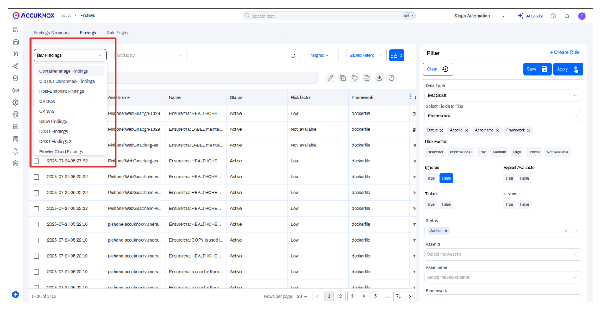

# Findings Lifecycle

AccuKnox's **Findings Lifecycle** is designed to help you efficiently manage security issues from initial detection to final resolution. It provides a structured workflow to **track, prioritize, and remediate vulnerabilities**, ensuring you can focus on what matters most and reduce alert fatigue.

This lifecycle applies to all finding types, including **Infrastructure as Code (IaC)**, **container images**, **Kubernetes**, and more.

## How the Lifecycle Works

The lifecycle of a finding is managed through **status flags**. AccuKnox helps by automatically updating statuses based on scan results while still giving you the flexibility to manage them manually.

### Automated Status Updates

To streamline your workflow, AccuKnox automatically tracks and updates the status of findings across scans:

1. **First Scan – Finding Detected**
   Any new finding is automatically assigned the `Active` status.

2. **Second Scan – Finding Not Detected**
   If the issue has been remediated and is no longer detected, the status changes to `Waiting for Verification`.

3. **Third Scan – Still Not Detected**
   If the finding remains absent in the third consecutive scan, the system marks it as `Fixed`.

### Manual Status Management

For more complex workflows, you can manually update a finding’s status from its **detail view**.

Available statuses include:

- **`Active`**: New, unaddressed finding.
- **`In Progress`**: Being actively remediated.
- **`Waiting for 3rd Party`**: Blocked by an external team or vendor.
- **`Potential`**: Needs further investigation to confirm.
- **`Accepted Risk`**: Reviewed and accepted by your organization.
- **`Duplicate`**: Duplicate of an existing finding.
- **`Exception Requested`**: An exception has been formally requested.
- **`Waiting for Verification`**: Fix applied; awaiting confirmation.
- **`Fixed`**: Remediation completed and verified.

## Managing and Remediating Findings

Use the lifecycle features to reduce noise and actively improve your security posture.

### 1. Filter to Focus Your View

The **Findings** page may contain thousands of items. Use the **Filter** panel to narrow down your list by:

- **Status** (e.g., `Active`)
- **Asset Name**
- **Risk Factor**
- **Framework**

This helps your team stay focused.

### 2. Investigate and Remediate with Guided Solutions

Click on any finding to view detailed context. Navigate to the **Solution** tab for:

- Step-by-step remediation instructions
- Pre-generated code snippets
- Links to relevant documentation

### 3. Integrate with Your Workflow (Ticketing)

Need to involve your team or track progress externally? Use the **Create Ticket** button to integrate findings with tools like:

- **Jira**
- **ServiceNow**
- Other ticketing systems (see all integrations [here](https://help.accuknox.com/integrations/ticket-template/ "https://help.accuknox.com/integrations/ticket-template/"))

## Benefits of Using the Findings Lifecycle

- **Reduce Noise**: Automatically close fixed vulnerabilities and highlight active ones.
- **Streamline Remediation**: Apply a consistent, structured process across your team.
- **Improve Collaboration**: Status updates and ticketing integrations ensure alignment.
- **Audit Trail**: Maintain a complete history of actions for each finding — perfect for compliance and reporting.
