# GAR Onboarding

When [Google Artifact Registry](https://cloud.google.com/artifact-registry/docs) with images is onboarded into AccuKnox SaaS platform, the images are scanned continuously. The risks and vulnerabilities associated with these images are identified and shown in the scan results. The vulnerabilities are classified based on the CVSS Scores.

## Steps to create service account in GCP for onboarding GAR

**Step 1**: Open the GCP Management Console and sign in with your GCP account credentials. Select the Project in which the GAR registry to be scanned is located

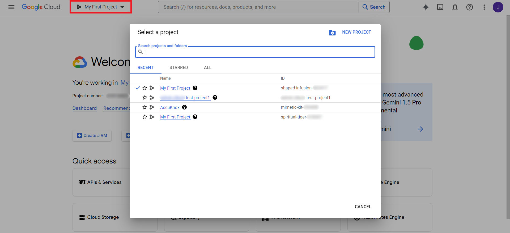

**Step 2**: In the Navigation Menu, goto **IAM & Admin** → **Service Accounts**

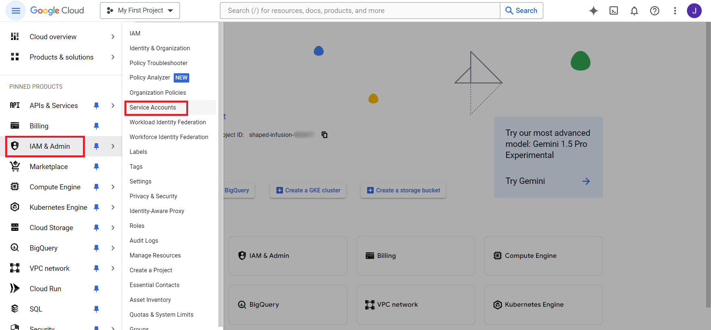

**Step 3**: Create a Service Account by selecting **Create Service Account** at the top

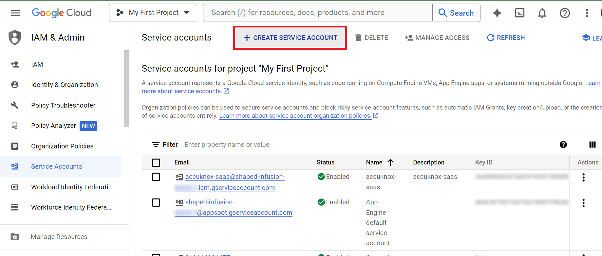

**Step 4**: Fill the Service Account Details such as name, description and then click **Create and Continue**

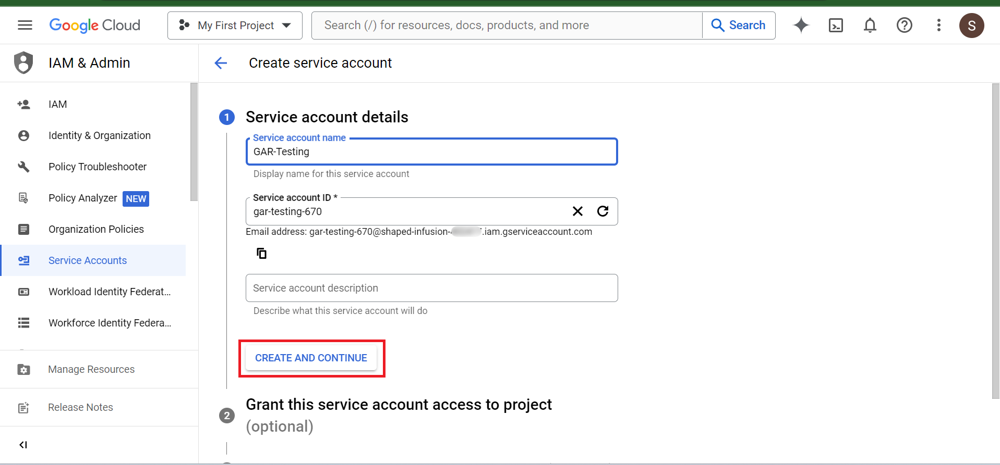

**Step 5**: We need two prerequisite roles for this - `Cloud Apigee Registry Viewer` and `Artifact Registry Reader`. Click on **Add Role** and search for `Cloud Apigee Registry Viewer` and `Artifact Registry Reader` and select them. Click **Continue** and **Done**

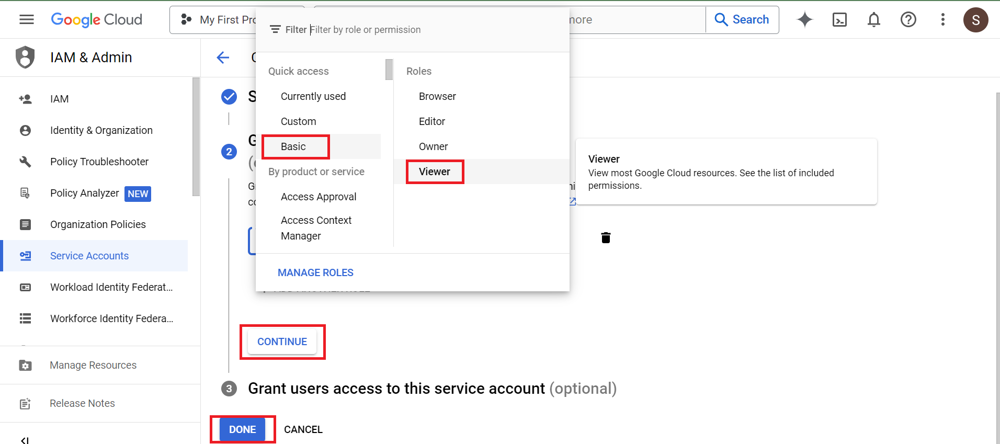

If you like, refer to what the permissions granted by the two roles:

- [Cloud IAM Apigee Registry Viewer Role](https://cloud.google.com/iam/docs/understanding-roles#apigeeregistry.viewer)
- [Cloud IAM Artifact Registry Reader Role](https://cloud.google.com/iam/docs/understanding-roles#artifactregistry.reader)

Here is the updated version with the new instructions replacing the old ones:

---

## Steps to create a service account token by adding the above-predefined permission

1. Navigate to the GCP Console and click on the **Service Accounts** tab, go to the created service account.

2. Click on the **Service Account Token** on the left-side panel.

3. Click on **Create Service Account Token**.

4. Fill in the **Service Account details**.

5. In the **Grant this SA to project** tab, provide the two predefined roles mentioned above (Note: For reference, see the screenshot below).

6. Click on **Done** to create the service account.

## To generate a token for that service account

1. Click on the **Service Account name** you want to generate the token for.

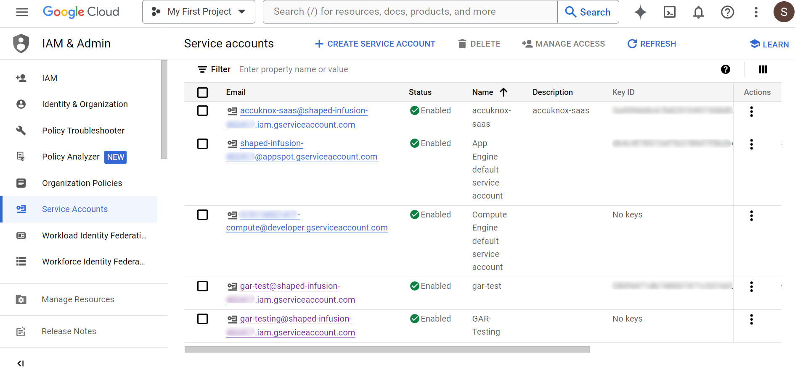

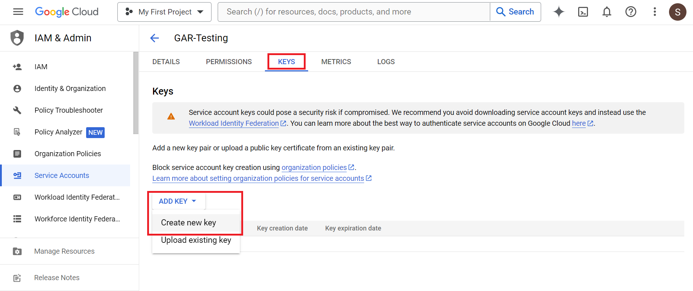

2. Go to the **Keys** tab, click on **Add Key**, and select the **Key Type** as **JSON**. This will download the JSON file to your system.

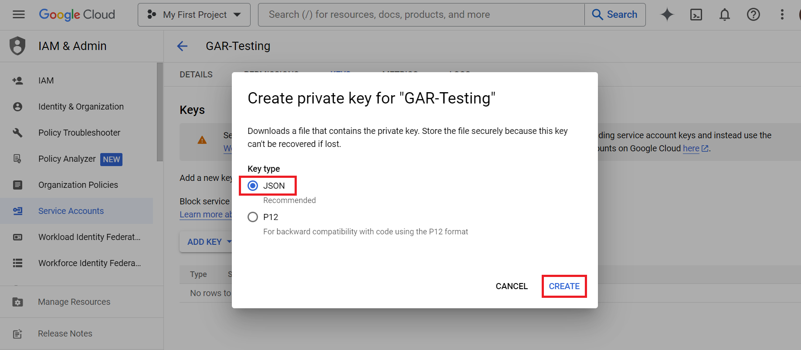

**Note:** The Private Key will be saved to your system automatically. We will require it for onboarding the GAR registry in AccuKnox SaaS.

## Steps to onboard the registry on AccuKnox SaaS

**Step 1:** Login to the AccuKnox SaaS and Navigate to Issues → Registry Scan. Click on **Add Registry**

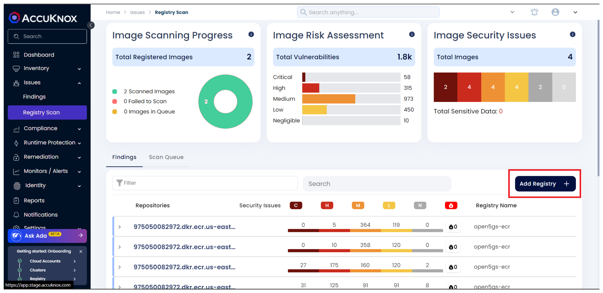

**Step 2:** Enter the Registry Name, Description, Registry Type, GCP Region where the GAR Registry is hosted and in the next field paste the ENTIRE content of the downloaded JSON key file for the service account.

Click on **Test Connection** and then click on the enabled **Save** button

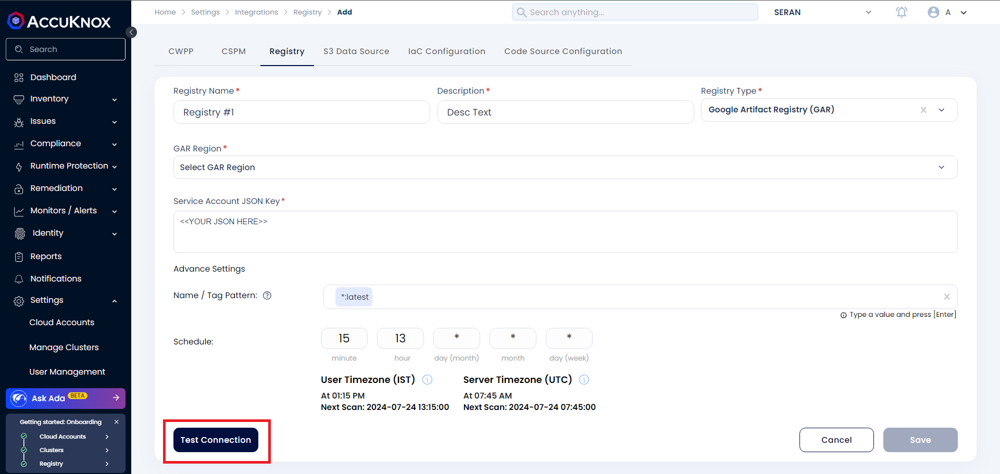

**Step 3:** A popup appears that the registry is added on successful onboarding. Navigate to Issues → Registry Scan to view the scan results. The status of the scan can be checked from the **Scan Queue** tab

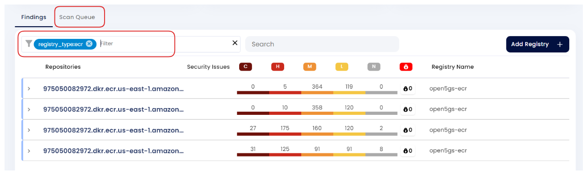

- - -
[SCHEDULE DEMO](https://www.accuknox.com/contact-us){ .md-button .md-button--primary }
