# Onboard a GCP organization

Connect your whole Google Cloud Platform (GCP) organization to AccuKnox in one pass. You fill in a short form in AccuKnox, download a Terraform script, and run it once. After that, AccuKnox lists the organization, its folders and its projects under **Settings → Cloud Accounts**.

The connection method is **Role Impersonation via Terraform Script**. The script creates the access that AccuKnox needs at the organization level, so you do not add projects one at a time.

To onboard a single GCP project instead, see [GCP account onboarding](gcp-onboarding.md).

## Prerequisites

Check this list before you start. Most failed runs come from a missing permission or a missing API.

**Access**

- An AccuKnox SaaS account.
- A Google Cloud user with access to the organization you want to onboard.

**Permissions for the Google Cloud user that runs Terraform**

The user must be able to:

- Create an organization-level custom IAM role.
- Create or update IAM role bindings at the organization, folder and project levels.
- Create IAM Deny policies, if you exclude folders or projects and the exclusion uses Deny policies.
- Read the organization resource hierarchy.
- Use the Quota Project. This needs the `serviceusage.services.use` permission, for example through `roles/serviceusage.serviceUsageConsumer`.

!!! note
    An organization administrator often has all of these permissions. Check the exact permissions of your user before you run Terraform.

**Tools on the machine that runs Terraform**

- Google Cloud CLI (`gcloud`).
- Terraform 1.9.0 or later.
- Application Default Credentials (ADC) for Terraform. To set them up, run:

    ```bash
    gcloud auth application-default login
    ```

**Values you need**

- The **Organization ID** of your GCP organization. To find it, run `gcloud organizations list`, or see [Getting your organization resource ID](https://cloud.google.com/resource-manager/docs/creating-managing-organization#retrieving_your_organization_id).
- A **Quota Project ID**. This is a GCP project that Google bills for organization-wide API calls.
- The **Cloud Asset API** enabled in the Quota Project.

## 1. Open the Onboarding Wizard in AccuKnox

1. Log in to AccuKnox.
2. Go to **Settings → Cloud Accounts**.
3. Click **Onboard Account**.

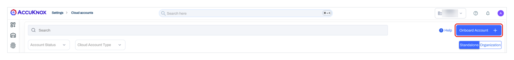

## 2. Choose GCP and Organization Account

1. Under **Select Cloud Provider**, click **Google Cloud Platform (GCP)**.
2. Under **Select Account Type**, click **Organization Account**.
3. Click **Next**.

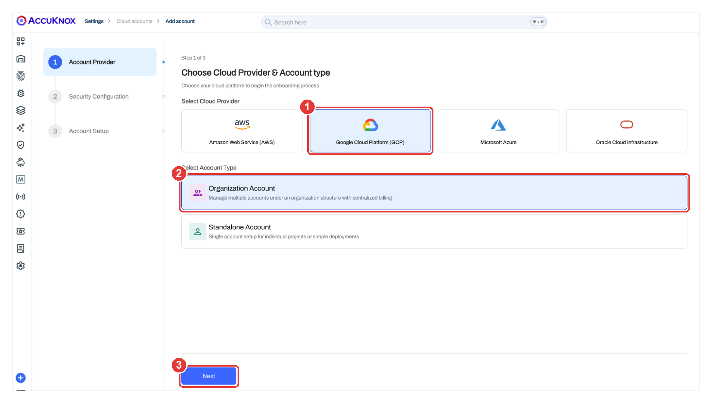

## 3. Enable CSPM Scanning

1. On the **Configure Scanning** page, turn on **Cloud Security Posture Management (CSPM)**.
2. Click **Next**.

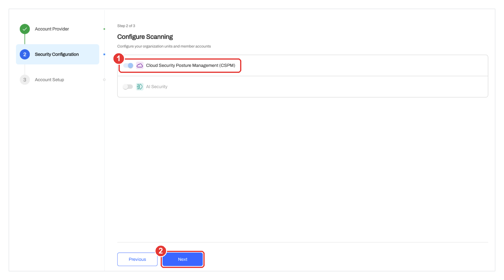

## 4. Confirm the Target Organization in Google Cloud

1. Open the [Google Cloud console](https://console.cloud.google.com/).
2. Click the resource picker at the top of the page.
3. Confirm that you are in the organization you want to onboard.

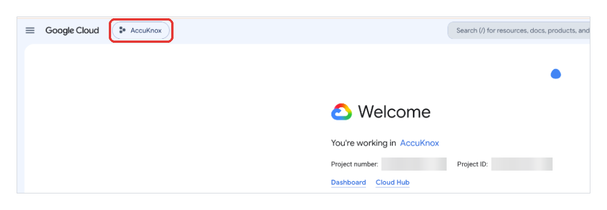

!!! warning
    Terraform changes IAM in the organization you name. Check the organization before you go on.

## 5. Enter the Organization ID and Quota Project ID

Go back to the AccuKnox onboarding page.

1. Under **Labels & Tags**, select a **Label** and a **Tag**, or create new ones. AccuKnox adds them to every asset it finds in this organization.
2. Under **Connection Method**, select **Role Impersonation via Terraform Script** (callout 1).
3. In **Organization ID**, enter your GCP organization ID (callout 2).
4. In **Quota Project ID**, enter the ID of your quota project (callout 3).

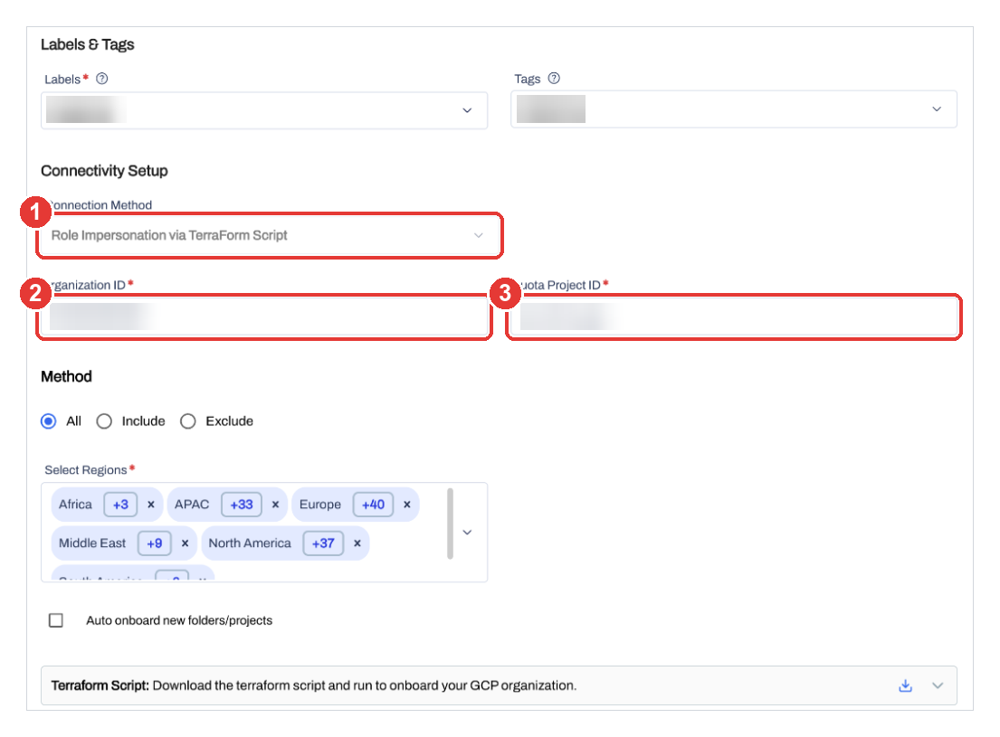

## 6. Choose the Scope and Download the Terraform Script

1. Under **Method**, choose which folders and projects to onboard (callout 1):
    - **All** onboards every folder and project in the organization.
    - **Include** onboards only the folders and projects you select.
    - **Exclude** onboards everything except the folders and projects you select.
2. Under **Select Regions**, choose the GCP regions to scan (callout 2).
3. Optional: select **Auto onboard new folders/projects** (callout 3). AccuKnox then picks up new folders and projects as you create them.
4. In the **Terraform Script** row, click the download icon (callout 4).

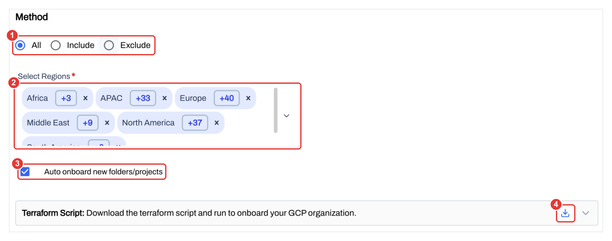

!!! tip
    Keep this browser tab open. You come back to it in step 9.

## 7. Run Terraform Init in the Script Folder

1. Extract the downloaded package.
2. Open a terminal in the folder that holds the Terraform files. The folder contains `main.tf`, `outputs.tf`, `terraform.tfvars` and `variables.tf`.
3. Run:

    ```bash
    terraform init
    ```

4. Look for `Terraform has been successfully initialized!`.

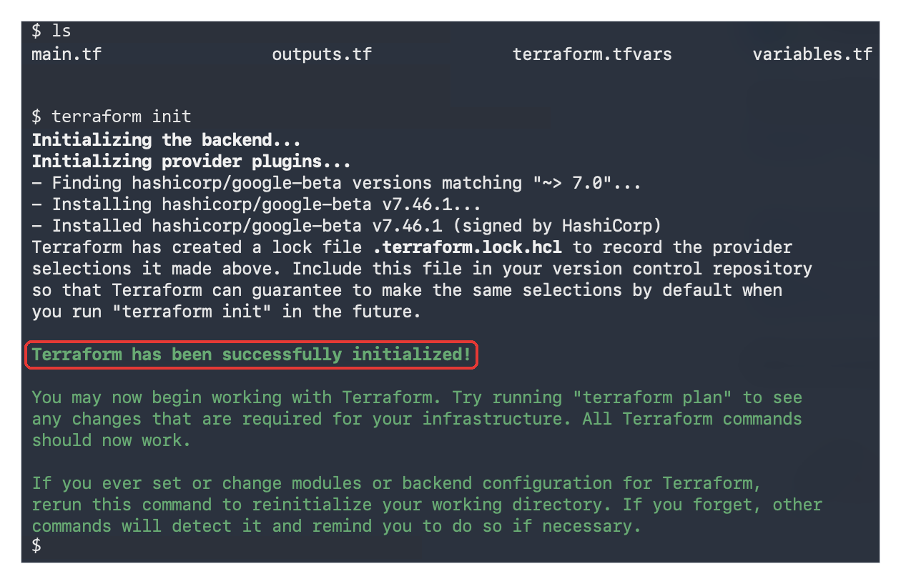

## 8. Review the Plan, Then Apply It

1. See what Terraform will create:

    ```bash
    terraform plan
    ```

2. Read the plan. Then apply it:

    ```bash
    terraform apply
    ```

3. Type `yes` when Terraform asks you to confirm.
4. Wait for `Apply complete!`. The **Outputs** section lists the service account that AccuKnox uses and the number of IAM bindings Terraform created.

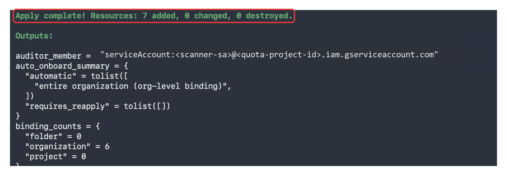

## 9. Click Verify & Connect in AccuKnox

1. Go back to the AccuKnox onboarding tab.
2. Check that the form still shows your labels and tags, connection method, Organization ID, Quota Project ID, method, regions and auto onboard choice.
3. Click **Verify & Connect**.

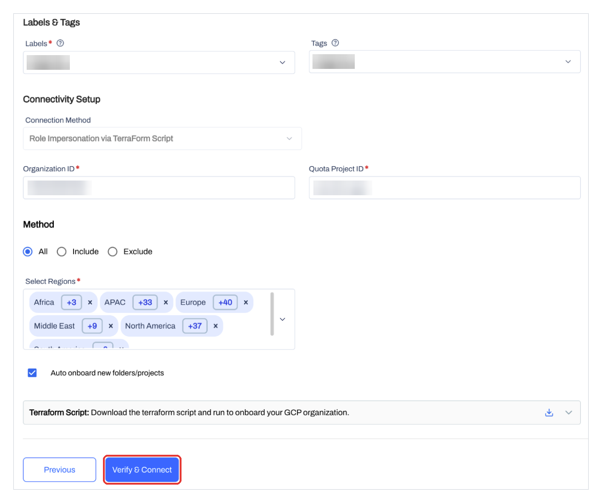

## 10. The Organization Appears in Cloud Accounts

AccuKnox shows the message `Task has been added in the queue, you will be notified once organization has been onboarded` (callout 1). Then the page opens **Cloud Accounts** on the **Organization** view.

Your GCP organization appears in the list, with its Organization ID and label (callout 2).

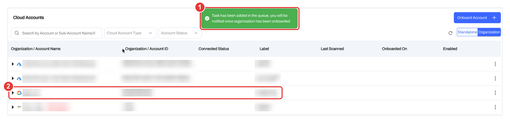

## 11. Folders and Projects Appear Under the Organization

1. Click the arrow next to your GCP organization.
2. Check that the folders (callout 2) and projects appear under it.

Each project shows **Active** in **Connected Status** when AccuKnox can reach it.

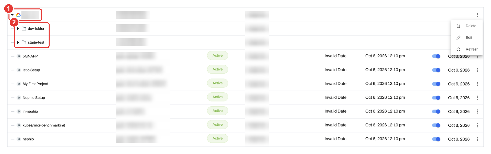

## Related

- [GCP prerequisites](cspm-prereq-gcp.md)
- [GCP IAM permissions reference](cspm-permissions-gcp.md)
- [Offboard a cloud account](cloud-offboarding.md)
