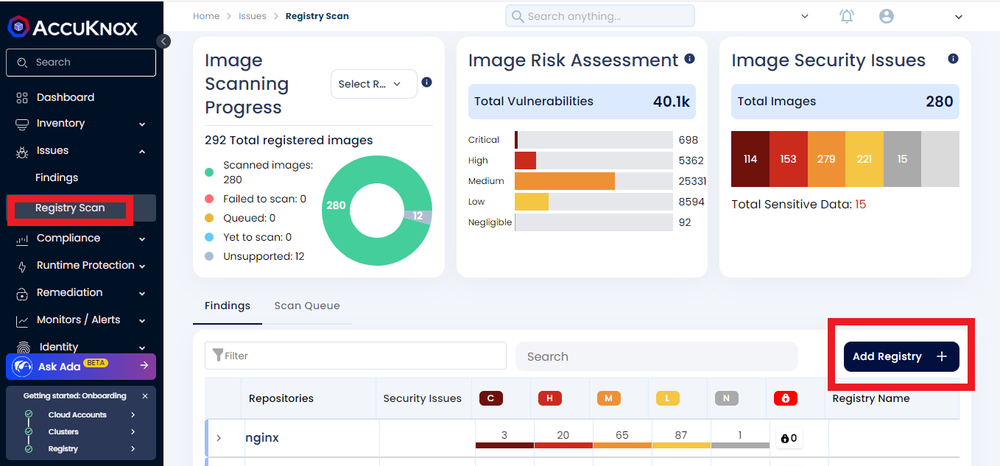
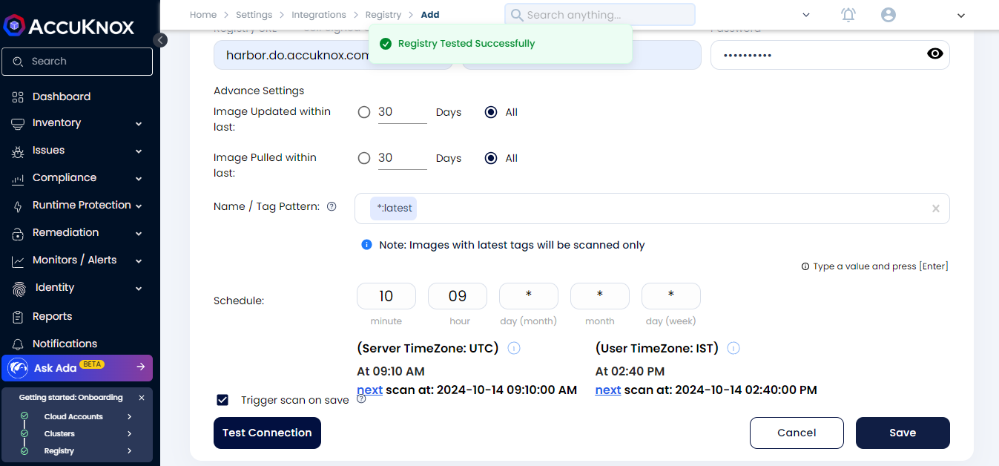
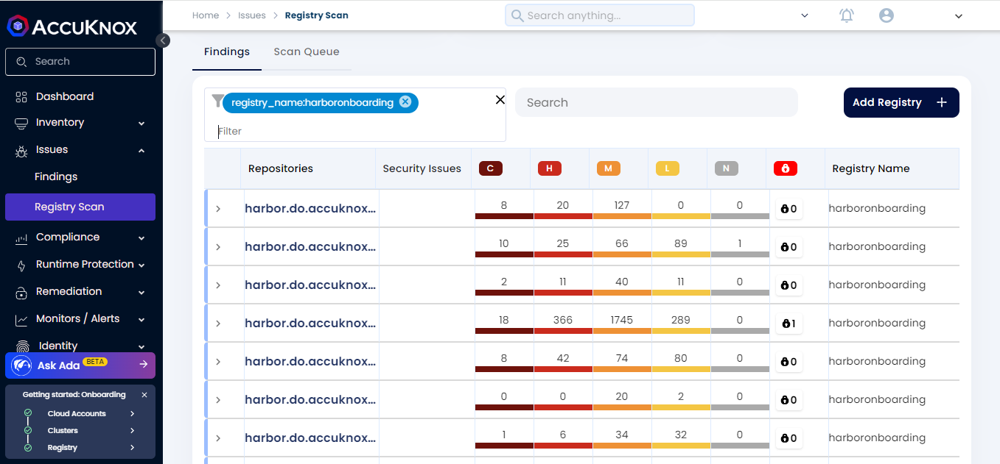
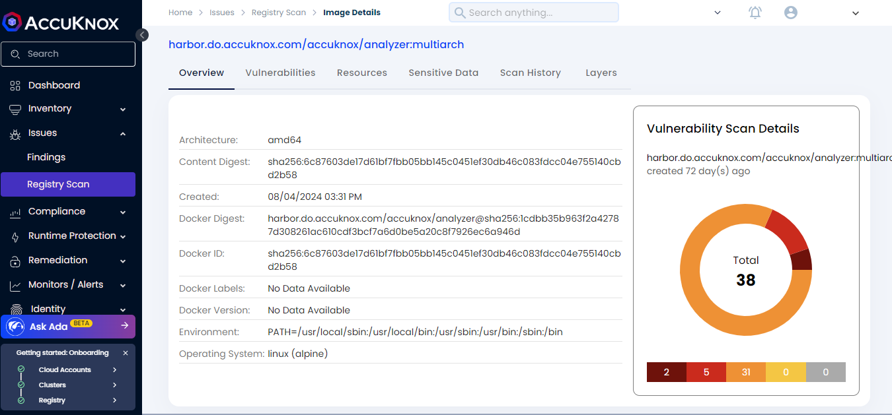

# Harbor Registry Onboarding

**Harbor** is an open-source registry that secures artifacts with policies and role-based access control, ensures images are scanned and free from vulnerabilities, and signs images as trusted.

## **Prerequisites for Harbor Registry Onboarding in AccuKnox**

In **Harbor**, users and groups are created by the admin.

If you have admin access, then log in through those credentials.

To create a new user in **Harbor**, you can follow the steps mentioned here:

[https://goharbor.io/docs/1.10/administration/managing-users/create-users-db/](https://www.google.com/url?q=https://goharbor.io/docs/1.10/administration/managing-users/create-users-db/&sa=D&source=editors&ust=1729076950833858&usg=AOvVaw1IltrM90n1QGyIN4047PCw)

After creating the user, we need to add this user as a member in the Project.

Click on **"Projects"**, select the Project in which you have to add the user.

Click on the **"Members"** tab -> **+User** -> give the username and select **"Limited Guest"** role -> **OK**

We have now added the member (user) in the Project.

Now we can onboard this user in the **AccuKnox dashboard**.

## **Steps to Onboard Harbor Registry on AccuKnox**

In the **AccuKnox dashboard**, under **Issues**, click on **"Registry Scan"**

Now, click on **"Add Registry"**

Give the registry name, select **Label**, and select **"Harbor Registry"** from the **Registry type** dropdown.

Then, paste the **Registry URL** and provide the user credentials.

Provide the **Tag pattern**, and schedule time for the scanning.

If you need to trigger the scan after saving, then click on the **"Trigger scan on save"** checkbox.

After providing all the information, click on **"Test Connection"**, it should show **"Registry Tested Successfully"**.

Now, click on **Save**.

After saving the registry, the scan will start based on the scheduled time.

To see whether the scanning is completed or not, go to **Settings** -> **Integrations** -> **Registry**

Here, we can see the list of onboarded registries and their details.

Once the scanning is completed, we can see the scan results in **Issues** -> **Registry Scan**

-> Under the **"Image Scanning Progress"** pie chart, select your registry to view the progress.

To view the details of your registry, you can use filters such as **"registry_type"**, then select the **"harbor"** registry or you can also use the filter **"registry_name"** and provide the name of your registry.

By clicking on the repositories, we can get more details about the scan results.

