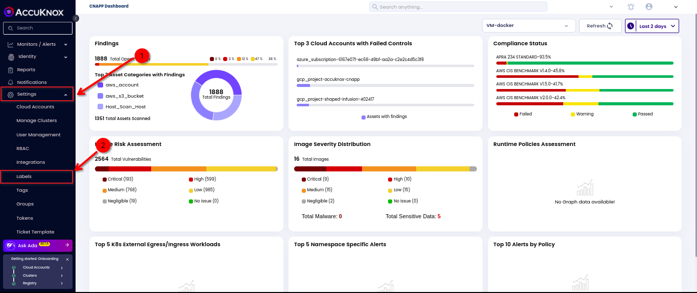
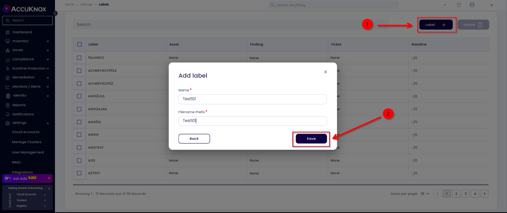

# How to Create Labels

This guide on how to create labels in AccuKnox SaaS platform helps you to organize and manage your resources effectively. Labels are key-value pairs that you can attach to resources like images, registries, and repositories. You can use labels to filter and group resources based on your requirements.

Labels are key-value pairs that are used to organize components like Policies, Cloud Accounts, and User Profiles. In the Labels section, users can create labels and can see the assets, findings, tickets, and baseline for the labels.

**Step 1:** Login to AccuKnox SaaS and navigate to Labels under Settings.

**Step 2:** Click on Labels, then click Add label. Enter the Name and Filename Prefix, and click Save. The new label will now appear in the list.

