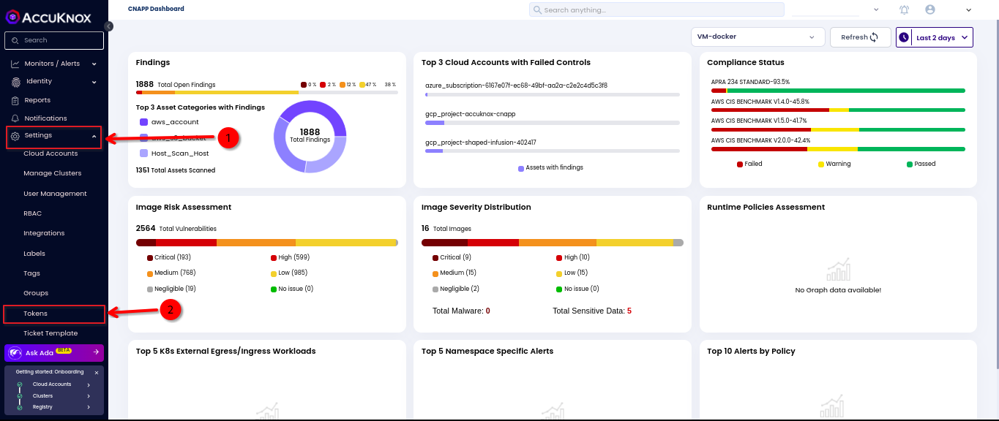
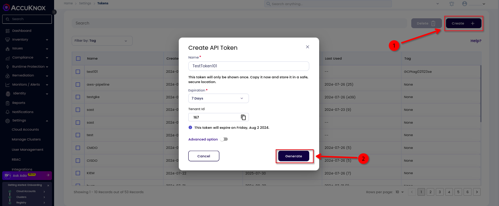
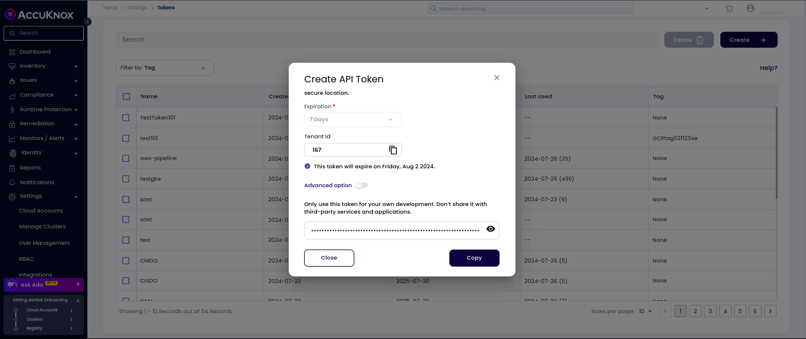

# How to Create Tokens

This guide on how to create tokens in AccuKnox SaaS platform helps you to authenticate and authorize your resources securely. Tokens are used to authenticate and authorize the users to access the AccuKnox SaaS platform. You can create tokens for different users and manage them effectively.

API Tokens are authentication credentials used to securely interact with various services and systems. They are crucial for operations such as cron job deployments and integrations with tools like KIEM, Kubernetes CIS Benchmark, and managing cluster misconfigurations. By providing controlled access, API tokens enable automated and secure management of resources and functionalities within the platform.

**Step 1:** Go to Settings and then select Tokens.

**Step 2:** On the Tokens page, click Create Token. Enter a Name (with at least one alphabetic character) and set Expiration based on your need. Optionally, users can configure Tags under Advanced Options to associate tags with the generated token. Click Generate to create the token.

Copy the token immediately and store it securely, as it will only be shown once.

