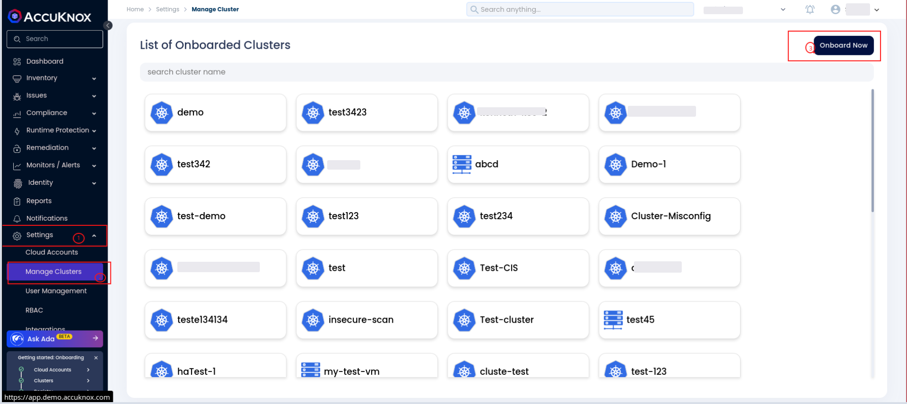
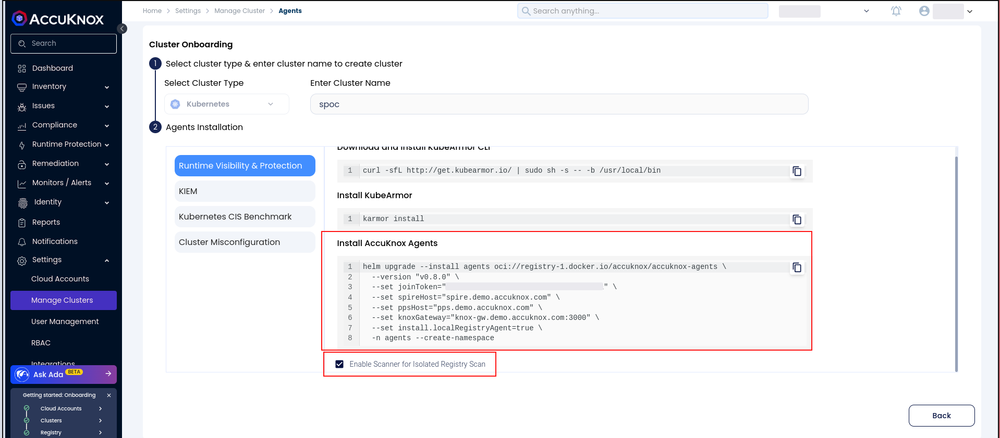
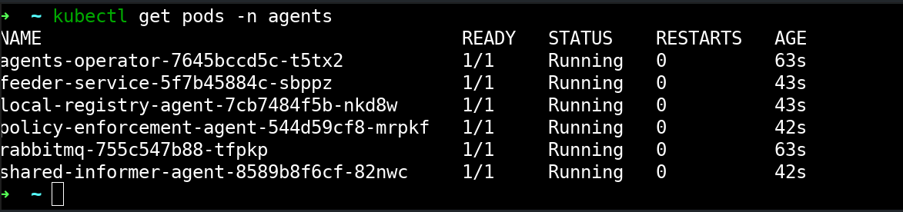
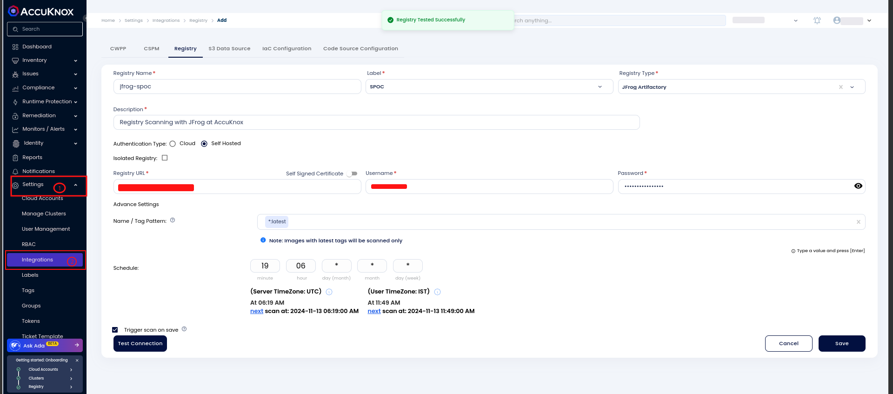
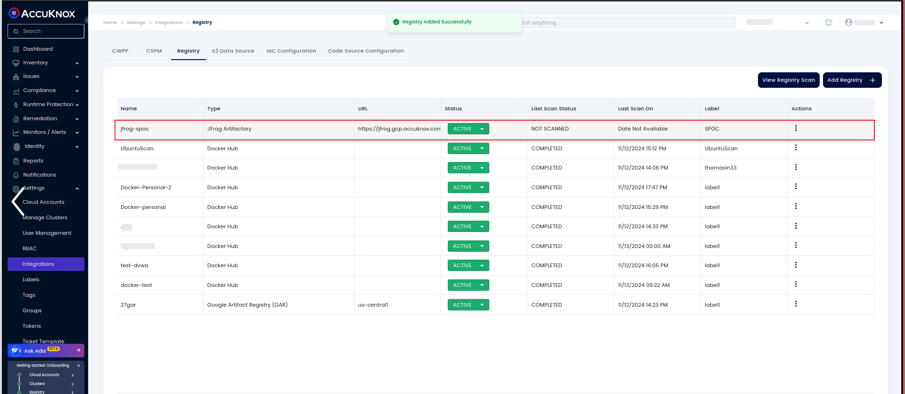
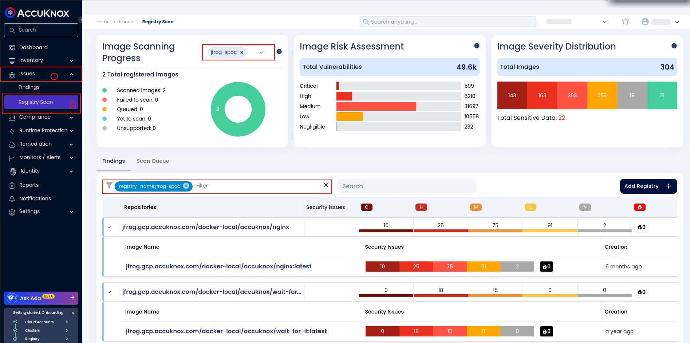
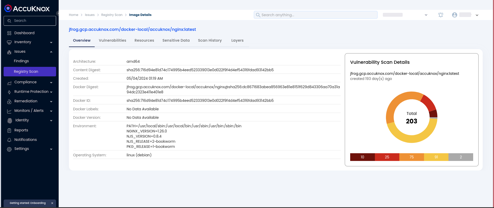

# JFrog Container Registry Onboarding

JFrog Container Registry is a secure, universal repository manager specifically optimized for storing and managing container images. Widely adopted by DevOps and software teams, it supports Docker and Helm images, offering seamless integration with CI/CD pipelines to enhance workflows and ensure image security and traceability.

JFrog Artifactory offers two primary deployment options:

1. **Cloud-Based**: Managed by JFrog, offering scalability and minimal maintenance for teams preferring a ready-to-use solution.

2. **Self-Hosted**: On-premise for strict security needs, giving organizations control over configurations, with support for deployment in isolated networks.

## **AccuKnox Support for JFrog Container Registry Scanning**

AccuKnox provides robust security scanning for container images stored in the JFrog Container Registry, regardless of deployment type. Supporting both cloud-based and self-hosted JFrog instances.

- **Cloud-Based JFrog Scanning**: For the JFrog Container Registry deployed in the cloud, AccuKnox connects seamlessly to scan images and detect vulnerabilities in real time.

- **Self-Hosted JFrog Scanning**: AccuKnox also supports self-hosted JFrog Container Registry deployments, providing vulnerability scanning for images in private, on-premise environments.

    - **Isolated Network Support**: AccuKnox can connect to self-hosted JFrog instances in isolated or air-gapped networks. This enables secure scanning in environments with strict compliance or network restrictions, ensuring continuous monitoring without compromising security.

The following steps outline how to onboard your JFrog Container Registry into the AccuKnox platform for ongoing security scanning, giving you real-time insights into vulnerabilities and risks within your container images.

### Scanning an Isolated Registry

> **Important**: If you're using a non-isolated JFrog Container Registry (cloud-based or non-isolated self-hosted), you can skip this section. This part applies **only** to **isolated JFrog instances**.

To get started with scanning a JFrog isolated container registry, ensure the following prerequisites are met:

1. Set up an **isolated JFrog container registry**.

2. Ensure you have access to a Kubernetes cluster where the **AccuKnox agents** can be onboarded.

Once your registry is set up, the next step is to onboard the AccuKnox agents to your Kubernetes cluster.

1. Navigate to **Settings** > **Manage Cluster** in the AccuKnox platform.

2. Click **Onboard Now** to begin the process.


3. Provide an appropriate name for your cluster in the form that appears. During the agent installation process, ensure that the **Scanner for Isolated Registry Scan** option is enabled.


4. Run the following Helm command to install the AccuKnox agents

```bash
helm upgrade --install agents oci://registry-1.docker.io/accuknox/accuknox-agents \
  --version "v0.8.0" \
  --set joinToken="<TOKEN>" \
  --set spireHost="spire.demo.accuknox.com" \
  --set ppsHost="pps.demo.accuknox.com" \
  --set knoxGateway="knox-gw.demo.accuknox.com:3000" \
  --set install.localRegistryAgent=true \
  -n agents --create-namespace
```

5. Verify the installation of the agents by running the following command:

`kubectl get pods -n agents`



Once the agents are installed, navigate to the Cluster View in AccuKnox to ensure that your onboarded cluster is live and ready for scanning. This completes the onboarding process for scanning an isolated container registry in AccuKnox. The next step is to configure the registry scanning, as outlined in the previous sections.

### Configuring the **JFrog** Registry

For this example, we'll proceed with **JFrog Self-hosted**.

Next, configure the self-hosted registry to begin scanning. Choose between **JFrog Cloud** or **Self-hosted**.

1. Go to **Settings** -> **Integration** -> **Registry**.

2. Click on the **Add Registry** button

3. Fill out the required fields such as:

    1. Name

    2. Description

    3. Registry Type

    4. URL

    5. Credentials

    6. Cron Expression (for scheduled scans)

4. If your JFrog Container Registry is in an isolated mode, ensure that the **Isolated Registry** flag is enabled in the onboarding form

5. Test the connection. If the configuration is correct, you will receive a successful response.


6. Once the connection is verified, save the form and create the registry.
After the registry is configured and connected, it will appear as **Active** in the registry list.



AccuKnox will begin scanning at the scheduled time specified during the configuration or If you've enabled the **Trigger scan on the save** option, the first scan will start immediately. Once the scan completes, navigate to the registry page to view the results.

### Viewing Scan Details

After the scan is completed, you can explore detailed information about the registry:

1. Go to **Issues** -> **Findings** -> **Registry Scan**.

2. Filter the results to view the onboarded registry.

3. Click on an image to see a detailed view of the metadata, vulnerabilities, and other scan details.

In the **JFrog Self-hosted Registry** that we onboarded to AccuKnox during this presentation, there is a specific package, **accuknox/nginx**. Below, you can see the associated vulnerabilities for this image, as highlighted in the following screenshots.



To get more detailed information about the vulnerabilities associated with the image, simply click on the container image in the AccuKnox dashboard. This will allow you to view the metadata, including any embedded secrets and a comprehensive list of the vulnerabilities identified in the image. You will also be able to explore the severity of these vulnerabilities, CVSS scores, and recommended remediation actions.



Integrating JFrog Container Registry with AccuKnox ensures continuous security scanning for container images, whether cloud-based or self-hosted. For isolated networks, AccuKnox provides secure, compliance-friendly scanning, helping you detect and address vulnerabilities efficiently.
