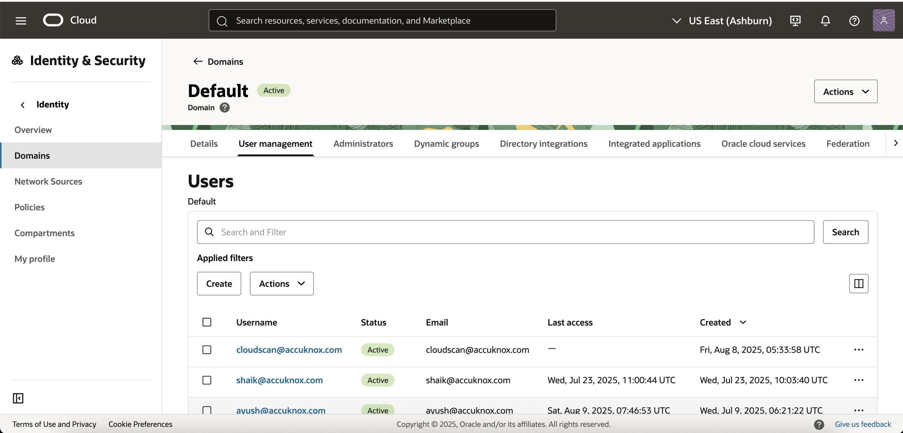
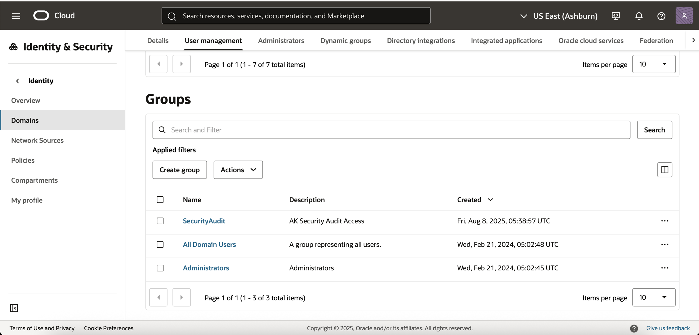
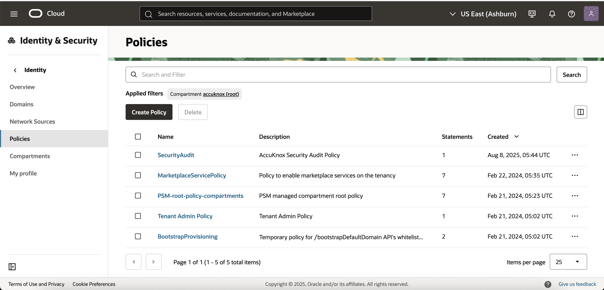
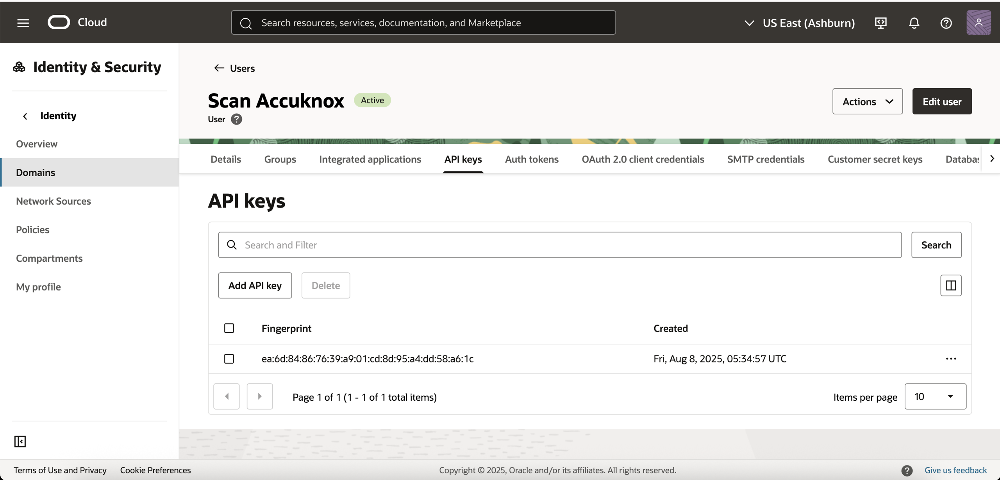
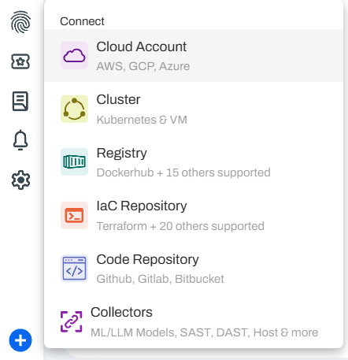
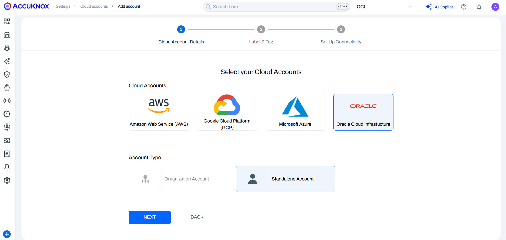
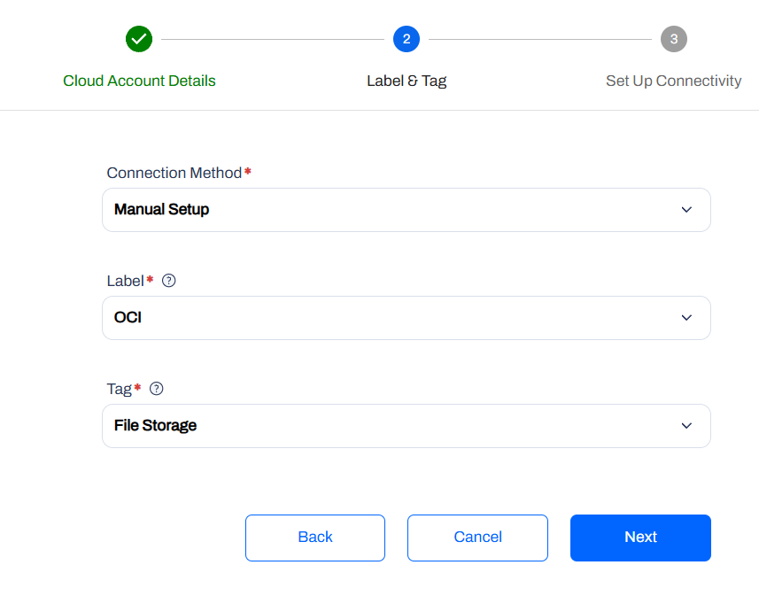
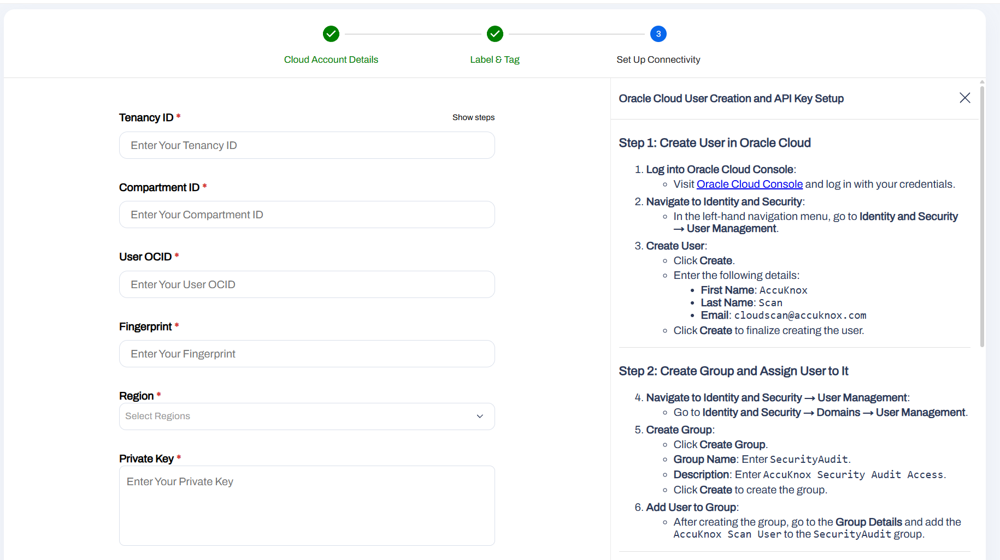
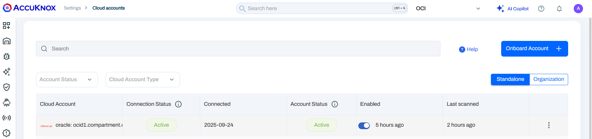
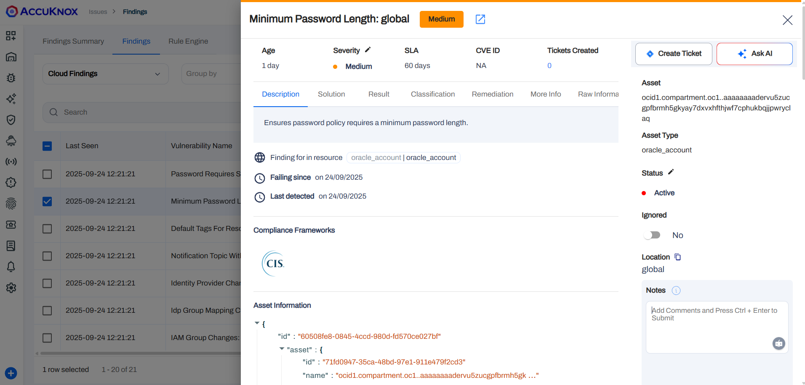

# Onboarding Oracle Cloud Infrastructure (OCI) to AccuKnox

This guide will walk you through the two main stages of the process:

1. **Configuring OCI**: Creating a dedicated read-only user, group, and policy in your Oracle Cloud account.
2. **Onboarding to AccuKnox**: Using the credentials generated from OCI to connect your account to the AccuKnox platform.

## Part 1: Configure Your Oracle Cloud Infrastructure (OCI) Account

Follow these steps to create a secure, read-only access configuration for AccuKnox within your OCI console. 🔐

### 1. Create a New User

First, we'll create a dedicated user for AccuKnox.

1. Log in to your **Oracle Cloud Console**.
2. Navigate to the main menu ☰ and go to **Identity & Security**.
3. Under **Identity**, click on **Domains**.
4. Select the appropriate domain (usually the **Default** domain).
5. In the left pane, click on **Users**.
6. Click **Create user**.
7. Enter the following details:
      * **First Name**: `AccuKnox`
      * **Last Name**: `Scan`
      * **Email / Username**: `cloudscan@accuknox.com`
8. Click **Create**.



### 2. Create a New Group

Next, create a group to hold the new user and assign permissions to it.

1. In the same domain settings, click on **Groups** in the left pane.
2. Click **Create group**.
3. Enter the following details:
      * **Name**: `SecurityAudit`
      * **Description**: `AccuKnox Security Audit Access`
4. Click **Create**.
5. After the group is created, click on its name (`SecurityAudit`) from the list.
6. Click **Add user to group** and select the **AccuKnox Scan** user you created earlier.



### 3. Create a Read-Only Policy

This policy grants the `SecurityAudit` group read-only access to all resources in your tenancy.

1. Navigate to the main menu ☰ and go to **Identity & Security**.
2. Under **Identity**, click on **Policies**.
3. Ensure you are in your root compartment to apply the policy to the entire tenancy.
4. Click **Create Policy**.


5. Enter the following details:
      * **Name**: `SecurityAudit`
      * **Description**: `AccuKnox Security Audit Policy`
6. Switch the **Policy Builder** to the **Manual editor**.
7. In the text box, enter the following policy statement:

    ```
    Allow group SecurityAudit to read all-resources in tenancy
    ```

8. Click **Create**.

### 4. Generate API Keys

Finally, generate the API keys that AccuKnox will use to connect to your account.

1. Navigate back to the **AccuKnox Scan** user profile (**Identity & Security** -> **Domains** -> Your Domain -> **Users** -> **AccuKnox Scan**).
2. In the left pane under **Resources**, click **API Keys**.
3. Click **Add API key**.


4. Select the **Generate API key pair** option.
5. Click **Download Private Key** and **Download Public Key**. **Save the private key file (`.pem`) in a secure location**; you will need its contents shortly.
6. Click **Add**.
7. A **Configuration File Preview** will appear in a pop-up window. **Copy the entire text block** and save it to a temporary text file. This contains your `User OCID`, `Tenancy OCID`, `Key Fingerprint`, and `Region`.

You now have all the necessary information from OCI!

-----

## Part 2: Onboard Your OCI Account in AccuKnox

Now, let's use the credentials you just created to connect your account to the AccuKnox platform. ✨

1. **Log in** to your AccuKnox account.


2. Navigate to **Settings** ⚙️ and select **Cloud Accounts**.

3. Click the **Add Account** button.


4. Select **Oracle** from the list of cloud providers.

5. You may be prompted to add optional labels and tags for better organization. Configure them as needed and proceed.


6. You will now see the credential entry screen. Fill in the fields using the information you saved from the OCI console in the previous steps, use your OCI config file and the private key you downloaded:
    - User OCID
    - Tenancy OCID
    - Fingerprint
    - Region
    - Private Key

    

Click **Add** and AccuKnox will validate the credentials and connect to your OCI account. You should see your newly added Oracle account in the list on the **Cloud Accounts** page.



### Viewing and Managing Your Onboarded OCI Account

Once the Oracle Cloud account is onboarded, you can shortly view the **Cloud Findings** by navigating to the Issues -> Cloud Findings -> Cloud Scan and selecting the Oracle account from the dropdown to view the findings specific to that account.



