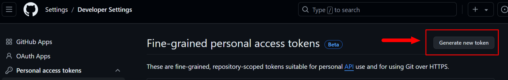
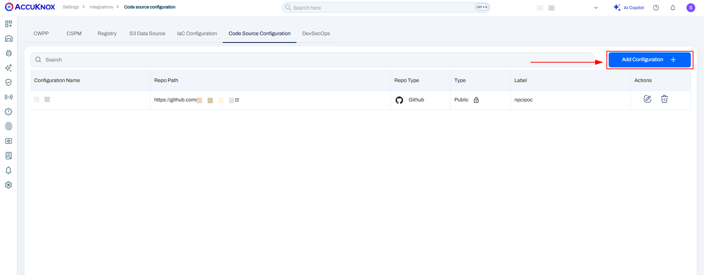
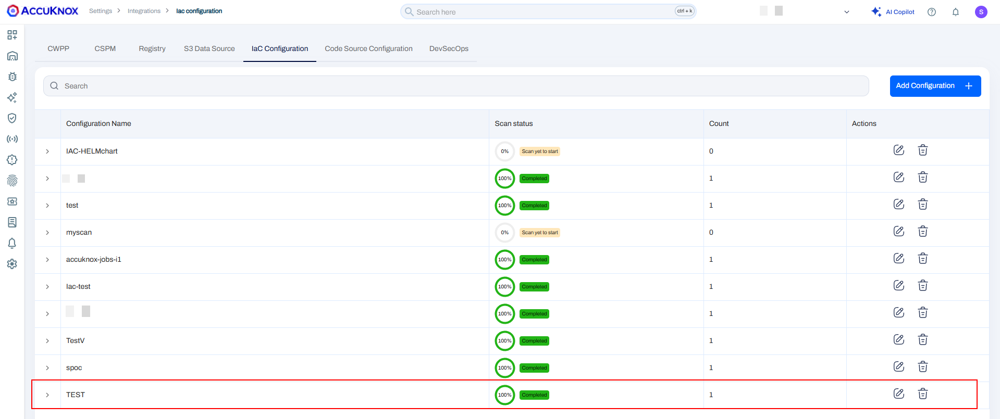
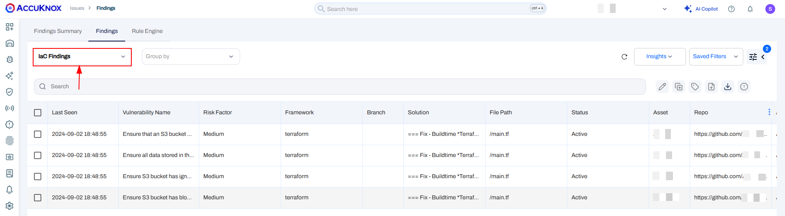
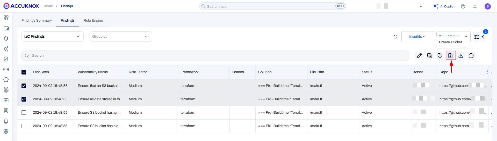
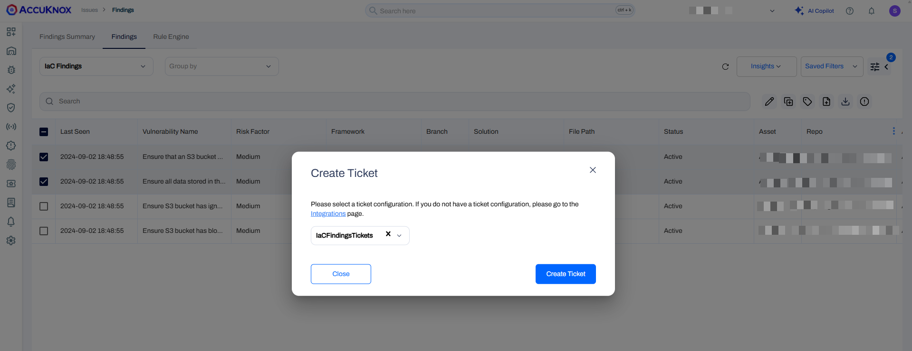
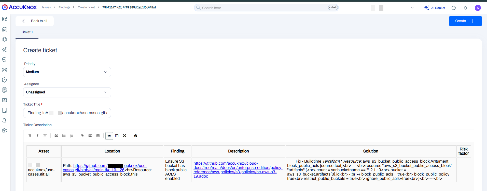

# Onboarding a Private Github Repo

## Configuration

### Prerequisites

For Github the IaC Scan from AccuKnox SaaS we require three prerequisites. They are as follows:

- Creating Fine-Grained tokens from GitHub for Private Repos only
- Label creation
- Adding the Code repository

### Creating fine-grained tokens from GitHub  

For generating the fine-grained access token from GitHub users need to do the following steps.

**Step 1:** Go to the Github profile and select Settings.

**Step 2:** Select the Developer Settings in Settings options

**Step 3:** Select the Personal Access token-> Fine-Grained Access token

**Step 4:** Click on the Generate new token option

**Step 5:** Please fill out the token name, description, Duration, and Repository that you need to onboard, and in the Repository permission section please select the content: Readonly

**Step 6:** After this click on Generate token to get the Fine Grained access token with Read-only access to the Repository

### Label Creation

After Creating the Fine-grained Access token user needs to create a label from AccuKnox SaaS. For this user need to navigate to the Settings-> label Section click on Add new label and create their label

### Adding code Repository

After creating the token from Github and Creating the label from AccuKnox SaaS. Users can onboard the Source Code Repository by following the steps below.

**Step 1:** Navigate to the Settings-> Integrations and select the Code Source Configuration

**Step 2:** Click on the Add Configuration button

**Step 3:** Fill in the name select the type as Github input the Repository URL and Fine-grained Access token and click on Verify

**Step 4:** After successful Verification, you can select the branch and Label name that was created from the SaaS.

**Step5:** Click on save to add the Source code configuration

## IaC scan

To create an IaC scan for the added Source Code Configuration users need to perform the following steps.

**Step 1:** Navigate to Settings-> Integrations and select IaC

**Step 2:** Click on Add Configuration give the name and select the Repository for which you want to schedule the IaC Scan. Select the Framework type as Kubernetes yaml, helm, or Terraform and click on save to add the IaC configuration.

**Step 3:** After saving the IaC Configuration the scan will start in the background and it will be completed sometime.

**Step 4:** After the scan is completed the progress will change to 100% completed

## Risk Assessment: How to check Findings?

After the IaC scan is completed to see the findings users need to navigate to the Issues-> Findings section and select IaC findings in the filter to see all the findings.

We can filter the findings based on the Repository, Risk Factor, and so on.

## Remediation: How to fix problems? How to create tickets?

To remediate any findings users will need to select the finding or group of findings From the issues-> Findings page and click Create Ticket as shown in the below screenshot.

!!! info
    Before this users must have integrated their Ticketing backend like Jira Servicenow or connects or Freshservice under Integrations->CSPM section

After clicking on the create ticket Icon the next page will popup

Once the user clicks on Create Ticket new page with all the information related to the IaC findings and with a predefined Priority based on the Risk Factor. The user has to click on Create to confirm the ticket creation.

