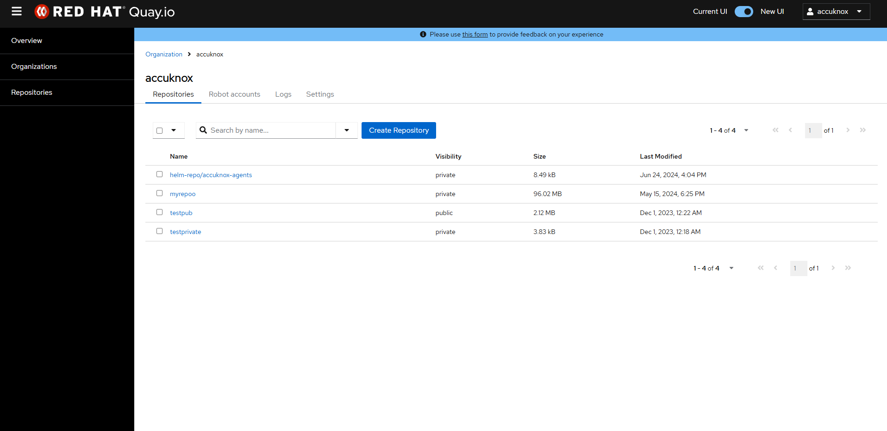
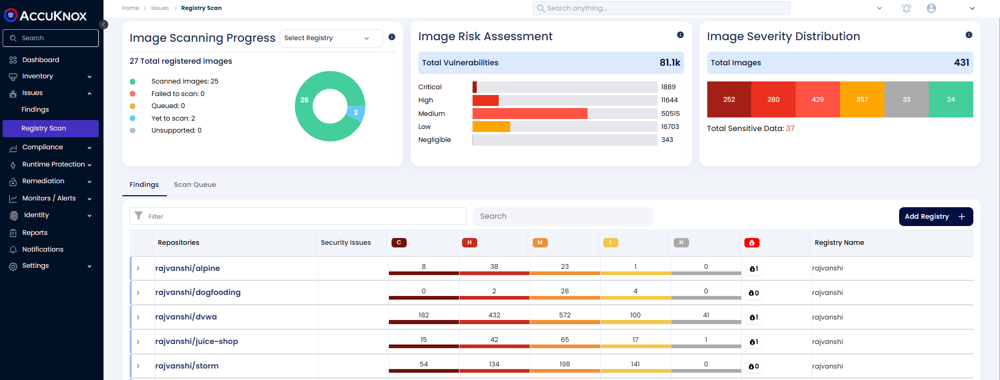
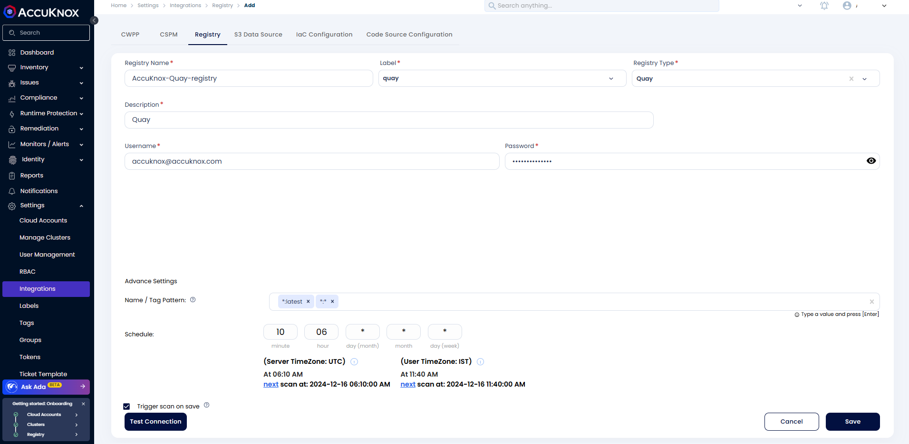
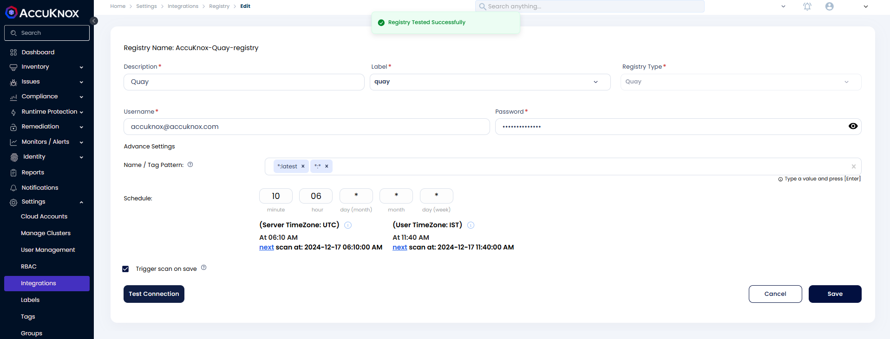
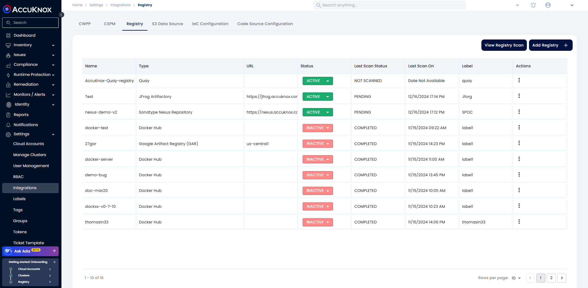
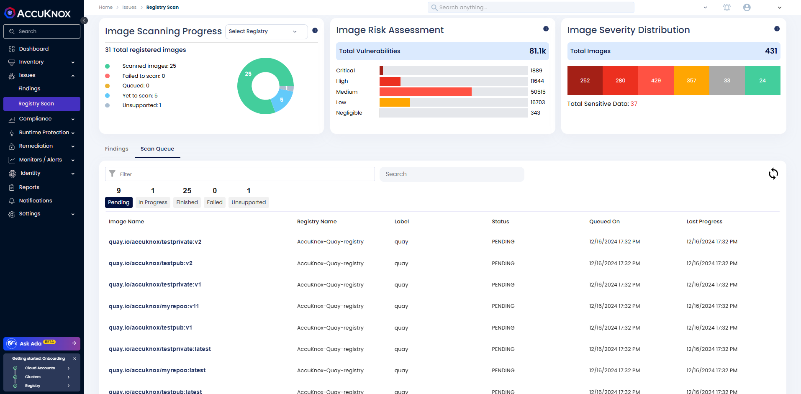
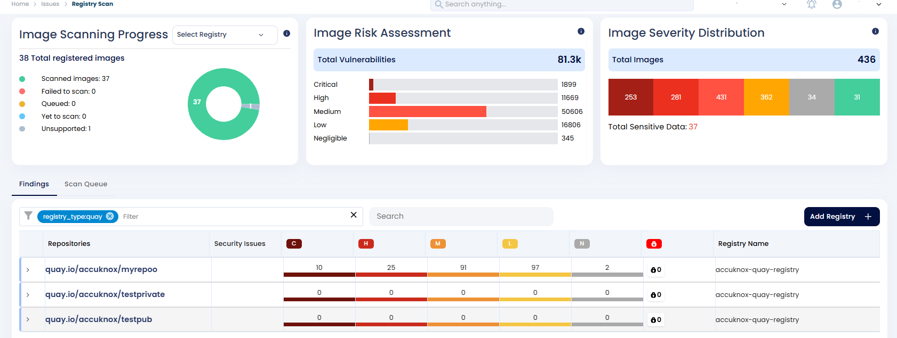
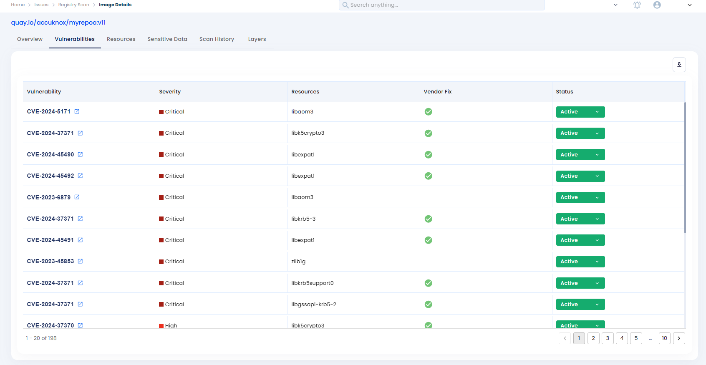

# Quay Registry Onboarding
Red Hat Quay is a fully managed hosted container image registry that offers both public and private repository options and an automated lifecycle of your containerized artifacts.

## Pre-requisites

- A valid [Quay.io](http://quay.io/ "http://Quay.io") account

- Container Images stored in the account

- User creds with at least image pull permission

## **Steps to Onboard Quay Registry on AccuKnox**

**Step 1:** In the **AccuKnox dashboard**, under **Issues**, click on **"Registry Scan"**

- Alternatively you can go to "Settings → Integration → Registry Scan"

Now, click on **"Add Registry"**

**Step 2:** Give the registry name, select **Label**, and select **"Quay"** from the **Registry type** dropdown. Then, provide the user credentials.

Provide the **Tag pattern** and schedule a time( using the cron expression) for the scanning. If you need to trigger the scan after saving, click the **"Trigger scan on save"** checkbox.

**Step 3:** After providing all the information, click on **"Test Connection"**, it should show **"Registry Tested Successfully"**.

Now, click on **Save**.

After saving the registry, the scan will start based on the scheduled time, if Trigger scan on save is checked the scan will start right after save. After saving the scan user will be redirected to **Settings** -> **Integrations** -> **Registry**. Here, we can see the list of onboarded registries and their details.

Alternatively, you can click on "**View Registry Scan**" from the list view and this will redirect to **Issues → Registry Scan**

Once the scanning is completed, we can see the scan results

Under **"Findings"**, you can find the scanned registry.

To view the details of your registry, you can use filters such as **"registry_type"**, and then select the **"quay"** registry you can also use the filter **"registry_name"** and provide the name of your registry.

By clicking on the repositories, we can get more details about the scan results.

