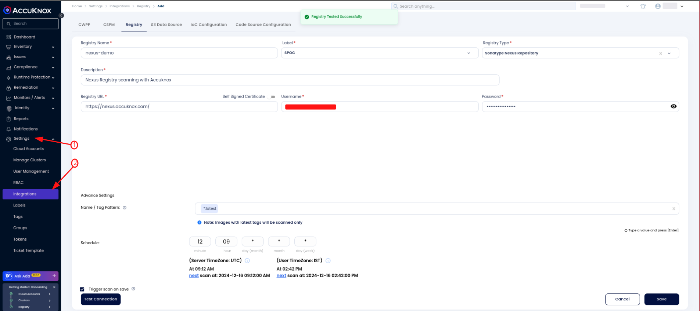
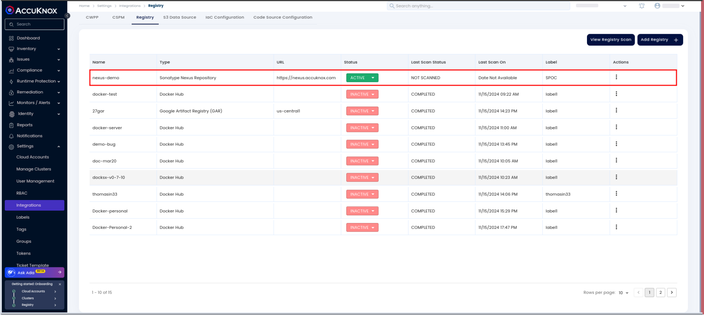
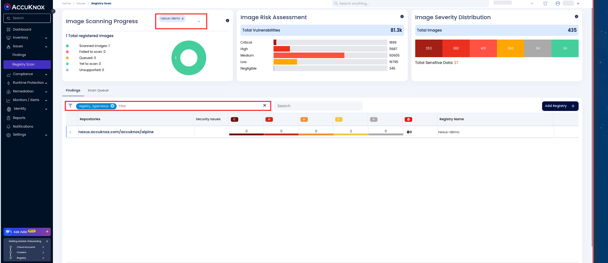
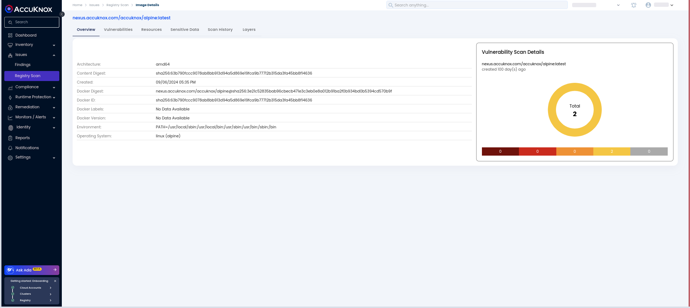

# Sonatype Nexus Registry Onboarding

Sonatype Nexus Registry is a robust and secure platform designed for managing and storing container images. It supports various formats, such as Docker and Helm, and is tailored to meet the needs of DevOps teams and software developers.

AccuKnox enhances the security of container images stored in Nexus Registries by offering continuous vulnerability scanning. This ensures that images are regularly assessed for potential risks and security issues, helping to maintain a secure environment.

## **AccuKnox Support for Sonatype Nexus Registry Scanning**

AccuKnox integrates effortlessly with Sonatype Nexus Registries, providing real-time vulnerability scanning for container images. This integration enables early detection of security threats, offering actionable insights to address them promptly.

### Configuring the **Sonatype Nexus** Registry

To configure Nexus Registry for vulnerability scanning, follow these steps:

1.  Go to **Settings** -> **Integration** -> **Registry**.

2.  Click on the **Add Registry** button

3.  Fill out the required fields such as:
    1.  Name
    2.  Description
    3.  Registry Type
    4.  URL
    5.  Credentials
    6.  Cron Expression (for scheduled scans)

4.  Test the connection to ensure the configuration is correct. A successful response indicates the connection is established.

5.  Once verified, save the configuration and create the registry

After the registry is configured and connected, it will appear as **Active** in the registry list.

After configuration, AccuKnox will start scanning based on the schedule or immediately if the **Trigger scan on save** option is selected. The results of the scan can be viewed by navigating to the registry page.

### Viewing Scan Details

Once the scan is completed, you can access detailed scan information by following these steps:

1.  Go to **Issues** -> **Findings** -> **Registry Scan**.

2.  Filter the results to view the onboarded registry.

3.  Click on an image to see a detailed view of the metadata, vulnerabilities, and other scan details.

For instance, the Nexus Registry onboarded in this demo has an image called **accuknox/alpine**. The vulnerabilities associated with this image will be visible in the scan results. By clicking on the image, you can view a list of identified vulnerabilities, their severity, CVSS scores, and suggested remediation steps.

To get more detailed information about the vulnerabilities associated with the image, simply click on the container image in the AccuKnox dashboard. This will allow you to view the metadata, including any embedded secrets and a comprehensive list of the vulnerabilities identified in the image. You will also be able to explore the severity of these vulnerabilities, CVSS scores, and recommended remediation actions.

Integrating **Sonatype Nexus Registry** with **AccuKnox** ensures continuous and efficient vulnerability scanning for your container images. AccuKnox provides a secure and compliance-friendly solution to detect, assess, and address vulnerabilities, helping maintain a robust security posture.
