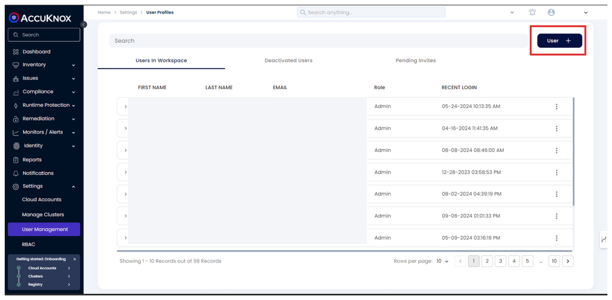

# SSO Login Guide

This guide covers the complete process from inviting a new user to logging in with SSO.

## 1. Inviting a New User

Log in to your AccuKnox dashboard.

Navigate to "User Management" in the left sidebar menu.
Click the "User +" button in the top right corner of the Users page.

In the "Invite User" form, fill out the following details and hit send.

!!! note
    You can view pending invitations in the "Pending Invites" tab on the Users page. You can resend or revoke invitations from this tab. Viewing all permissions of a user is possible via the main tab.

## 2. User Receives Invitation

The invited user will receive containing a link to accept the invitation and set up their account if they haven't already done so.

## 3. User Login Options

Users can log in to AccuKnox using two methods:

### Option A: Traditional Login

1. Go to the AccuKnox login page.
2. Enter the email address and password.
3. Click "Sign In".

!!! note
    This requires you to use the MFA (multi-factor authentication) code if it was enabled during the invitation process. MFA is required for every sign-in attempt.

### Option B: Single Sign-On (SSO) with Google

1. Go to the AccuKnox login page.
2. Look for "Or login with" at the bottom of the form.
3. Click on the "Google" button.
4. If not already signed in to Google, enter Google account credentials.
5. Grant any necessary permissions for AccuKnox.

!!! note
    If you are already signed in to Google, you will be automatically logged in to AccuKnox. No need for MFA in this case.

## Notes

+ SSO is currently only supported for Google accounts.
+ Users must be invited with their Gmail address to use Google SSO.
+ For the best experience, use the same email address for invitation and login.
+ If you encounter any issues, contact your AccuKnox administrator or support team.
+ Emails with + modifiers (e.g., <test+stable@gmail.com> or example+solutions@gmail.com) are not supported for SSO. Please use a base email address.
