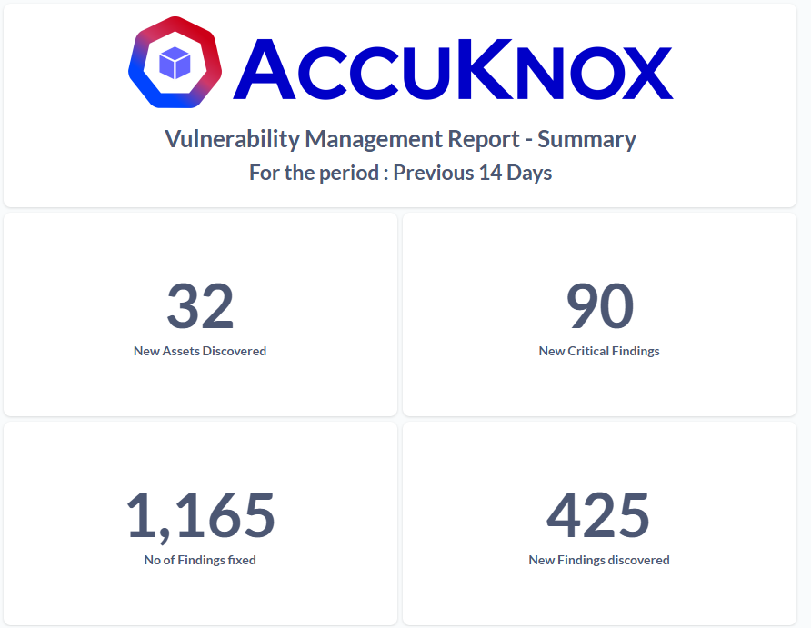
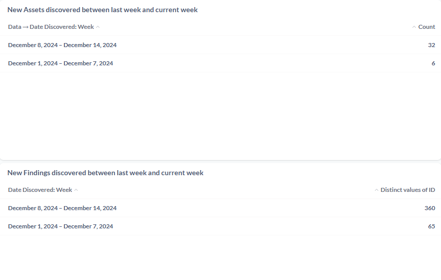
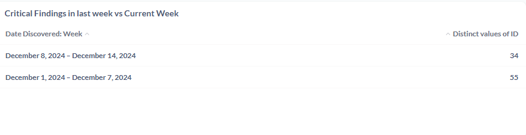

# Summarized Custom Report

AccuKnox's latest feature update provides new custom reporting feature capabilities that can help users get the reports customized as per their requirements.

!!! note
    For this feature to be enabled the customers need to inform the Support team(<support@accuknox.com>) regarding their requirements for custom reporting. Then the AccuKnox Support team can configure the report template from the backend. After which the users can generate an on-demand report or configure a scheduled report.

You can also read documentation on How to [Configure Custom Reports](https://help.accuknox.com/how-to/custom-reports/)

## Summary Report

AccuKnox Summary report can give an overview of the findings across various aspects like the code,cloud, cluster,container related findings. It can give a summarized view of the findings and actionable items that the users need to give more attention to improve their security posture. Here are some of the widgets that can be present in the summary report.

### New Assets Discovered

This widget provides the no. of New assets discovered across your code repos, cloud accounts, clusters/vms and container images that are onboarded into the AccuKnox SaaS in the defined period.

### New Critical Findings

This widget provides the no. of New critical findings across all the assets that are onboarded into the AccuKnox SaaS. This will be very helpful to identify the new critical findings that has been discovered in the latest scans. This can also be an immediate actionable items for the users.

### New Findings Discovered

This widget will provide the new findings that were discovered across all the latest scans. This will also be an immediate action item for the users to act upon.

### No. Of Findings Fixed

This widget will give a good impact for the security posture as it will showcase the no. of findings that were fixed by the team in the pre defined report period. This widget will help to improve the customer's security score.

### No. of Critical Findings unticketed

This widget will provide the information regarding the Critical findings that are not ticketed.This has to be looked upon by the users to create a ticket and assign it for remediation as these critical findings might affect their security posture.

### Trend Analysis

#### New Assets discovered Weekly Trend

This widget will provide the trend analysis across the no. of Assets that are getting discovered on a weekly basis from the onboarded cloud accounts,clusters, containers. This can give a clear picture of the growing asset count.

#### New Findings Weekly Trend

This widget will provide the Weekly trend of the new findings discovered across the assets. This will show the rate at which the findings are occurring in the onboarded assets. This will also give users an idea of how their new findings discovered trend. Using this they can assess their security posture. If this widget shows the sliding trend they the users can safely believe that their new findings rate have gone down which will imply improvement in their security posture.

#### Critical Findings Weekly Trend

This widget will provide the Critical Findings weekly trends that are discovered every week. These will be another important actionable item for the users as increase in Critical Findings will be a security risk for their infrastructure or assets.

!!! note
    The above are some of the sample widgets. These can be further customized based on the user requirements. Users can raise their request with <support@accuknox.com> for configuring this report with widgets of their choice.
