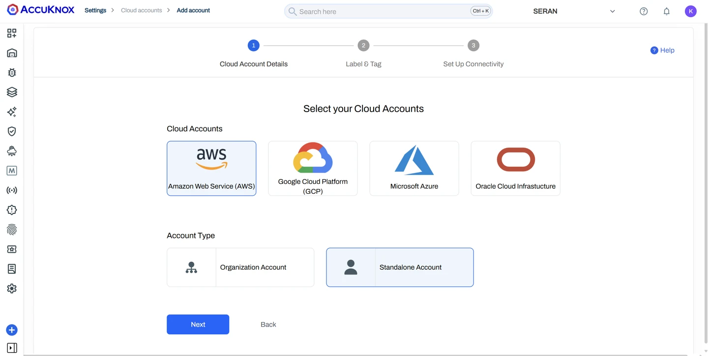
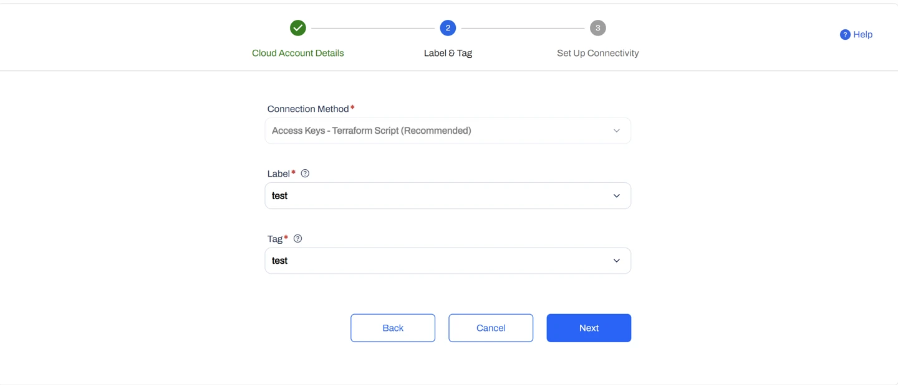
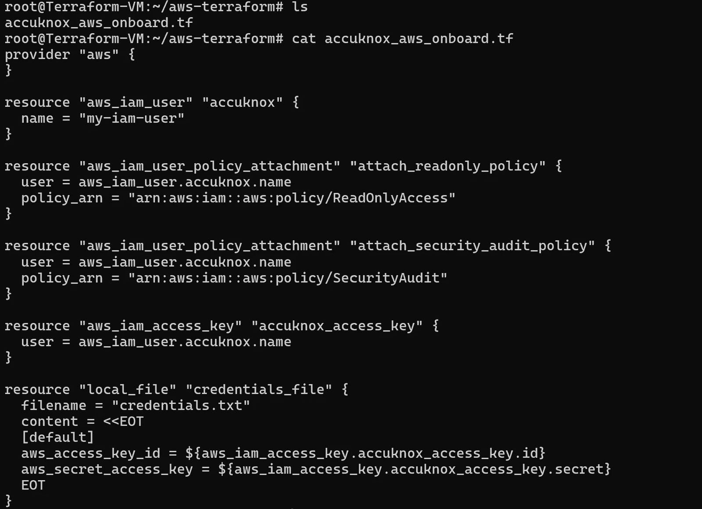
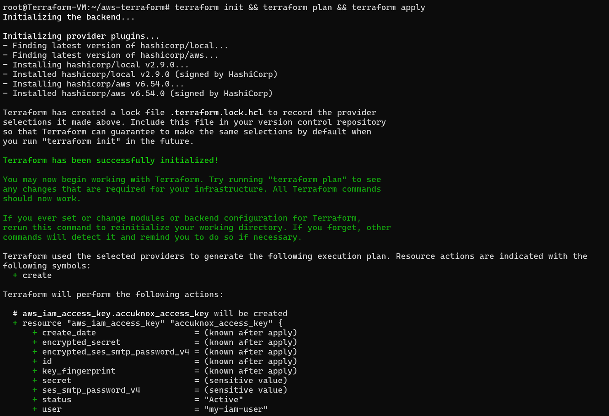
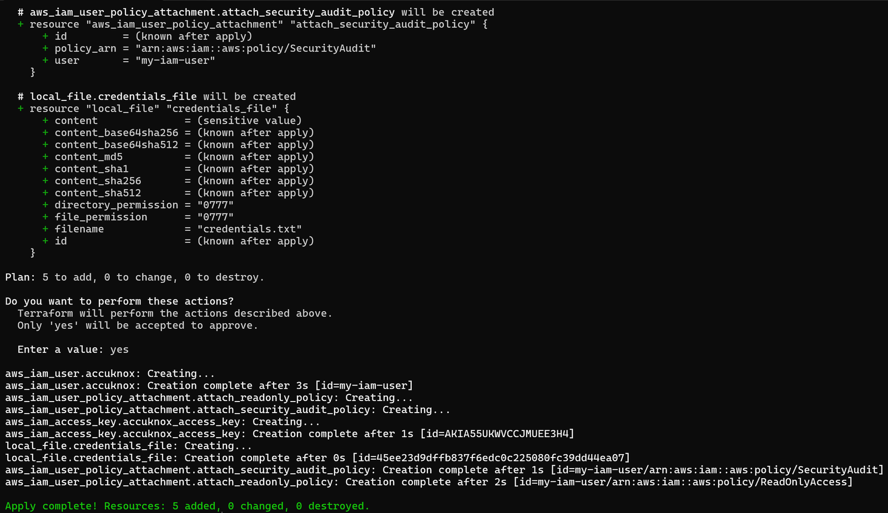
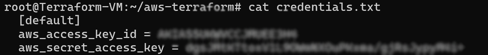
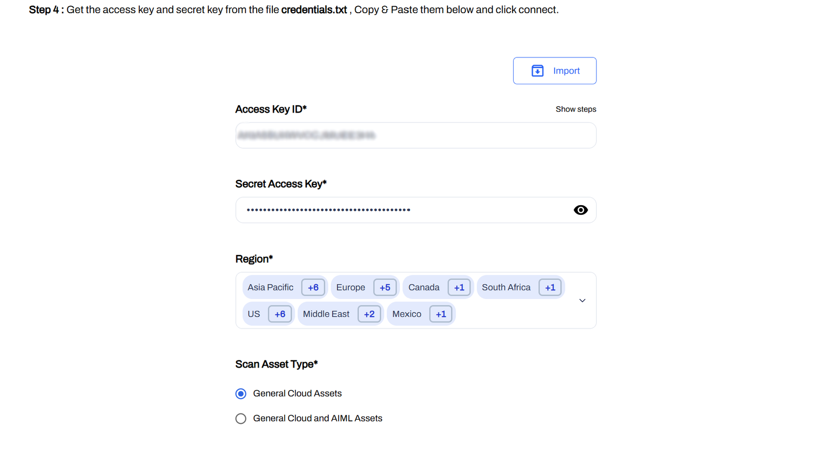
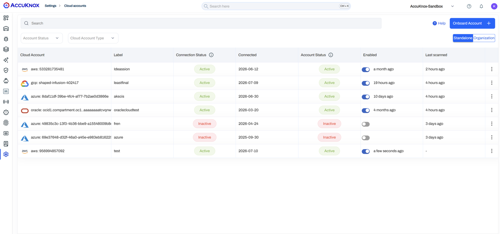

# AWS

## Overview

Terraform automatically provisions the required AWS IAM resources needed to connect a standalone AWS account to the AccuKnox platform.

## Prerequisites

- Terraform installed on the local machine.
- AWS CLI configured with an account that has IAM permissions.
- Access to the AccuKnox platform.

## Step 1: Select the Cloud Account

1. Open the AccuKnox Platform: [**https://app.demo.accuknox.com/**](https://app.demo.accuknox.com/).
2. Log in using your credentials.
3. Navigate to **Settings → Cloud Accounts**.
4. Click **Onboard Account**.
5. Select **Amazon Web Service (AWS)**.
6. Select **Standalone Account**.
7. Click **Next**.



## Step 2: Configure Label and Tag

1. Under **Connection Method**, select **Access Keys - Terraform Script (Recommended)**.
2. Select the required **Label**.
3. Select the required **Tag**.
4. Click **Next**.



## Step 3: Create the Terraform Configuration

1. Install Terraform if it is not already installed.
2. Create a file named **accuknox_aws_onboard.tf**.
3. Copy the Terraform script displayed on the onboarding page.
4. Paste the script into **accuknox_aws_onboard.tf**.



## Step 4: Apply the Terraform Configuration

Open a terminal in the directory containing the Terraform file.

Run:

```bash
terraform init
terraform plan
terraform apply
```

Terraform creates:

- IAM User
- ReadOnlyAccess policy Attachment
- SecurityAudit policy Attachment
- Access Key
- Secret Access Key
- `credentials.txt`

<div style="display: grid; grid-template-columns: 1fr 1fr; gap: 1rem; align-items: start;" markdown>


</div>

## Step 5: Retrieve the Generated Credentials

Open the generated `credentials.txt` file.

Copy:

- Access Key ID
- Secret Access Key



## Step 6: Connect the AWS Account

Return to the AccuKnox onboarding page.

Enter:

- Access Key ID
- Secret Access Key
- Region
- Scan Asset Type.



Click Connect.

## Step 7: Verification

After the connection is complete, verify that the AWS account appears under Cloud Accounts.



- - -
[SCHEDULE DEMO](https://www.accuknox.com/contact-us){ .md-button .md-button--primary }
