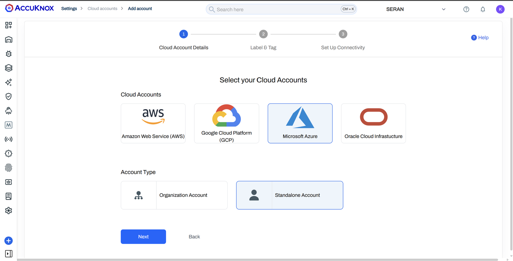
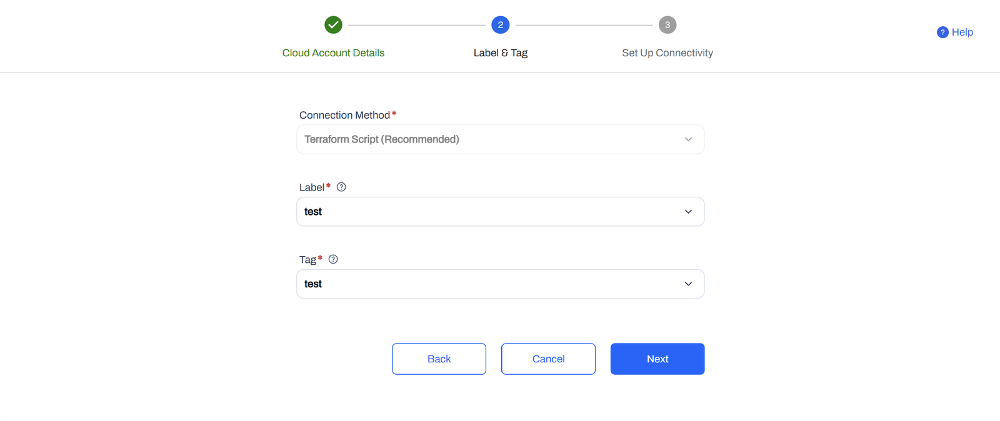
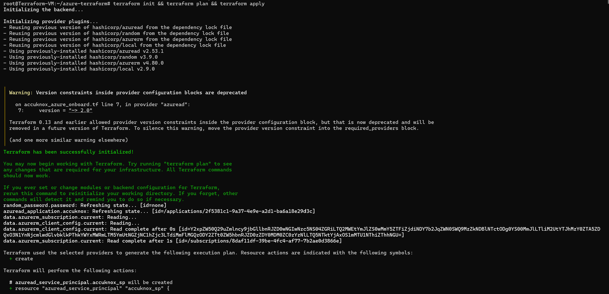
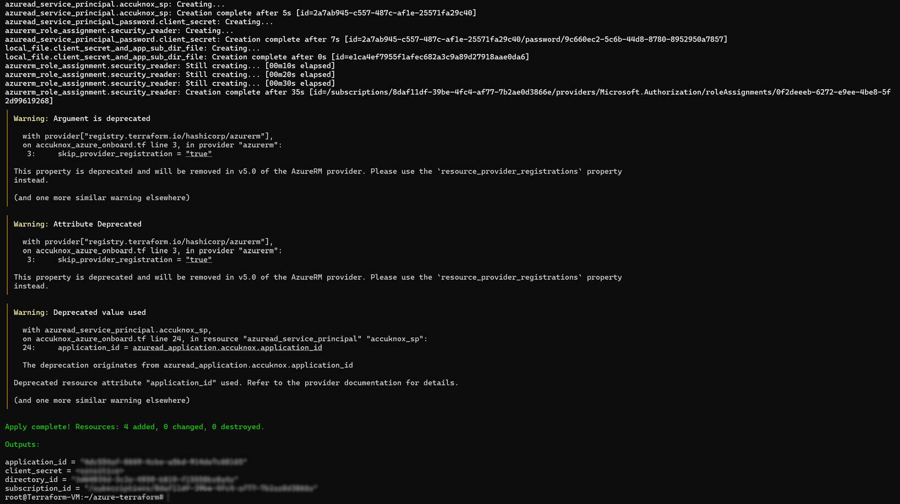
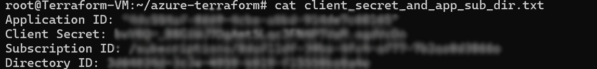
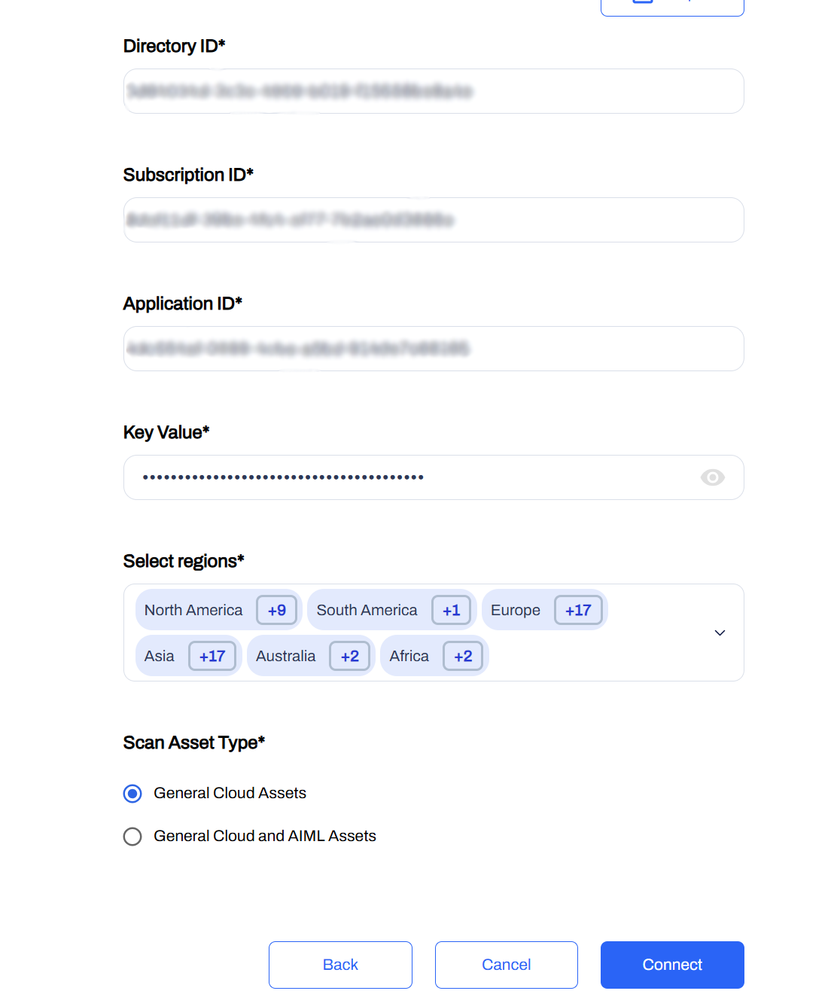
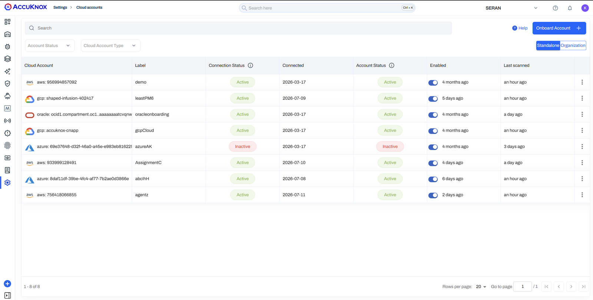

# Azure

## Overview

Terraform automatically provisions the Azure resources required to connect a standalone Azure subscription to the AccuKnox platform.

## Prerequisites

- Terraform installed on the local machine.
- Azure CLI installed and authenticated.
- Azure subscription with permission to create Azure AD applications and assign roles.
- Access to the AccuKnox platform.

## Step 1: Select the Cloud Account

1. Open the AccuKnox Platform: [**https://app.demo.accuknox.com/**](https://app.demo.accuknox.com/).
2. Log in using your credentials.
3. Navigate to **Settings → Cloud Accounts**.
4. Click **Add Account**.
5. Select **Microsoft Azure**.
6. Select **Standalone Account**.
7. Click **Next**.



## Step 2: Configure Label and Tag

1. Select **Terraform Script** as the connection method.
2. Select the required **Label**.
3. Select the required **Tag**.
4. Click **Next**.



## Step 3: Create the Terraform Configuration

1. Install Terraform if it is not already installed.
2. Create a file named **azure_onboard.tf**.
3. Copy the Terraform script from the onboarding page.
4. Paste the script into **azure_onboard.tf**.

```hcl
provider "azurerm" {
    features {}
    skip_provider_registration = "true"
  }
  
  provider "azuread" {
    version = "~> 2.0"
  }
  
  resource "azuread_application" "accuknox" {
    display_name = "AccuKnox"
  
    required_resource_access {
      resource_app_id = "00000003-0000-0000-c000-000000000000"  # Microsoft Graph
  
      resource_access {
        id   = "5778995a-e1bf-45b8-affa-663a9f3f4d04"  # Directory.Read.All
        type = "Scope"
      }
    }
  }
  
  resource "azuread_service_principal" "accuknox_sp" {
    application_id = azuread_application.accuknox.application_id
  }
  
  resource "random_password" "password" {
    length           = 32
    special          = true
    override_special = "_%@"
  }
  
  resource "azuread_service_principal_password" "client_secret" {
    service_principal_id = azuread_service_principal.accuknox_sp.id
  }
  
  data "azurerm_subscription" "current" {}
  
  resource "azurerm_role_assignment" "security_reader" {
    scope                = data.azurerm_subscription.current.id
    role_definition_name = "Reader"
    principal_id         = azuread_service_principal.accuknox_sp.object_id
  }
  
  data "azurerm_client_config" "current" {}
  
  output "application_id" {
    value = azuread_application.accuknox.application_id
  }
  
  output "client_secret" {
    value     = azuread_service_principal_password.client_secret.value
    sensitive = true
  }
  
  output "subscription_id" {
    value = data.azurerm_subscription.current.id
  }
  
  output "directory_id" {
    value = data.azurerm_client_config.current.tenant_id
  }
  
  resource "local_file" "client_secret_and_app_sub_dir_file" {
    filename = "client_secret_and_app_sub_dir.txt"
    content = <<-EOT
  Application ID: "${azuread_application.accuknox.application_id}"
  Client Secret: ${azuread_service_principal_password.client_secret.value}
  Subscription ID: ${data.azurerm_subscription.current.id}
  Directory ID: ${data.azurerm_client_config.current.tenant_id}
    EOT
  }
```

## Step 4: Apply the Terraform Configuration

Open a terminal in the directory containing **azure_onboard.tf** and run:

```bash
terraform init
terraform plan
terraform apply
```

Terraform creates:

- Azure AD Application
- Service Principal
- Client Secret
- Reader role assignment
- Custom ML role assignment
- client_secret_and_app_sub_dir.txt

<div style="display: grid; grid-template-columns: 1fr 1fr; gap: 1rem; align-items: start;" markdown>


</div>

## Step 5: Retrieve the Generated Credentials

Open client_secret_and_app_sub_dir.txt.

Copy the following values:

- Directory ID
- Subscription ID
- Application ID
- Key Value



## Step 6: Connect the Azure Subscription

Return to the AccuKnox onboarding page.

Enter:

- Directory ID
- Subscription ID
- Application ID
- Key Value
- Region
- Scan Asset Type.

Click **Connect.**



## Verification

Verify that the Azure subscription is listed under Cloud Accounts.



- - -
[SCHEDULE DEMO](https://www.accuknox.com/contact-us){ .md-button .md-button--primary }
