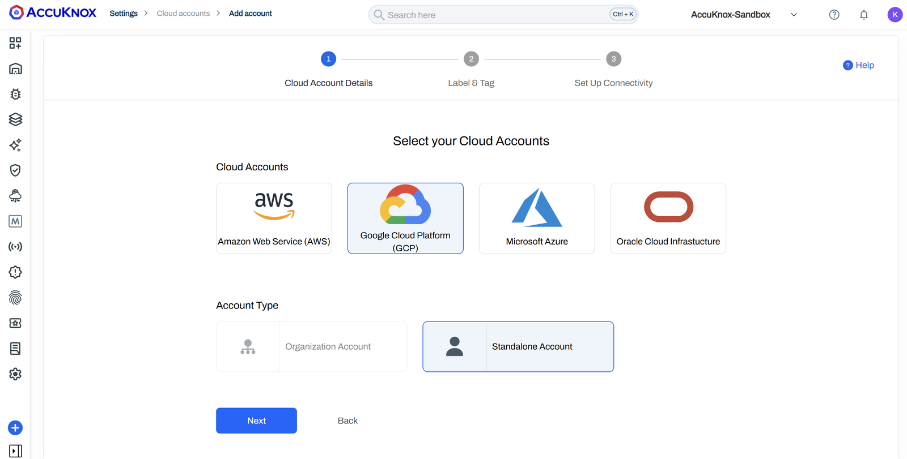
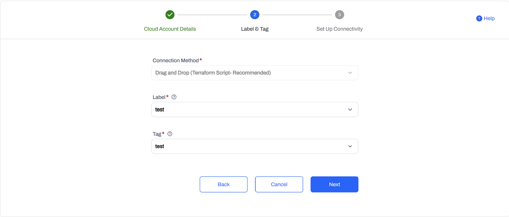
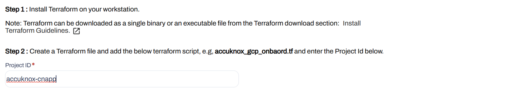
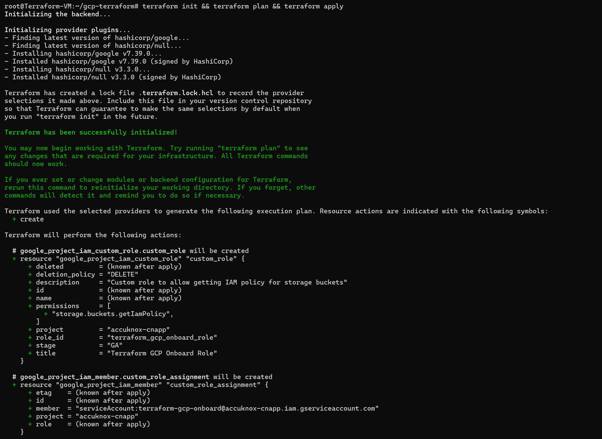
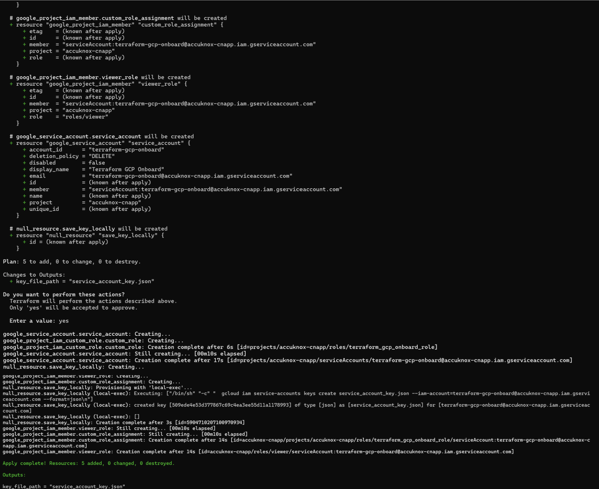
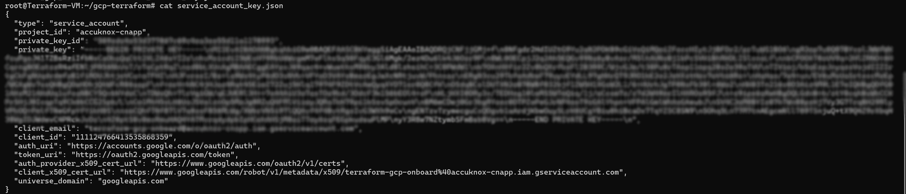
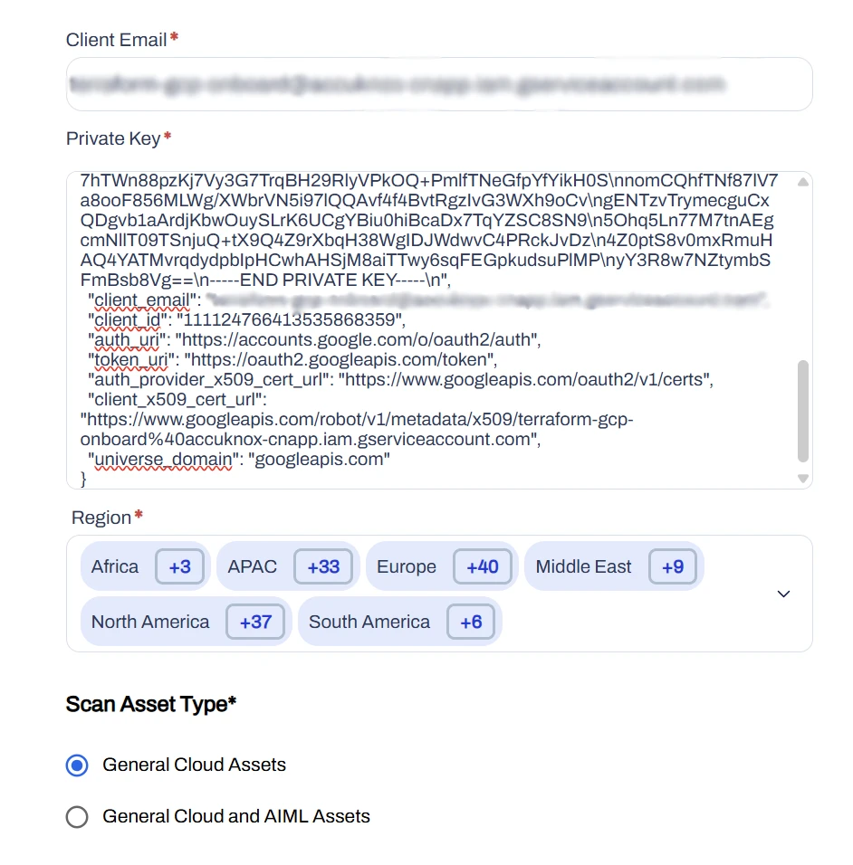
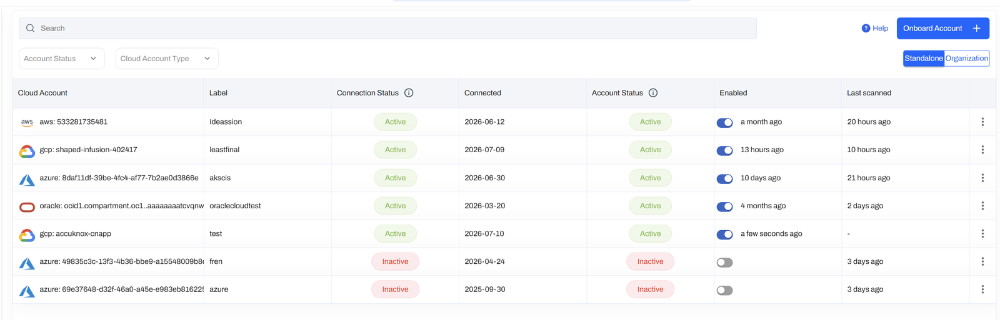

# GCP

## Overview

Terraform automatically provisions the required Google Cloud IAM resources needed to connect a standalone GCP project to the AccuKnox platform.

## Prerequisites

- Terraform is installed.
- Google Cloud CLI is installed and authenticated.
- The target GCP project is selected.
- You have sufficient permissions to create service accounts, IAM roles, and service account keys.
- You have access to the AccuKnox platform.

## Step 1: Select the Cloud Account

1. Open the AccuKnox Platform: [**https://app.demo.accuknox.com/**](https://app.demo.accuknox.com/).
2. Log in using your credentials.
3. Navigate to **Settings → Cloud Accounts**.
4. Click **Add Account**.
5. Select **Google Cloud Platform (GCP)**.
6. Select **Standalone Account**.
7. Click **Next**.



## Step 2: Configure Label and Tag

1. Select **Terraform Script** as the connection method.
2. Select the required **Label**.
3. Select the required **Tag**.
4. Click **Next**.



## Step 3: Create the Terraform Configuration

1. Install Terraform if it is not already installed.
2. Enter the **Project ID** in the Terraform configuration.

    

3. Create a file named **gcp_onboard.tf**.
4. Copy the Terraform script from the onboarding page.
5. Paste the script into **gcp_onboard.tf**.

```hcl
provider "google" {
    project = "accuknox-cnapp"
  }

  # Step 1: Create Custom Role
  resource "google_project_iam_custom_role" "custom_role" {
    project     = "accuknox-cnapp"
    role_id     = "terraform_gcp_onboard_role"
    title       = "Terraform GCP Onboard Role"
    description = "Custom role to allow getting IAM policy for storage buckets"
    permissions = ["storage.buckets.getIamPolicy"]
  }

  # Step 2: Create Service Account
  resource "google_service_account" "service_account" {
    account_id   = "terraform-gcp-onboard"
    display_name = "Terraform GCP Onboard"
  }

  # Step 3: Assign roles to the service account
  resource "google_project_iam_member" "viewer_role" {
    project = "accuknox-cnapp"
    role    = "roles/viewer"
    member  = "serviceAccount:${google_service_account.service_account.email}"
  }

  # Step 4: Assign custom role to the service account
  resource "google_project_iam_member" "custom_role_assignment" {
    project = "accuknox-cnapp"
    role    = google_project_iam_custom_role.custom_role.name
    member  = "serviceAccount:${google_service_account.service_account.email}"
  }
  # Step 5: Generate JSON key for service account
  resource "null_resource" "save_key_locally" {
    depends_on = [google_service_account.service_account]
    provisioner "local-exec" {
      command = <<EOF
  gcloud iam service-accounts keys create service_account_key.json --iam-account=${google_service_account.service_account.email} --format=json
  EOF
    }
  }
  output "key_file_path" {
    value = "service_account_key.json"
  }
```

## Step 4: Apply the Terraform Configuration

Open a terminal in the directory containing **gcp_onboard.tf** and run:

```bash
terraform init
terraform plan
terraform apply
```

Terraform creates:

- Service Account
- IAM role assignments
- Custom IAM roles
- service_account_key.json

<div style="display: grid; grid-template-columns: 1fr 1fr; gap: 1rem; align-items: start;" markdown>


</div>

## Step 5: Retrieve the Generated Credentials

After the Terraform configuration is applied, Copy the following values from the generated credentials file:

- Client Email
- Private Key (JSON)



## Step 6: Connect the GCP Project

Return to the AccuKnox onboarding page.

Enter

1. Client Email.
2. Private Key (JSON).
3. Region.
4. Scan Asset Type.



Click Connect.

## Step 7: Verification

Verify that the GCP project is listed under Cloud Accounts.



- - -
[SCHEDULE DEMO](https://www.accuknox.com/contact-us){ .md-button .md-button--primary }
