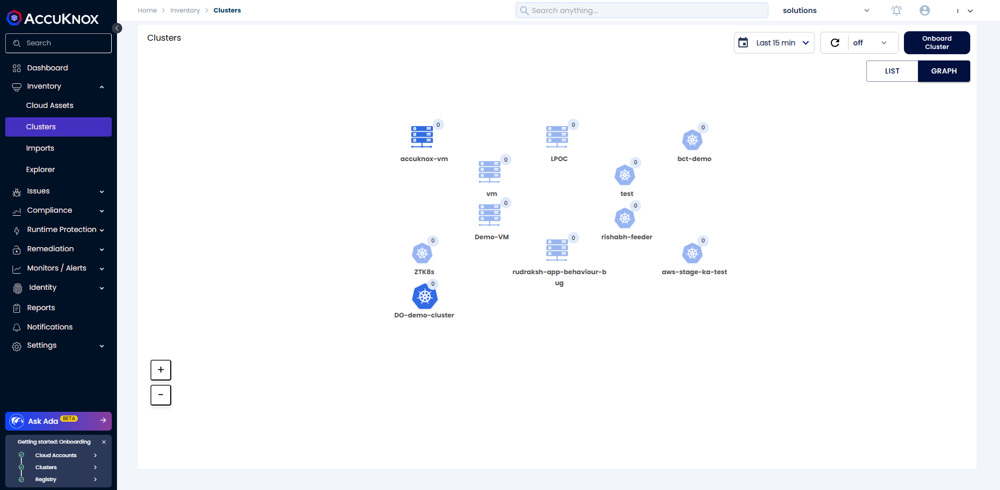

# VM Onboarding using Access Keys

## Overview

The access key method simplifies the onboarding of multiple VMs as control plane VMs. The process mirrors that of SystemD mode and Docker Container mode. Using the access key, users can onboard a VM directly from the CLI without needing to access the AccuKnox SaaS interface.

Users can select either SystemD or Docker Container mode for onboarding, as the same access key works for both. Moreover, the access key provides enhanced flexibility, enabling the onboarding of multiple control plane VMs with a single key

Here we will follow the `SystemD` mode of onboarding

## Pre-requisites

1. [Access Key](https://help.accuknox.com/how-to/create-access-keys/ "https://help.accuknox.com/how-to/create-access-keys/")

2. [Resource requirements](https://help.accuknox.com/how-to/vm-onboard-deboard-systemd/#resource-requirements "https://help.accuknox.com/how-to/vm-onboard-deboard-systemd/#resource-requirements")

3. [Network requirements](https://help.accuknox.com/how-to/vm-onboard-deboard-systemd/#network-requirements "https://help.accuknox.com/how-to/vm-onboard-deboard-systemd/#network-requirements")

4. BTF support is enabled in the VM

5. [RabbitMQ](https://www.rabbitmq.com/docs/download "https://www.rabbitmq.com/docs/download") should be installed

## Onboarding

In the case of the Access key onboarding method User can directly onboard the VMs from the CLI

!!!info "NOTE"
    We don't need to follow AccuKnox UI for the access key method of the VM onboarding; we will be using a command to do the same from the CLI.

### Install knoxctl/accuknox-cli

`curl -sfL https://knoxctl.accuknox.com/install.sh | sudo sh -s -- -b /usr/bin`

### Onboarding Control Plane

The command may look something like this:

```sh
$ knoxctl onboard vm cp-node \
--version v0.10.7 \
--spire-host=spire.accuknox.com \
--pps-host=pps.accuknox.com \
--knox-gateway=knox-gw.accuknox.com:3000 \
--vm-name="accuknox-vm" \
--access-key-url="cwpp.demo.accuknox.com" \
--access-key="access-token" \
--enable-host-policy-discovery \
--hostViz="process,network,file,capabilities" \
--viz="process,network,file"
```

In the above command, You need to replace the `--access-token` value with the created [access key](https://help.accuknox.com/how-to/create-access-keys/ "https://help.accuknox.com/how-to/create-access-keys/"), and substitute `--vm-name` with the desired vm name. After replacing the value the command will look like this:

By default, if Docker is not found, systemd mode of installation would be used. If you want to explicitly onboard using systemd services, add the `--vm-mode=systemd` flag to the above command.

### Output


The above command will emit the command to onboard worker nodes. You may also use the `--cp-node-addr` flag to specify the address that other nodes will use to connect with your cluster.

!!!info "NOTE"
    The user needs to repeat the CLI onboarding command to onboard multiple control plane VMs using the access key

## Onboarding Worker Nodes

The second command will be for onboarding worker nodes. It may look something like this:

`knoxctl onboard vm node --vm-mode="systemd" --version=v0.8.1 --cp-node-addr=<control-plane-addr>`

Example:

```cmd
$ knoxctl onboard vm node --vm-mode="systemd"  --version=v0.8.1 --cp-node-addr=192.168.56.106
Pulling kubearmor-init       ... done
Pulling kubearmor            ... done
Pulling kubearmor-vm-adapter ... done
Creating network "accuknox-config_accuknox-net" with the default driver
Creating kubearmor-init ... done
Creating kubearmor      ... done
Creating kubearmor-vm-adapter ... done
onboard-vm-node.go:41: VM successfully joined with control-plane!
```



## Troubleshooting

If you encounter any issues while onboarding, use the commands below to debug:

`sudo journalctl -xeu <service-name>.service`

Replace `<service-name>` with one of the following:

- `kubearmor`: Logs show policy enforcement and monitor Kubernetes workloads; useful for debugging misconfigurations or runtime issues.

- `kubearmor-relay-server`: Bridges KubeArmor clients with external log systems; logs debug communication or relay errors.

- `kubearmor-vm-adapter`: Tracks policy enforcement in VMs; logs diagnose policy application on non-Kubernetes workloads.

- `accuknox-policy-enforcement-agent`: Enforces security policies; logs troubleshoot policy errors or conflicts.

- `accuknox-shared-informer-agent`: Shares Kubernetes resource data; logs debug metadata collection issues.

- `accuknox-sumengine`: Processes telemetry data; logs resolve performance or data processing errors.

- `accuknox-discover-agent`: Discovers potential policies; logs analyze policy suggestions.

- `spire-agent`: Manages workload identities; logs debug identity issuance and attestation issues.

- `accuknox-hardening-agent`: Automates system hardening; logs troubleshoot configuration and hardening conflicts.

## Deboarding

Deboard the cluster from SaaS first.

To deboard the worker-vm/Node:

`knoxctl deboard vm node`

To deboard the Control-Plane VM:

`knoxctl deboard vm cp-node`

Sample Output:

```cmd
$ knoxctl deboard vm cp-node
[+] Running 10/10
 ✔ Container shared-informer-agent       Removed                                                                   0.6s
 ✔ Container feeder-service              Removed                                                                   0.6s
 ✔ Container policy-enforcement-agent    Removed                                                                   0.8s
 ✔ Container wait-for-it                 Removed                                                                   0.0s
 ✔ Container kubearmor-vm-adapter        Removed                                                                   5.6s
 ✔ Container kubearmor-relay-server      Removed                                                                   1.5s
 ✔ Container spire-agent                 Removed                                                                   0.5s
 ✔ Container kubearmor                   Removed                                                                  10.4s
 ✔ Container kubearmor-init              Removed                                                                   0.0s
 ✔ Network accuknox-config_accuknox-net  Removed                                                                   0.3s
Please remove any remaining resources at /home/user/.accuknox-config
Control plane node deboarded successfully.

```

After that cleanup the ~/.accuknox-config directory

`sudo rm -rf ~/.accuknox-config`
