# OpenShift VM Scanning (Agentless)

AccuKnox scans virtual machines running on Red Hat OpenShift Virtualization without installing anything inside the VMs. You install one operator on the cluster, point it at your AccuKnox tenant, and it does the rest on a schedule you choose.

Nothing about your VMs leaves the cluster except the scan findings.

## How the scan works

The operator installs two things: a **Scan** resource and a **Schedule** resource. You only create the Schedule. Everything below happens on its own, on the cron expression you set:

1. The scheduler starts a discovery pod at the scheduled time.
2. That pod lists every VM in the OpenShift Virtualization environment.
3. For each VM it creates a volume snapshot.
4. A second pod mounts each snapshot and scans it for vulnerabilities.
5. Results are pushed to the AccuKnox artifact API.
6. The snapshots and PVCs the operator created are deleted.

Discovery runs fresh on every execution, so VMs added or removed between runs are picked up automatically. You never have to update the schedule when your VM count changes.

## Prerequisites

Check these before you start. The scan fails without them.

| Requirement | Why |
| --- | --- |
| A `VolumeSnapshotClass` object exists in the cluster | The operator snapshots each VM's volume before scanning it |
| At least one `VolumeSnapshotClass` is marked **default** | The operator uses the default class when it creates snapshots |
| All VMs on the cluster use the same CSI driver | Normally true already, since a cluster rarely runs two storage solutions |
| `cluster-admin` on the OpenShift cluster | You create a CatalogSource and install a cluster-wide operator |
| Outbound HTTPS from the cluster to your AccuKnox CSPM endpoint | Findings are pushed to the artifact API |

The VMs themselves can live in any namespace. The operator does not care which one.

## Step 1: Add AccuKnox to the operator catalog

The AccuKnox operator is not listed in the OpenShift Software Catalog by default, so you add its catalog first.

1. In the OpenShift web console, go to **Administration → Cluster Settings**.

    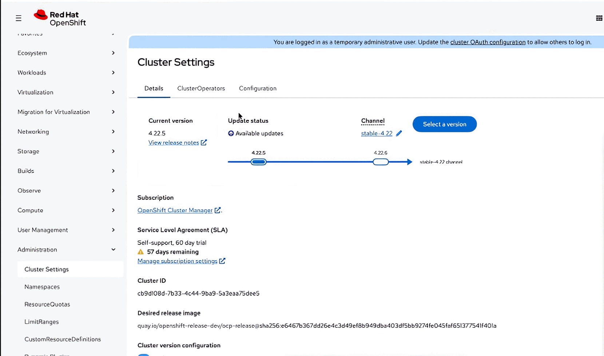

2. Open the **Configuration** tab and search for **OperatorHub**.
3. Open **OperatorHub → Sources**, then click **Create CatalogSource**.

    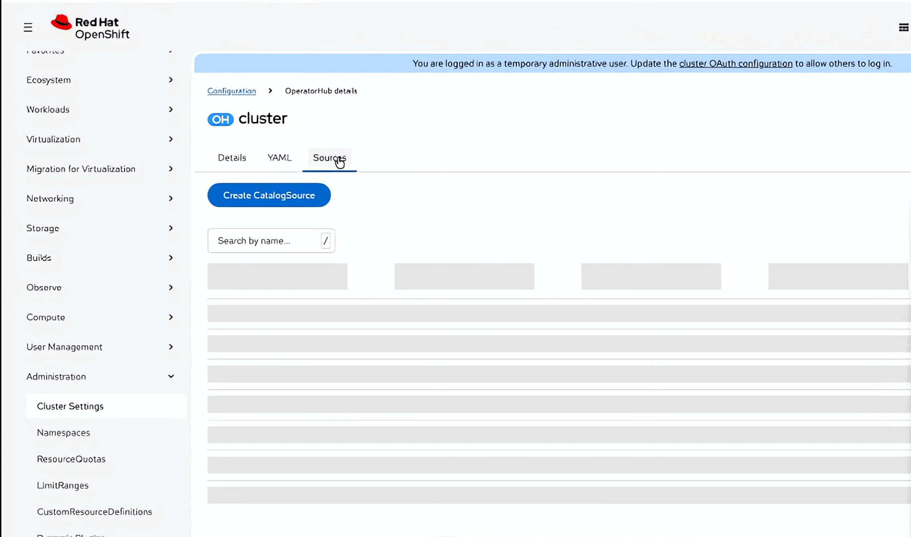

4. Fill in the form:

    | Field | Value |
    | --- | --- |
    | CatalogSource name | Anything, for example `accuknoxscanner` |
    | Display name | Anything, for example `AccuKnox Scanner` |
    | Publisher name | `accuknox` |
    | Image (URL of container image) | `public.ecr.aws/k9v9d5v2/omni-operator-index:v0` |
    | Availability | **Cluster-wide CatalogSource** (the default) |

    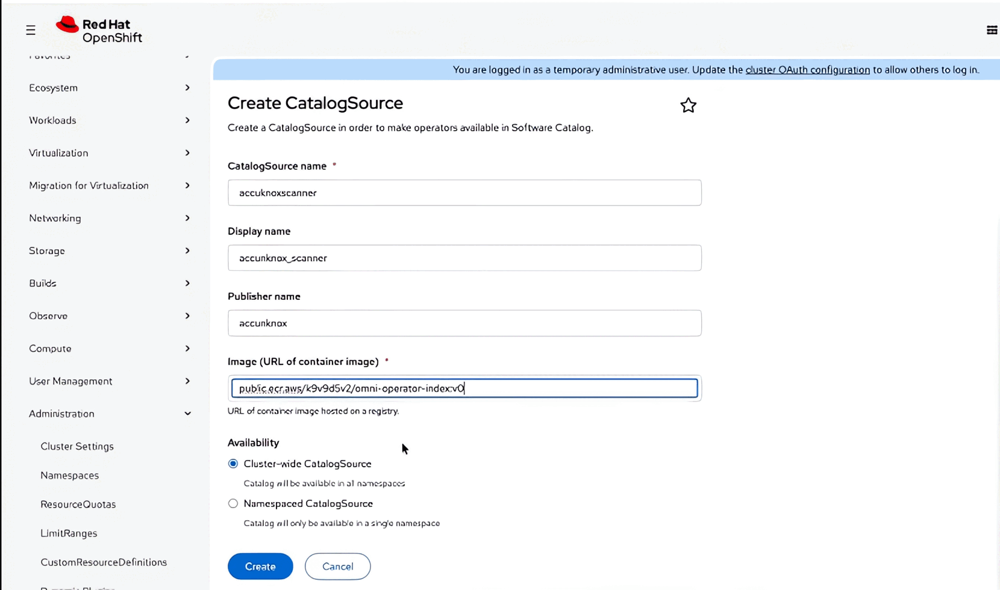

5. Click **Create**.
6. Wait for the new source to show **READY** in the Sources list. Anything else means the cluster could not pull the catalog image.

    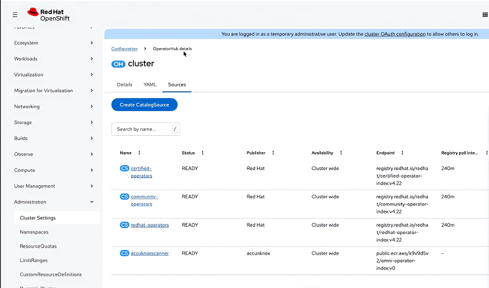

!!! note "Cluster-wide is required"
    Leave Availability set to **Cluster-wide CatalogSource**. A namespaced catalog source only exposes the operator inside one namespace, and the scan schedule needs to reach VMs across the cluster.

## Step 2: Install the operator

1. Go to **Ecosystem → Software Catalog** and search for `accuknox`. **AccuKnox VM Scanning** now appears because the catalog was added in Step 1.

    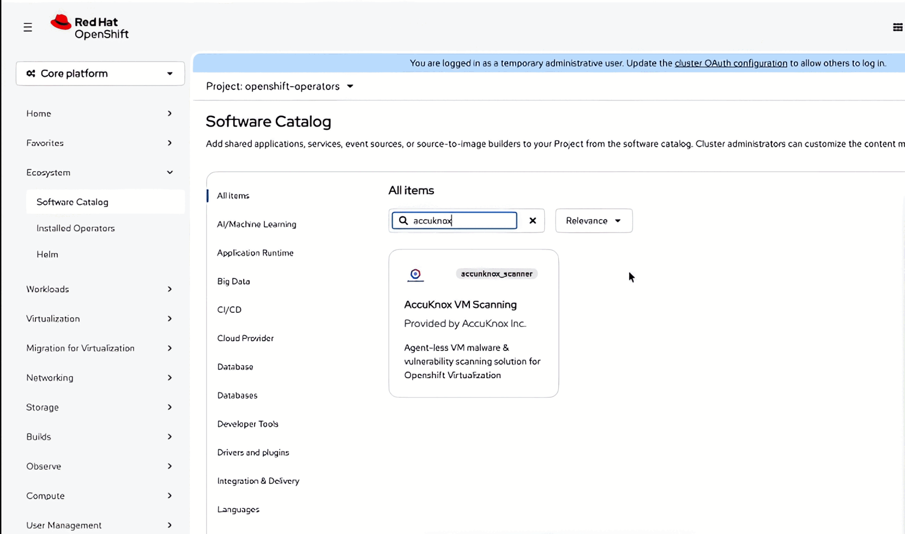

2. Click the tile, then click **Install**.

    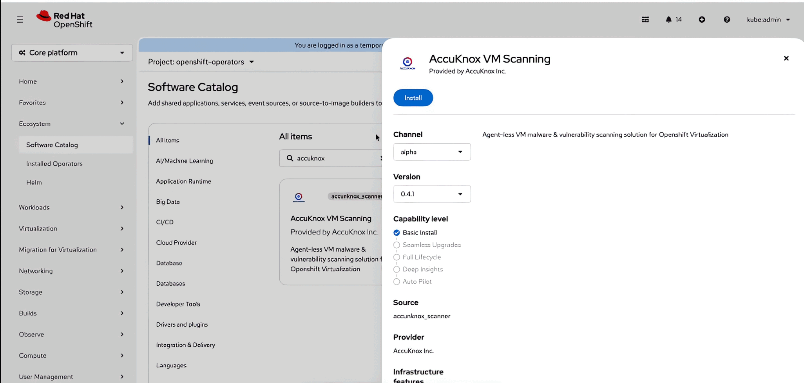

3. Keep every default on the Install Operator page, including the `openshift-operators` installed namespace, and click **Install**.

    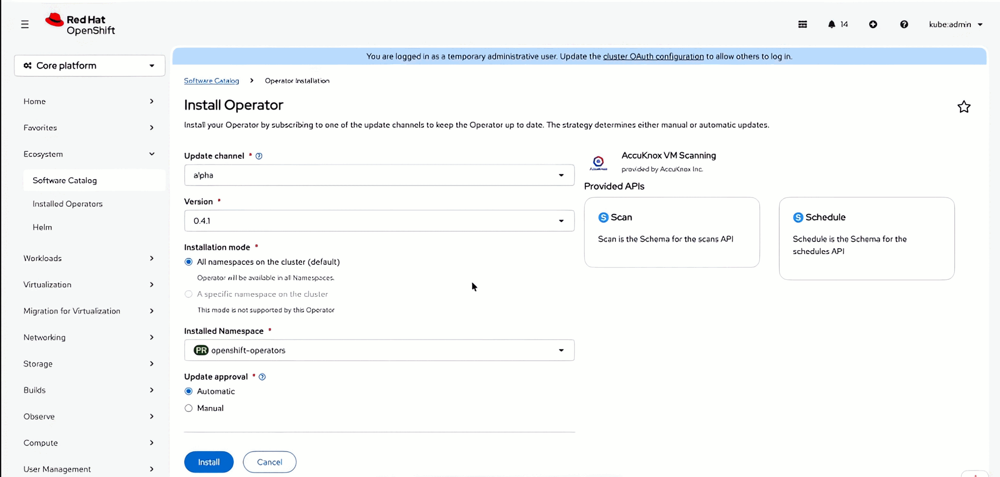

4. Installation takes a couple of minutes. When it finishes, the operator appears under **Ecosystem → Installed Operators** with two provided APIs, **Scan** and **Schedule**.

    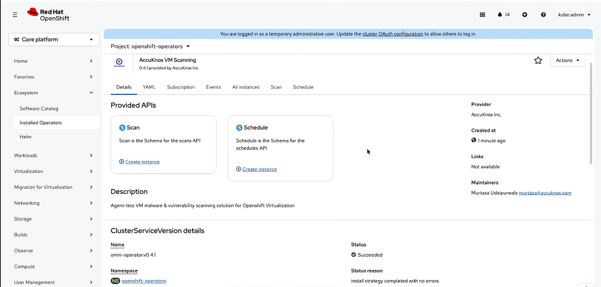

Note the namespace you installed into. You need it again in Step 3 and Step 4.

## Step 3: Create a token and a label in AccuKnox

Switch to the AccuKnox control plane for this step. These two values are the only things AccuKnox generates for this flow, everything else happens in OpenShift.

### Create the token

1. Go to **Settings → Tokens** and click **Create Token**.
2. Give it a name and an expiry, then click **Generate**.

    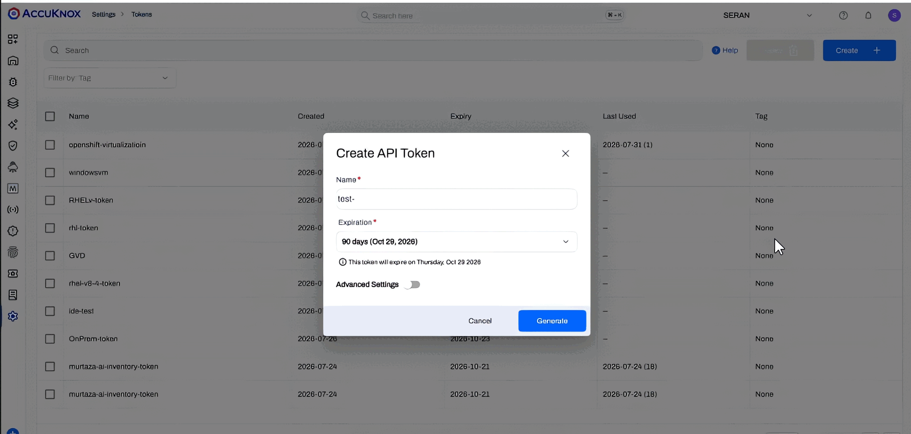

3. Copy the token now. You cannot view it again after closing the dialog.

### Create the label

1. Go to **Settings → Labels** and click **+ Label**.
2. Enter a name that identifies this cluster, for example `openshift-prod`, and save it.

    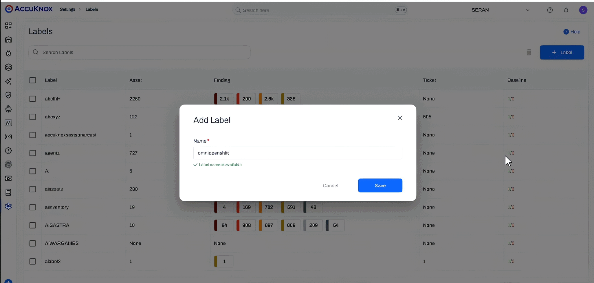

Every finding this schedule produces is tagged with this label, which is how you filter for them later. You will type the same label name into the schedule in Step 4, so it has to match exactly.

!!! note "No tenant ID needed"
    You do not have to look up or enter a tenant ID anywhere in this flow. The operator reads the tenant from the token you just created, so the token and the label are the only two values AccuKnox gives you.

## Step 4: Store the token as a secret in OpenShift

The operator reads the token from a Kubernetes secret rather than from the schedule spec, so create that secret first.

1. In OpenShift, go to **Workloads → Secrets** and select **Create → Key/value secret**.

    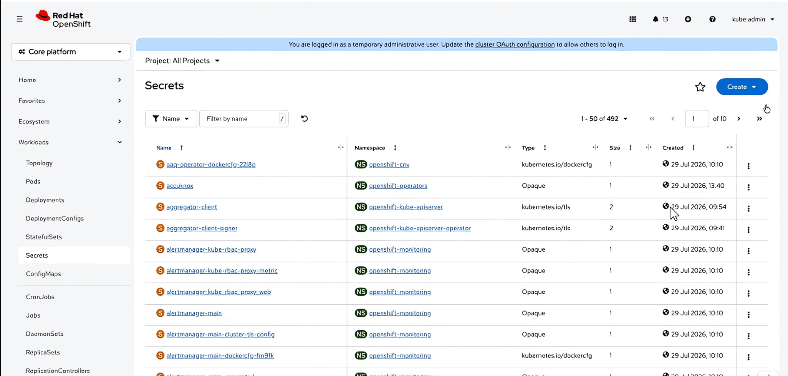

2. Fill in the form:

    | Field | Value |
    | --- | --- |
    | Project | The namespace the operator is installed in, for example `openshift-operators` |
    | Secret name | Anything, for example `accuknox-token` |
    | Key | Anything, for example `token` |
    | Value | The token you copied in Step 3 |

    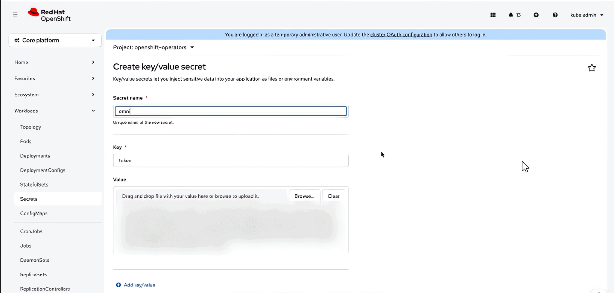

3. Click **Create**.

Write down the secret name, the key, and the namespace. All three go into the schedule in the next step.

!!! warning "The namespace has to match"
    Create the secret in the same namespace you will set as `cronJobNamespace` in Step 5. If they differ, the scan job starts and then fails to read the token.

## Step 5: Create the scan schedule

1. Go to **Ecosystem → Installed Operators → AccuKnox VM Scanning**, open the **Schedule** tab, and click **Create Schedule**.

    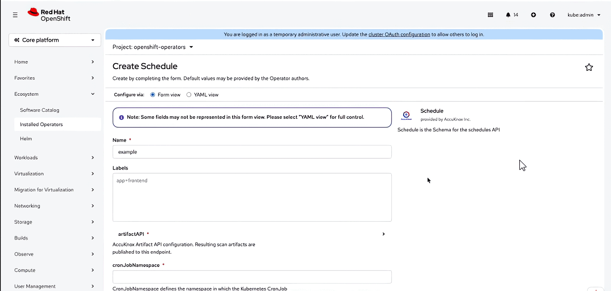

2. Fill in the fields below. Required fields are marked with a red asterisk in the console.

    | Field | What to enter |
    | --- | --- |
    | Name | Anything, for example `scanner` |
    | Labels | Kubernetes labels applied to the Schedule object itself. Optional, leave empty. |
    | `artifactAPI → endpoint` | Your AccuKnox artifact API URL, for example `https://cspm.accuknox.com/api/v1/artifact/` |
    | `artifactAPI → label` | The label you created in Step 3, typed exactly |
    | `artifactAPI → token → secretRef → key` | The key from the secret in Step 4, for example `token` |
    | `artifactAPI → token → secretRef → name` | The secret name from Step 4, for example `accuknox-token` |
    | `cronJobNamespace` | The namespace the secret lives in, for example `openshift-operators` |
    | `schedule` | A cron expression, for example `0 2 * * *` for 2 AM daily |
    | `concurrency` | How many VM scans run at once. Start with `1`. |
    | `template → clusterName` | Any name. This becomes the asset name for the findings in AccuKnox. |
    | `timeZone` | A tz database name such as `Asia/Kolkata`. Case-sensitive. |
    | `scansHistoryLimit` | How many finished scans to keep. Defaults to `3`. |

    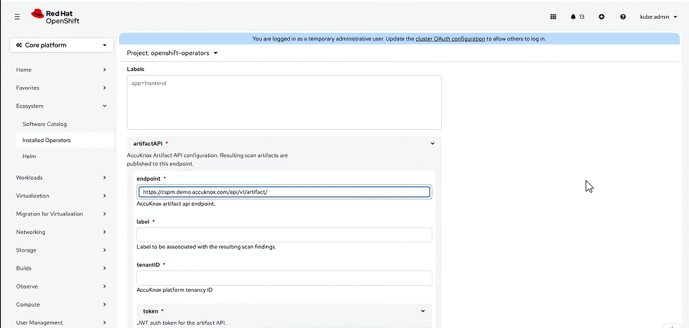

    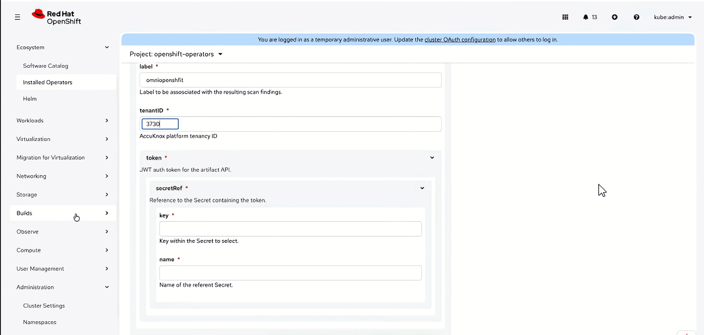

    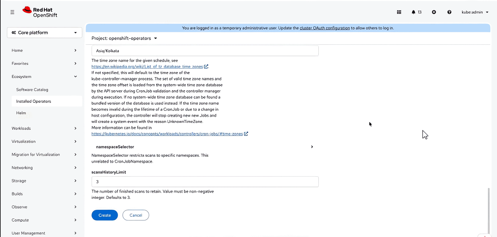

3. Click **Create**.

The schedule appears in the list with a phase of **Awaiting** until the cron expression next fires.

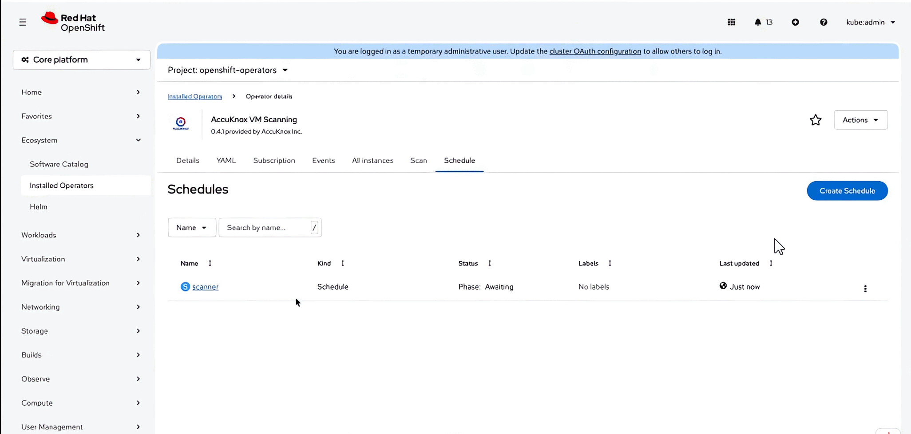

!!! tip "Testing before you commit to a schedule"
    Set the cron expression a few minutes into the future for the first run so you can watch it work, then edit the schedule to the cadence you actually want. Editing a schedule takes effect on the next run, and nothing has to be reinstalled.

## Step 6: View the findings

Once a scan finishes, results are pushed to AccuKnox. Allow roughly **10 minutes** from the end of the scan to findings appearing in the UI.

In the AccuKnox control plane, go to **Issues → Findings**, select **Linux VM Vulnerability Findings** in the findings-type dropdown, and filter by the label you created in Step 3.

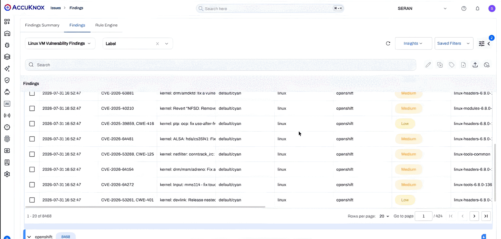

Expand a group to see the per-VM detail: CVE, package, installed version, fix version, risk factor, and the asset name you set as `template → clusterName`.

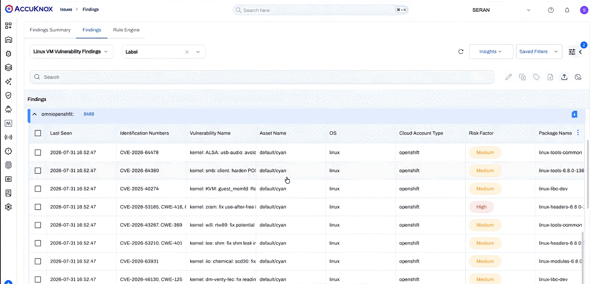

## Scanning only some VMs

One schedule scans every VM the operator discovers. To scan a subset, or to scan different sets on different cadences, create more than one Schedule instance and give each one a VM label selector.

VMs whose labels match a given schedule are scanned by that schedule only. This is how you put production VMs on a nightly scan and development VMs on a weekly one, in the same cluster, without any other configuration.

## Uninstalling

1. Delete the Schedule instances first, from the operator's **Schedule** tab. Removing the operator does not remove the custom resources it created.
2. Go to **Ecosystem → Installed Operators**, select **AccuKnox VM Scanning**, and click **Uninstall**.

    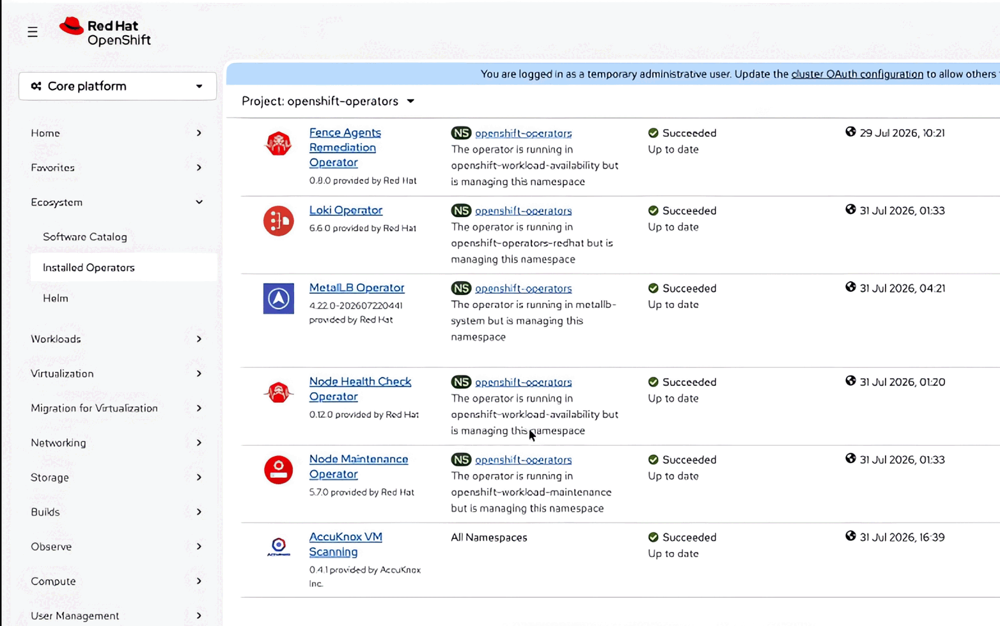

3. Delete the secret you created in Step 4, from **Workloads → Secrets**.
4. To also remove the catalog, go to **Administration → Cluster Settings → Configuration → OperatorHub → Sources**, then delete the catalog source you added in Step 1.

    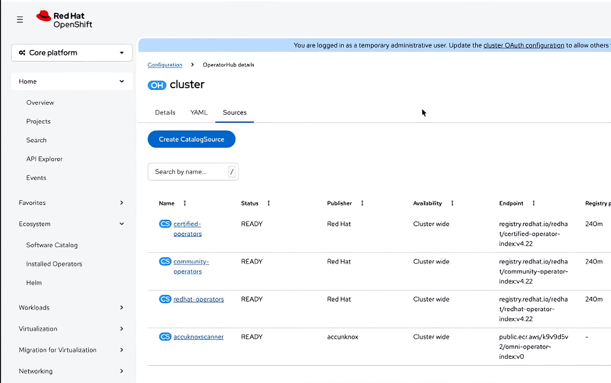

Findings already sent to AccuKnox stay in the control plane. Delete the label under **Settings → Labels** if you want them cleared out of your views.

## Troubleshooting

| Symptom | Likely cause |
| --- | --- |
| Catalog source never reaches **READY** | The cluster cannot pull `public.ecr.aws/k9v9d5v2/omni-operator-index:v0`. Check egress and any image registry mirroring policy. |
| Operator does not appear in the Software Catalog | The catalog source is namespaced rather than cluster-wide, or it is not READY yet. |
| Schedule stays in **Awaiting** past its cron time | Check the cron expression and the `timeZone` value. Time zone names are case-sensitive. |
| Scan pod starts and then fails | The secret name, key, or namespace in the schedule does not match the secret you created, or `cronJobNamespace` points at a different namespace. |
| Snapshot creation fails | No default `VolumeSnapshotClass`, or the VMs use a CSI driver the default class does not cover. |
| Scan completes but no findings in AccuKnox | Wrong `endpoint` or an expired token. Also confirm you are filtering Findings by the right label. |

## Related

- [Cloud Based VM Scanning (Agentless)](cloud-vm-scanning.md) for AWS, GCP, and Azure
- [Agent based VM scanning for Linux](../agent-based/linux.md)
