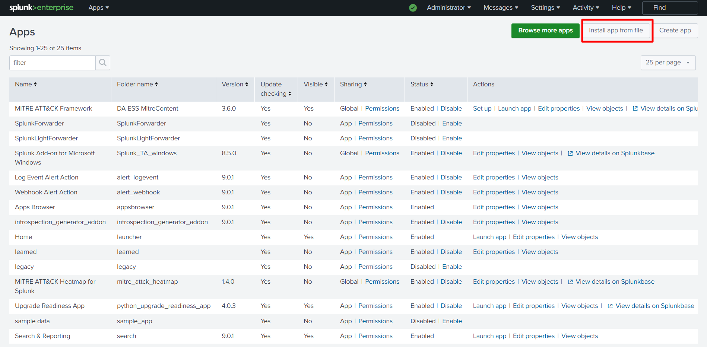
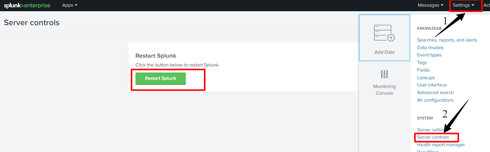
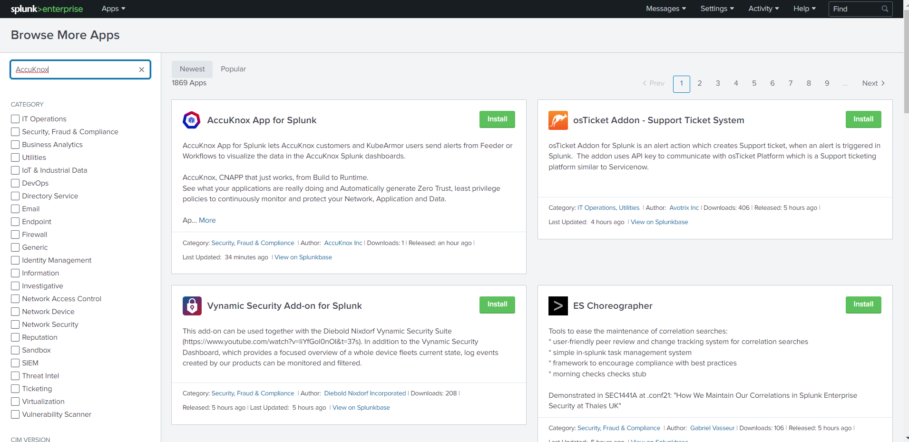

# AccuKnox Splunk App


## **Introduction**
The AccuKnox Splunk App is designed to deliver operational reporting as well as a simplified and configurable dashboard.
Users can view the real-time alerts in form of logs and telemetries.

***Important features***

-  Dashboard to track the real time alerts genrated from K8s cluster.

-  Data models with pivots for easy access to data and visualization.

-  Filter out the Alerts based on defferent namespaces, pods, operations, severity, tags and the actions of policies.

-  Drilldown ability to see how the alerts genrated, what policy was violated and what was the result for the same.

## **Installation**
#### **Prerequisites :**
*1. K8s Cluster with AccuKnox agents installed, up and running fine. KubeArmor and Feeder Service are mandatory. The environment variable for the feeder is set for the K8s cluster in use.*

*2. An active Splunk Deployment and Access to the same.*

>  *To depoy Splunk on Kubernetes Cluster follow https://splunk.github.io/splunk-operator/*  *and for Linux follow https://docs.splunk.com/Documentation/Splunk/9.0.1/Installation/InstallonLinux*

### Where to install it?
Splunk App can be installed on Splunk Enterprise Deployment done on K8s or VM.
***User can install the App using three different ways.***
## Option 1: Install from File
**This App can be installed by Uploading the file to the Splunk UI.**
  1. Download the AccuKnox Splunk App file, by typing the following command. This file can be downloaded anywhere from where the user can upload the file to Splunk UI.
 ```bash
 git clone https://github.com/accuknox/splunk.git AccuKnox
 tar -czvf AccuKnox.tar.gz AccuKnox
 ```
2. Log in to your **Splunk Deployment.**
    
3. Click on the gear {:   style="height:15px;width:15px"} icon next to **Apps.**
   
4. This will navigate you to the **Apps Dashboard.** On the top right, click on **Install app from file.**
   
5. This will navigate to **Upload App** Screen. Select **AccuKnox.tar.gz** file downloaded in the _first step_, and upload. In case you are updating the app and it’s already installed, mark the check box for Upgrade App.
 
6. Once Uploaded the App will be installed on the Splunk Deployment, with a confirmation message, **“**_**AccuKnox" was installed successfully.**_ Click on **Launch App** to view the App.

 
7. You can **Restart Splunk** for the App to work properly. Go to **Settings > Server Control > Restart Splunk,** Restarting the app will take approx. 1-2 minutes.

 
8. Wait for Splunk to Restart And you can log in back to see the **AccuKnox App** in the App section.

 
9. Click on the **AccuKnox App** to launch the App. This will navigate you to the App dashboard.

 

_*Note:*_

1.  *If Dashboards shows no data, you need to configure the HEC on Splunk and Forward the data first, check below how to configure and [create HEC](https://docs.splunk.com/Documentation/Splunk/9.0.1/Data/UsetheHTTPEventCollector) and [ forward the data]().*

2. *If data is not being pushed, Login to Splunk > Setting > Data Input > Select HTTP Event Collector > Global Settings > Disable SSL if Enabled by unchecking the box.*

## Option 2: Install the App from SplunkBase

Install the AccuKnox App by downloading it from the App homepage.



## Option 3: Install from GitHub
This App is available on [SplunkBase](https://apps.splunk.com/apps/id/SplunkforAccuKnox "https://apps.splunk.com/apps/id/SplunkforAccuKnox") and [Github](https://github.com/accuknox/splunk "https://github.com/accuknox/splunk"). Optionally, you can clone the GitHub repository to install the App. Please feel free to submit contributions to the App using pull requests on GitHub.

1. Locate the Splunk Deployment done in your environment.

2. Navigate to the Splunk App directory. For Linux users `/opt/splunk/etc/apps` and windows users `\Program Files\Splunk\etc\apps`

From the directory `$SPLUNK_HOME/etc/apps/`, type the following command:
```bash

git clone https://github.com/accuknox/splunk.git AccuKnox

```
## **What data types does AccuKnox export/integrate into Splunk?**
-   KubeArmor Alert
-   KubeArmor Container Logs
-   Cilium Alerts
-   Cilium Logs

**Managing data sent to Splunk, What can be sent?**

AccuKnox can forward the data to Splunk in two ways:

1.  From feeder service running on client cluster
2.  From SAAS platform


## **Forwarding Events to Splunk from Feeder**
**Prerequisites:**
1.  Feeder Service and KubeArmor are Installed and running on the user’s K8s Cluster.

2. A sample application can be used to generate the alerts, check [how to deploy a sample application](/getting-started/open-source/#2-install-sample-application), and generate alerts.


#### **Configuring feeder for the first time to forward the events:**
1 . Assuming the user is inside their K8s Cluster, type the following command to edit the feeder deployment.
```bash
kubectl edit deployment feeder-service -n accuknox-agents
```
2 . The below Configuration parameters needs be updated for Splunk configuration. _(Default params in code blocks need to be modified, line number 93 of feeder chart )_

**To start editing press *Insert* button**
**name: SPLUNK_FEEDER_ENABLED**
_**value:**_  `false`

>  change value to `true` to enable the feed

_**name: SPLUNK_FEEDER_URL**_

_**value:**_  `https://<splunk-host>`

> change value to the `HEC URL` created.

_**name: SPLUNK_FEEDER_TOKEN**_

**value:**  `" x000x0x0x-0xxx-0xxx-xxxx-xxxxx00000"`

>   change  the value with `generated token` for HEC


_**name: SPLUNK_FEEDER_SOURCE_TYPE**_

**value:**  `"http:kafka"`


>  change the value to `http:kafka` if not added


_**name: SPLUNK_FEEDER_SOURCE**_
_
**value:**_  `"json"`

> change the value as per your choice


_**name: SPLUNK_FEEDER_INDEX**_

_**value:**_  `"main"`

> change the value as to `main`

 **Hit `ctrl + c` once editing is done, and enter `:wq` and hit `enter`** **to save the configuration.**


>  *Additionaly you can Enable and Disable the event forwarding by Enabling/Disabling Splunk (Runtime):*

```bash
kubectl set env deploy/feeder-service SPLUNK_FEEDER_ENABLED="true" -n accuknox-agents
```

*By enabling the flag to true (as above), the events will be pushed to Splunk. And disabling it to `false` will stop pushing logs.*

***Note***: *Likewise other configuration parameters can be updated in Runtime.*


## From SAAS, Channel Integration

### Integration of Splunk:


### 1. Prerequisites:

Set up Splunk HTTP Event Collector (HEC) to view alert notifications from AccuKnox in Splunk. Splunk HEC lets you send data and application events to a Splunk deployment over the HTTP and Secure HTTP (HTTPS) protocols.

- To set up HEC, use instructions in [Splunk documentation](https://docs.splunk.com/Documentation/Splunk/latest/Data/UsetheHTTPEventCollector). For source type,_json is the default; if you specify a custom string on AccuKnox, that value will overwrite anything you set here.

- Select Settings > Data inputs > HTTP Event Collector and make sure you see HEC added in the list and that the status shows that it is Enabled .


### 2. Steps to Integrate:


-   Go to [Channel Integration](https://app.accuknox.com/channel-integrations).

-   Click integrate now on Splunk.

-   Enter the following details to configure Splunk.

-   Select the Splunk App : From the dropdown, Select Splunk Enterprise.


	-   **Integration Name**: Enter the name for the integration. You can set any name. e.g., Test Splunk

	-   **Splunk HTTP event collector URL**: Enter your Splunk HEC URL generated earlier. e.g  https://splunk-xxxxxxxxxx.com/services/collector

	-   **Index**: Enter your Splunk Index, once created while creating HEC. e.g  main

	-   **Token**: Enter your Splunk Token, generated while creating HEC URL. e.g  `x000x0x0x-0xxx-0xxx-xxxx-xxxxx00000`

	-   **Source**: Enter the source as `http:kafka`

	-   **Source Type**: Enter your Source Type here, this can be anything and the same will be attach to the event type forwarded to splunk. e.g  `_json`

	-   Click **Test** to check the new functionality, You will receive the test message on configured slack channel. e.g `Test Message host = xxxxxx-deployment-xxxxxx-xxx00 source = http:kafka sourcetype = trials`


-   Click Save to save the Integration. You can now configure [Alert Triggers](/saas/triggers/) for Slack Notifications.

**How will AccuKnox manage the Splunk data—what will be sent & what will not be sent?**
## **Managing what type of data can be sent to Splunk?**

From AccuKnox we can manage the type of data forwardered to integration using triggers.

### **How to create a new trigger?**

1.  After choosing specific log filter from the Logs Screen, click on `Create Trigger` button. You can either click elements directly from the log events list, search for elements directly in the filter, or use Search Filters to choose a specific log filter

2.  Configure the required options:

    


- **Name:** Define an alert trigger name.

- **When to initiate this trigger:** Set the frequency of the trigger. You have four options to select, (1) Runtime as it happens (2) Once a day (3) Once a week (4) Once a month

- **Define Threat Level:** Define the threat level for the trigger. You have three options (1) High (2) Medium (3) Low

- **Selected Filter:** The chosen log filter from step 1 is populated here. You can shift to predefined filters from here also.

- **Notification channel:** Choose the notification channel that should receive the alerts.

   Note: Before selecting the notification channel, you should complete the  channel integration for this channel. Review the Channel Integration for more context.        [Channel Integration Guide](/saas/slack/)

3. Click `Save` button to store the trigger in database.


- - -
[SCHEDULE DEMO](https://www.accuknox.com/contact-us){ .md-button .md-button--primary }