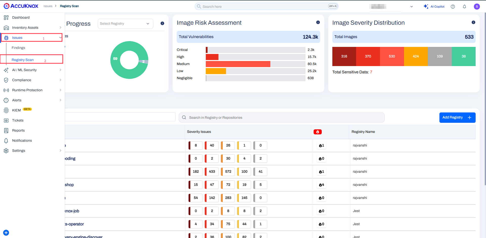

# AWS Code Pipeline - Container Scan

This document contains the process of integrating AccuKnox Container Scanning with AWS CodePipeline. By incorporating AccuKnox scanning into the pipeline, we can identify and resolve these vulnerabilities before deploying the image.

## Prerequisites

Before beginning the integration, ensure you have the following:

* **AWS CodePipeline access** - Administrative access to create and modify pipelines.
    * 📖 *Reference:* [Getting Started with AWS CodePipeline](https://docs.aws.amazon.com/codepipeline/latest/userguide/getting-started-codepipeline.html)
    * 📖 *Reference:* [Create a Pipeline in AWS CodePipeline](https://docs.aws.amazon.com/codepipeline/latest/userguide/pipelines-create.html)

* **AWS CodeBuild access** - Make sure that you have added the `codestar-connections:UseConnection` IAM permission to your service role policy.
    * 📖 *Reference:* [Getting Started with AWS CodeBuild](https://docs.aws.amazon.com/codebuild/latest/userguide/getting-started.html)

* **AccuKnox UI access** - Access to the AccuKnox platform.

* **AWS IAM Configuration** - Proper service role permissions configured.
    * 📖 *Reference:* [Add permissions to your CodeBuild service role policy](https://docs.aws.amazon.com/codepipeline/latest/userguide/troubleshooting.html#codebuild-role-connections)

* **AccuKnox API credentials**, including:
    * Authentication Token
    * Endpoint URL
    * Labels

* **Repository Configuration**:
    * **Full clone enabled** - Ensure AWS CodePipeline is configured to pass metadata that allows CodeBuild actions to perform a full Git clone.
        * 📖 *Reference:* [Enable Full Clone in AWS CodeBuild](https://docs.aws.amazon.com/codepipeline/latest/userguide/tutorials-github-gitclone.html)

## Configuration Steps

### Step 1: Configure AWS CodePipeline Environment Variables

Add the following environment variables to your CodeBuild project or pipeline configuration:

* 📖 *Reference:* [Set Environment Variables in CodeBuild Project](https://docs.aws.amazon.com/codepipeline/latest/userguide/tutorials-pipeline-variables.html)

| Name                | Description                                                                                                                           | Required | Example Value            |
| ------------------- | ------------------------------------------------------------------------------------------------------------------------------------- | -------- | ------------------------ |
| `ACCUKNOX_ENDPOINT` | The URL of the CSPM panel to push the scan results to.                                                                                | Yes      | `cspm.demo.accuknox.com` |
| `ACCUKNOX_TOKEN`    | Token for authenticating with the AccuKnox CSPM panel. Refer to [How to Create Tokens](https://help.accuknox.com/how-to/how-to-create-tokens/). | Yes      | `your_api_token_here`    |
| `ACCUKNOX_LABEL`    | Token for authenticating with the AccuKnox CSPM panel. Refer to [How to Create Tokens](https://help.accuknox.com/how-to/how-to-create-tokens/). | Yes      | `test123`                |

### Step 2: Configure AWS CodeBuild Specification (buildspec.yml)

Create or update your `buildspec.yml` file in your repository root with the following configuration:

```yaml
version: 0.2

env:
  variables:
    SOFT_FAIL: "true"
    IMAGE: "gitlab"
    IMAGE_TAG: "test"
    IMAGE_TAR: "image.tar"

phases:
  pre_build:
    commands:
      - echo "Installing AccuKnox ASPM scanner..."
      - pip install https://github.com/accuknox/aspm-scanner-cli/releases/download/v0.13.4/accuknox_aspm_scanner-0.13.4-py3-none-any.whl --break-system-packages
  build:
    commands:
      - |
        echo "Running AccuKnox container scan"
        docker build -t $IMAGE:$IMAGE_TAG -f Dockerfile .
        docker save -o $IMAGE_TAR $IMAGE:$IMAGE_TAG
        docker load -i $IMAGE_TAR
        if [ "$SOFT_FAIL" = "true" ]; then
          SOFT_FAIL_ARG="--softfail"
        fi
        CMD="image $IMAGE_NAME"
        [ -n "$IMAGE_TAG" ] && CMD="image $IMAGE:$IMAGE_TAG"
        [ -n "$SEVERITY" ] && CMD="$CMD --severity $SEVERITY"
        echo accuknox-aspm-scanner scan $SOFT_FAIL_ARG container --command "$CMD" --container-mode
        accuknox-aspm-scanner scan $SOFT_FAIL_ARG container --command "$CMD" --container-mode

artifacts:
  files:
    - '**/*'
    - $IMAGE_TAR
```

## Workflow Execution Without AccuKnox

**Without security automation:**

* Vulnerable images are unknowingly pushed to production.
* Developers rely on manual checks or periodic scans.
* Security issues are detected late, increasing remediation costs.
* No centralized vulnerability tracking or compliance validation.


## Workflow Execution With AccuKnox

**With AccuKnox integrated:**

* Every push or pull request triggers a vulnerability scan.
* Insecure builds are blocked automatically.
* Findings are centralized in the AccuKnox dashboard.
* Developers are alerted in real-time and can act quickly.
* Continuous compliance with security baselines is maintained.




## Viewing Results in AccuKnox

1.  After the pipeline run, log in to **AccuKnox**.
2.  Navigate to **Issues → RegistryScan**.


3.  Locate your repository and click on the scanned image.
4.  Explore metadata, vulnerability list, and scan history.


### Vulnerabilities Tab

In the `Findings` section, the user can see the image-specific vulnerabilities in a list manner that contains relevant information.

* Displays CVEs and affected packages.
* Includes severity (CRITICAL, HIGH, etc.) and remediation advice.

[Let us know](https://www.accuknox.com/contact-us/) if you are seeking additional guidance in planning your cloud security program.