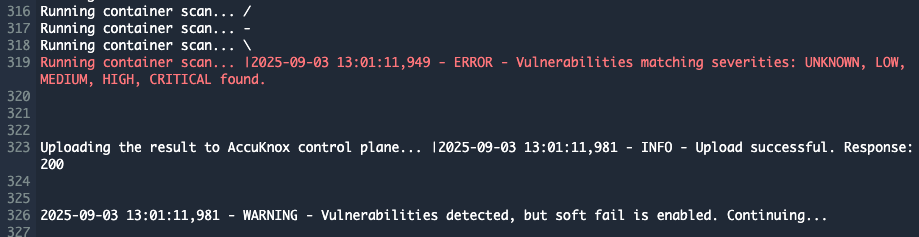
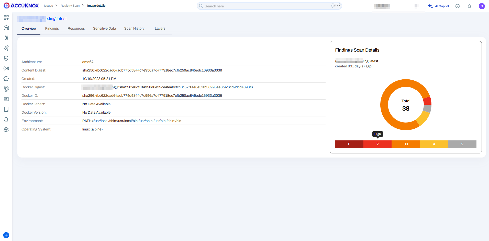

# AWS Code Pipeline - Container Scan

To demonstrate the benefits of integrating AccuKnox into a CI/CD pipeline using AWS Code Pipeline to enhance security, let's consider a specific case involving a container image with known vulnerabilities. By incorporating AccuKnox scanning into the pipeline, we can identify and resolve these vulnerabilities before deploying the image

## Scenario Before Integrating AccuKnox

**Context:** We initially used an outdated base image (`python:3.6-alpine`) with many known security vulnerabilities in the Dockerfile, unintentionally introducing security weaknesses into the Container image.

**Dockerfile Example:**

`FROM python:3.6-alpine # Further configuration and setup of the image`

**Hypothetical Code Build Log - Pre AccuKnox Scan:**

```sh
Building Docker image...
Successfully built d0c92993ff32
Successfully tagged docker.io/***/aws-pipeline:v1
The push refers to repository [docker.io/***/aws-pipeline]
Image pushed successfully.
```

Before using AccuKnox, our container image was sent to the registry without any vulnerability checks. This oversight could allow vulnerable images to be deployed, opening up potential security risks.

## Scenario After Integrating AccuKnox

**Enhancing the AWS Code Build workflow:** We added a step to run the AccuKnox vulnerability scan on the newly built Container image



**Updated AWS Code build Workflow Snippet (Incorporating AccuKnox Scan)**

```sh
version: 0.2
env:
  variables:
    IMAGE_NAME: "rajvanshi/aws-pipeline:v1"
    SCAN_IMAGE_NAME: "accuknox/accuknox-container-scan:latest"
    CSPM_URL: cspm.demo.accuknox.com
    TENANT_ID: "167"
  parameter-store:
    DOCKER_LOGIN_USER: dockerLoginUser
    DOCKER_LOGIN_PASSWORD: dockerLoginPassword
    ACCUKNOX_API_TOKEN: accuknoxApiToken

phases:
  pre_build:
    commands:
      - docker login -u $DOCKER_LOGIN_USER -p $DOCKER_LOGIN_PASSWORD
      - docker pull $SCAN_IMAGE_NAME

  build:
    commands:
      - docker build . -t $IMAGE_NAME

  post_build:
    commands:
      - echo Running AccuKnox Container Scanner...
      - docker run --rm -v /var/run/docker.sock:/var/run/docker.sock $SCAN_IMAGE_NAME image $IMAGE_NAME --format json  >> /tmp/report.json

      - echo Uploading report.json to CSPM endpoint...

      - |
        curl --location --request POST "https://${CSPM_URL}/api/v1/artifact/?tenant_id=${TENANT_ID}&data_type=TR&save_to_s3=false" \
          --header "Tenant-Id: ${TENANT_ID}" \
          --header "Authorization: Bearer $ACCUKNOX_API_TOKEN" \
          --form "file=@/tmp/report.json"
      - ls -l /tmp
      - echo Checking for critical vulnerabilities using grep...
      - |
        if grep -q "CRITICAL" /tmp/report.json; then echo "AccuKnox Scan has halted the deployment because it detected critical vulnerabilities"; exit 1; else exit 0; fi

      - echo Pushing Docker image to Docker Hub...
      - docker push $IMAGE_NAME
```

**AWS Code Build Logs - Post AccuKnox Integration**

```sh
[Container] Running command echo Checking for critical vulnerabilities...
Checking for critical vulnerabilities...
[Container] Running command if grep -q "CRITICAL" /tmp/report.json; then
  echo "AccuKnox Scan has halted the deployment because it detected critical vulnerabilities"
  exit 1
else
  echo "No critical vulnerabilities found. Continuing deployment."
  exit 0
fi
AccuKnox Scan has halted the deployment because it detected critical vulnerabilities
Reason: exit status 1
```

AccuKnox carefully analyzed the image and found critical and high-severity vulnerabilities. Based on these findings, the workflow stopped and prevented the vulnerable image from being deployed.


## Remediation and Rescan

**Fortifying the Dockerfile:** After seeing the vulnerabilities, we updated the Dockerfile to use a newer, more secure base image (python:3.12-alpine3.20) instead, to fix the security issues.

**Dockerfile Post-Update**

`FROM python:3.12-alpine3.20 # Additional image enhancements and setup`

**AWS Code Build Log - After Remediation**

```sh
[Container] Running command curl --location --request POST "https://${CSPM_URL}/api/v1/artifact/?tenant_id=${TENANT_ID}&data_type=TR&save_to_s3=false" \
  --header "Tenant-Id: ${TENANT_ID}" \
  --header "Authorization: Bearer $ACCUKNOX_API_TOKEN" \
  --form "file=@/tmp/report.json"

  % Total    % Received % Xferd  Average Speed   Time    Time     Time  Current
                                 Dload  Upload   Total   Spent    Left  Speed

  0     0    0     0    0     0      0      0 --:--:-- --:--:-- --:--:--     0
100 16093  100    39  100 16054    176  72537 --:--:-- --:--:-- --:--:-- 72819
{"detail":"File received successfully"}
[Container] Running command ls -l /tmp
total 16
drwx------ 2 root root     6 May  2 19:29 2b30d767-d90b-46a4-91fa-05d22a419a47
-rw-r--r-- 1 root root 15839 Jul 25 15:58 report.json
[Container] Running command echo Checking for critical vulnerabilities using grep...
Checking for critical vulnerabilities using grep...
[Container] Running command if grep -q "CRITICAL" /tmp/report.json; then echo "AccuKnox Scan has halted the deployment because it detected critical vulnerabilities"; exit 1; else exit 0; fi
[Container] Running command echo Pushing Docker image to Docker Hub...
Pushing Docker image to Docker Hub...
[Container] Running command docker push $IMAGE_NAME
The push refers to repository [docker.io/***/aws-pipeline]
5f70bf18a086: Preparing
e2f58c88a98f: Preparing
57f27f8c0aef: Preparing
18c03c7b658b: Layer already exists
98fa020064f0: Layer already exists
ecd40abe8681: Layer already exists
5f70bf18a086: Pushed
e2f58c88a98f: Pushed
57f27f8c0aef: Pushed
v2: digest: sha256:60c24e6958cfbc70280d379480e086e5d2450689a52c872945488dee85777a68 size: 1993
[Container] 2024/07/25 15:58:46.622823 Phase complete: POST_BUILD State: SUCCEEDED
[Container] 2024/07/25 15:58:46.622846 Phase context status code:  Message:
[Container] 2024/07/25 15:58:46.667266 Set report auto-discover timeout to 5 seconds
[Container] 2024/07/25 15:58:46.667395 Expanding base directory path:  .
[Container] 2024/07/25 15:58:46.670900 Assembling file list
[Container] 2024/07/25 15:58:46.670917 Expanding .
[Container] 2024/07/25 15:58:46.674504 Expanding file paths for base directory .
[Container] 2024/07/25 15:58:46.674520 Assembling file list
[Container] 2024/07/25 15:58:46.674524 Expanding **/*
[Container] 2024/07/25 15:58:46.678129 No matching auto-discover report paths found
[Container] 2024/07/25 15:58:46.678198 Report auto-discover file discovery took 0.010932 seconds
[Container] 2024/07/25 15:58:46.678221 Phase complete: UPLOAD_ARTIFACTS State: SUCCEEDED
```

After addressing the vulnerabilities, the AccuKnox scan approved the updated image, allowing it to be safely pushed to the registry. This example highlights the importance of including vulnerability scanning in the pipeline. It prevents insecure images from being deployed to production, ensuring that only secure images are allowed.



## AccuKnox Container scan integration with AWS Code Build Pipeline

Pre-requisites:

1. **AWS Console access:** AWS console access to create the workflow

2. **AWS CLI configured:** To interact with AWS via CLI

3. **AWS Code Commit source repositories:** A git repository to store our code, a containerized "python-app" written in Python.

4. **Elastic/Dockerhub Container Registry:** The registry where we will push the images we build.

5. **AWS Parameter Store:** To store the AccuKnox API token, you must grant the Code Build service role permission to access secrets.

## Creating a Code Build workflow for image scanning

We'll follow a basic "image scanning for AWS Code Build" example project:

1. **Build** the container image.

2. Get the **secret token** required to communicate with the AccuKnox Saas Platform.

3. **Scan** the container image using AccuKnox Container Scan.

4. **Push** the container image to a registry.

## Steps needed to be taken for integration

**Step 1:** The user needs to create a `buildspec.yml` file in their AWS code commit repository using the following workflow Template:

```sh
version: 0.2
env:
  variables:
    IMAGE_NAME: "rajvanshi/aws-pipeline:v2"
    SCAN_IMAGE_NAME: "accuknox/accuknox-container-scan:latest"
    CSPM_URL: {accuknox_backend_url}
    TENANT_ID: {accuknox_tenant_id}
  parameter-store:
    DOCKER_LOGIN_USER: dockerLoginUser
    DOCKER_LOGIN_PASSWORD: dockerLoginPassword
    ACCUKNOX_API_TOKEN: accuknoxApiToken

phases:
  pre_build:
    commands:
      - docker login -u $DOCKER_LOGIN_USER -p $DOCKER_LOGIN_PASSWORD
      - docker pull $SCAN_IMAGE_NAME

  build:
    commands:
      - docker build . -t $IMAGE_NAME

  post_build:
    commands:
      - echo Running AccuKnox Container Scanner...
      - docker run --rm -v /var/run/docker.sock:/var/run/docker.sock $SCAN_IMAGE_NAME image $IMAGE_NAME --format json  >> /tmp/report.json

      - echo Uploading report.json to CSPM endpoint...

      - |
        curl --location --request POST "https://${CSPM_URL}/api/v1/artifact/?tenant_id=${TENANT_ID}&data_type=TR&save_to_s3=false" \
          --header "Tenant-Id: ${TENANT_ID}" \
          --header "Authorization: Bearer $ACCUKNOX_API_TOKEN" \
          --form "file=@/tmp/report.json"
      - ls -l /tmp
      - echo Checking for critical vulnerabilities using grep...
      - |
        if grep -q "CRITICAL" /tmp/report.json; then echo "AccuKnox Scan has halted the deployment because it detected critical vulnerabilities"; exit 1; else exit 0; fi

      - echo Pushing Docker image to Docker Hub...
      - docker push $IMAGE_NAME
```

**Note:** In the above template, the user needs to change some variables, including `TENANT_ID, IMAGE_NAME, CSPM_URL(cspm.demo|stage|dev.accuknox.com), and ACCUKNOX_API_TOKEN`Values for these variables can be viewed from the AccuKnox SaaS.

**Step 2:** Now, The user can create build triggers based on cron to trigger the workflow and perform the necessary steps for scanning and posting the results to AccuKnox SaaS.

**Note:** The user can configure the workflow according to their needs, setting it to trigger on events such as scheduled cron or any definite amount of time.

**Step 3:** Once the scan is complete, the user will be able to go into the AccuKnox SaaS and navigate to `Issues -> RegistryScan` where they can find their repository name and select it to see the findings associated with it.


**Step 4:** After clicking on the image name, the user will be able to see the metadata for the image that was built during the workflow execution.


**Step 5:** In the `Vulnerabilities` section, the user can see the image-specific vulnerabilities in a list manner that contains relevant information. These findings will also be available in `Issues -> Findings` section where the user can manage these findings with others as well.


**Step 6:** The `Resources` section contains information about packages and modules that were used to build the code base into a container image.


**Step 7:** The `Sensitive Data` section contains information about any secrets or credentials that might be exposed in the image.


**Step 8:** The user can see the scan history of every scan that happened while pushing any changes to the repo.


## Conclusions

AWS offers a complete ecosystem for CI/CD that includes AWS Code Build, Elastic Container Registry, AWS Code Repository, and AWS Code Deploy. AccuKnox container scanning brings several benefits to the mix:

- Image scanning in a CI/CD pipeline stops vulnerable images from reaching a registry.

- With inline scanning, image contents like proprietary source code or leaked credentials stay in your pipeline. Only the report from the analysis is sent to the image scanner's backend.

- From AccuKnox Saas users can view the vulnerabilities and mitigate the CRITICAL/HIGH vulnerabilities

- Once the issues are fixed users can trigger the scan again and observe the changes in the vulnerabilities to make sure the fixed image gets to the registry

AccuKnox container scanning also integrates seamlessly with most CI/CD pipeline tools, including Jenkins, GitHub, GitLab, Azure DevOps Pipeline, GCP Pipeline, etc.
