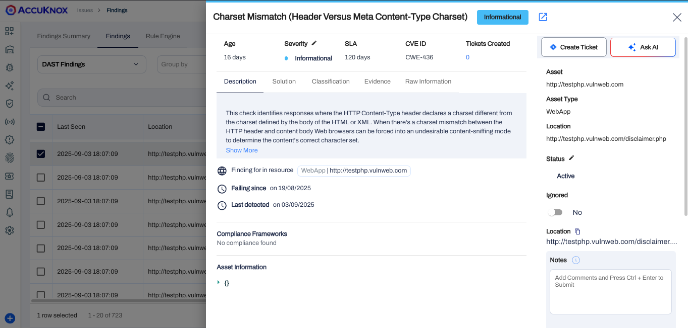

# Integrating AccuKnox DAST with AWS CodePipeline

This document contains the process of integrating AccuKnox DAST with AWS CodePipeline. By integrating AccuKnox DAST into the pipeline, you can identify and resolve security vulnerabilities for your applications.


## Prerequisites

Before beginning the integration, ensure you have the following:

* **AWS CodePipeline access** - Administrative access to create and modify pipelines.
    * 📖 *Reference:* [*Getting Started with AWS CodePipeline*](https://docs.aws.amazon.com/codepipeline/latest/userguide/getting-started-codepipeline.html)
    * 📖 *Reference:* [*Create a Pipeline in AWS CodePipeline*](https://docs.aws.amazon.com/codepipeline/latest/userguide/pipelines-create.html)

* **AWS CodeBuild access** - Make sure that you have added the `codestar-connections:UseConnection` IAM permission to your service role policy.
    * 📖 *Reference:* [*Getting Started with AWS CodeBuild*](https://docs.aws.amazon.com/codebuild/latest/userguide/getting-started.html)

* **AccuKnox UI access** - Access to the AccuKnox platform.

* **AWS IAM Configuration** - Proper service role permissions configured.
    * 📖 *Reference:* [Add permissions to your CodeBuild service role policy](https://docs.aws.amazon.com/codepipeline/latest/userguide/troubleshooting.html#codebuild-role-connections)

* **AccuKnox API credentials** including:
    * Authentication Token
    * Endpoint URL
    * Labels

* **Repository Configuration**
    * **Full clone enabled** - Ensure AWS CodePipeline is configured to pass metadata that allows CodeBuild actions to perform a full Git clone.
        * 📖 *Reference:* [*Enable Full Clone in AWS CodeBuild*](https://docs.aws.amazon.com/codepipeline/latest/userguide/tutorials-github-gitclone.html)

## Configuration Steps

### Step 1: Configure AWS CodePipeline Environment Variables

Add the following environment variables to your CodeBuild project or pipeline configuration.

* 📖 *Reference:* [*Set Environment Variables in CodeBuild Project*](https://docs.aws.amazon.com/codepipeline/latest/userguide/tutorials-pipeline-variables.html)

| Name                | Description                                                                                                      | Required | Example Value              |
| ------------------- | ---------------------------------------------------------------------------------------------------------------- | -------- | -------------------------- |
| `ACCUKNOX_ENDPOINT` | The URL of the CSPM panel to push the scan results to.                                                           | Yes      | `cspm.demo.accuknox.com`   |
| `ACCUKNOX_TOKEN`    | Token for authenticating with the AccuKnox CSPM panel. Refer to [How to Create Tokens](https://help.accuknox.com/how-to/how-to-create-tokens/). | Yes      | `your_api_token_here`      |
| `ACCUKNOX_LABEL`    | Labels to associate with the scan results in the AccuKnox platform.                                              | Yes      | `test123`                  |

### Step 2: Configure AWS CodeBuild Specification (buildspec.yml)

Create or update your `buildspec.yml` file in your repository root with the following configuration:

```yaml
version: 0.2

env:
  variables:
    SOFT_FAIL: "true"
    TARGET_URL: "[https://juice-shop.herokuapp.com/](https://juice-shop.herokuapp.com/)"
    DAST_SCAN_SCRIPT: "zap-baseline.py"

phases:
  pre_build:
    commands:
      - echo "Installing AccuKnox ASPM scanner..."
      - pip install https://github.com/accuknox/aspm-scanner-cli/releases/download/v0.13.4/accuknox_aspm_scanner-0.13.4-py3-none-any.whl --break-system-packages

  build:
    commands:
      - |
        echo "Running AccuKnox DAST scan"
        mkdir /tmp/scan-dir
        chmod 777 /tmp/scan-dir
        cd /tmp/scan-dir

        if [ "$SOFT_FAIL" = "true" ]; then
          SOFT_FAIL_ARG="--softfail"
        fi

        ARGS="$DAST_SCAN_SCRIPT -t $TARGET_URL -I "

        echo accuknox-aspm-scanner scan $SOFT_FAIL_ARG dast --command "$ARGS" --container-mode
        accuknox-aspm-scanner scan $SOFT_FAIL_ARG dast --command "$ARGS" --container-mode
        cd -
```

## Workflow Execution Without AccuKnox

Initially, the pipeline scans the application for vulnerabilities but does not forward results to AccuKnox, requiring manual review.


## Workflow Execution With AccuKnox

With AccuKnox integrated, scan results are automatically sent to AccuKnox for further risk assessment and remediation.

## Viewing Results in AccuKnox

1.  After the pipeline run, log in to **AccuKnox**.
2.  To see all of your DAST findings, navigate to `AccuKnox > Issues > Findings` and select `DAST Findings`.


3.  Click on any finding to get more details. You can also click on the **Create Ticket** button to create a ticket.


[Let us know](https://www.accuknox.com/contact-us/) if you are seeking additional guidance in planning your cloud security program.