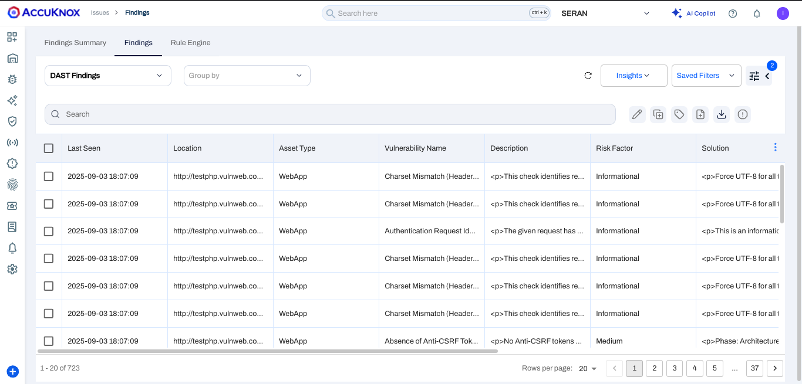

# AWS Code Pipeline - DAST

This document contains the process of integrating AccuKnox DAST with AWS codepipeline. By integrating AccuKnox DAST into the pipeline, you can identify and resolve security vulnerabilities for your applications.

## Prerequisites

- AWS Code pipeline access

- AccuKnox UI access

### **Step 1: Create the AccuKnox Token**

The first step is to generate an AccuKnox token. For generating the AccuKnox token, open up the AccuKnox, Go to Settings > Tokens then click on the create button.


Give your token a name and click on the Generate button.



 Once you have generated the the token, click on the copy button and take a note of it. It will be required to configured as a secret in the pipeline. Also copy the Tenant Id and take a note of it.


Copy this token, go to AWS secrets manager and create a secret with key `AK_TOKEN` and paste the value. Create another secret with the key `TENANT_ID`, and paste it's value.


### **Step 2: Create a label**

In AccuKnox, labels are used for grouping similar types of assets together. For creating a label navigate to Settings > Labels and click on the create label button. Give your label a name and a filename prefix. Take a note of the label and click on the save button.


### **Step 3: Create the pipeline**

Add this content to your buildspec file. Configure the variables `CSPM_URL`, `TARGET_URL`, `TENANT_ID` and `LABEL`.

```yaml
version: 0.2
env:
  variables:
    CSPM_URL: cspm.demo.accuknox.com
    TENANT_ID: "167"
    TARGET_URL: http://testhtml5.vulnweb.com
    REPO_URL: https://github.com/th3-v3ng34nc3/Aditya-ak-DAST
    LABEL: "awsdast"

  secrets-manager:
    AK_TOKEN: "AK_TOKEN:AK_TOKEN"

phases:
  pre_build:
    commands:
      - mkdir app
      - echo Cloning repository...
      - git clone --single-branch --branch main ${REPO_URL} app
      - chmod -R 777 app

  build:
    commands:
      # Run OWASP ZAP scan using Docker
      - docker run --rm -v $(pwd)/app:/zap/wrk -w /zap/wrk ghcr.io/zaproxy/zaproxy:stable zap-baseline.py -t "$TARGET_URL" -r scanreport.html -x scanreport.xml -J scanreport.json -I

  post_build:
    commands:
      - ls -al app
      # Print out the results
      - echo "Scan completed. Check the scanreport.json file for results."

      # Post the scan report using curl
      - |
        curl --location --request POST "https://cspm.demo.accuknox.com/api/v1/artifact/?tenant_id=$TENANT_ID&label_id=$LABEL&data_type=ZAP&save_to_s3=true" \
          --header "Tenant-Id: $TENANT_ID" \
          --header "Authorization: Bearer $AK_TOKEN" \
          --form  "file=@\"app/scanreport.json\""

artifacts:
  files:
    - app/scanreport.json

cache:
  paths:
    - "/root/.m2/**/*"
    - "/root/.npm/**/*"
```

Once you have added the above buildspec file and pushed it to repository, it will trigger the CI/CD pipeline. And you will see a screen like this.


### **Step 4: View the findings**

To see all of your DAST findings, navigate to AccuKnox > Issues > Findings and select the DAST Findings


Click on any finding to get more details. You can also click on the Create Ticket button to create a ticket.


