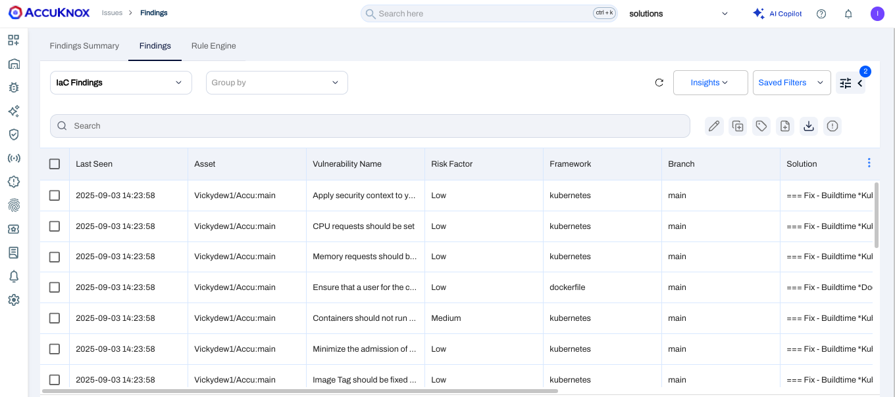

# AWS Code Pipeline - IaC Scan

This document explains how to integrate **AccuKnox IaC Scan** with **AWS CodePipeline**. By integrating AccuKnox IaC Scan into the pipeline, you can identify and resolve security vulnerabilities for your applications.

## Prerequisites

Before beginning the integration, ensure you have the following:

- **AWS CodePipeline access** – Administrative access to create and modify pipelines.
!!! note "Reference"
    - [Getting Started with AWS CodePipeline](https://docs.aws.amazon.com/codepipeline/latest/userguide/getting-started-codepipeline.html)
    - [Create a Pipeline in AWS CodePipeline](https://docs.aws.amazon.com/codepipeline/latest/userguide/pipelines-create.html)

- **AWS CodeBuild access** – Ensure that you have added the `codestar-connections:UseConnection` IAM permission to your service role policy.
!!! note "Reference"
    - [Getting Started with AWS CodeBuild](https://docs.aws.amazon.com/codebuild/latest/userguide/getting-started.html)

- **AccuKnox UI access** – Access to the AccuKnox platform.

- **AWS IAM Configuration** – Proper service role permissions configured.
!!! note "Reference"
    - [Add permissions to your CodeBuild service role policy](https://docs.aws.amazon.com/codepipeline/latest/userguide/troubleshooting.html#codebuild-role-connections)

- **AccuKnox API credentials** including Authentication Token, Endpoint URL, Labels

- **Repository Configuration**
  - **Full clone enabled** – Ensure AWS CodePipeline is configured to pass metadata that allows CodeBuild actions to perform a full Git clone.
!!! note "Reference"
    - [Enable Full Clone in AWS CodeBuild](https://docs.aws.amazon.com/codepipeline/latest/userguide/tutorials-github-gitclone.html)

## Configuration Steps

### Step 1: Configure AWS CodePipeline Environment Variables

Add the following environment variables to your CodeBuild project or pipeline configuration:

!!! note "Reference"
    - [Set Environment Variables in CodeBuild Project](https://docs.aws.amazon.com/codepipeline/latest/userguide/tutorials-pipeline-variables.html)

| Name                | Description                                                                                                                   | Required | Example Value            |
| ------------------- | ----------------------------------------------------------------------------------------------------------------------------- | -------- | ------------------------ |
| `ACCUKNOX_ENDPOINT` | The URL of the CSPM panel to push the scan results to.                                                                        | Yes      | `cspm.demo.accuknox.com` |
| `ACCUKNOX_TOKEN`    | Token for authenticating with the AccuKnox CSPM panel. Refer to [How to Create Tokens](https://help.accuknox.com/how-to/how-to-create-tokens/). | Yes      | `your_api_token_here`    |
| `ACCUKNOX_LABEL`    | Label used to categorize and organize scan results.                                                                           | Yes      | `test123`                |

### Step 2: Configure AWS CodeBuild Specification (`buildspec.yml`)

Create or update your `buildspec.yml` file in your repository root with the following configuration:

```yaml
version: 0.2

env:
  variables:
    SOFT_FAIL: "true"
    DIRECTORY: "."
    COMPACT: "true"
    QUIET: "true"

phases:
  pre_build:
    commands:
      - echo "Installing AccuKnox ASPM scanner..."
      - pip install https://github.com/accuknox/aspm-scanner-cli/releases/download/v0.13.4/accuknox_aspm_scanner-0.13.4-py3-none-any.whl --break-system-packages

  build:
    commands: |
      echo "Running AccuKnox IaC scan"
      if [ "$SOFT_FAIL" = "true" ]; then
        SOFT_FAIL_ARG="--softfail"
      fi

      CMD_ARGS=""
      [ -n "$FILE" ] && CMD_ARGS="$CMD_ARGS --file $FILE"
      [ -n "$DIRECTORY" ] && CMD_ARGS="$CMD_ARGS --directory $DIRECTORY"
      [ "$COMPACT" = "true" ] && CMD_ARGS="$CMD_ARGS --compact"
      [ "$QUIET" = "true" ] && CMD_ARGS="$CMD_ARGS --quiet"
      [ -n "$FRAMEWORK" ] && CMD_ARGS="$CMD_ARGS --framework $FRAMEWORK"

      echo accuknox-aspm-scanner scan $SOFT_FAIL_ARG iac --command "$CMD_ARGS" --container-mode
      accuknox-aspm-scanner scan $SOFT_FAIL_ARG iac --command "$CMD_ARGS" --container-mode
```

## Workflow Execution With AccuKnox

Once integrated, scan results are automatically sent to **AccuKnox** for risk assessment and remediation.

## Viewing Results in AccuKnox

1. After the pipeline run, log in to **AccuKnox**.
2. Navigate to **AccuKnox → Issues → Findings**, and select **IaC Findings**.


3. Click any finding to view more details.


4. Use the **Create Ticket** button to raise a ticket directly from the finding.

[Let us know](https://www.accuknox.com/contact-us/) if you need additional guidance in planning your cloud security program.