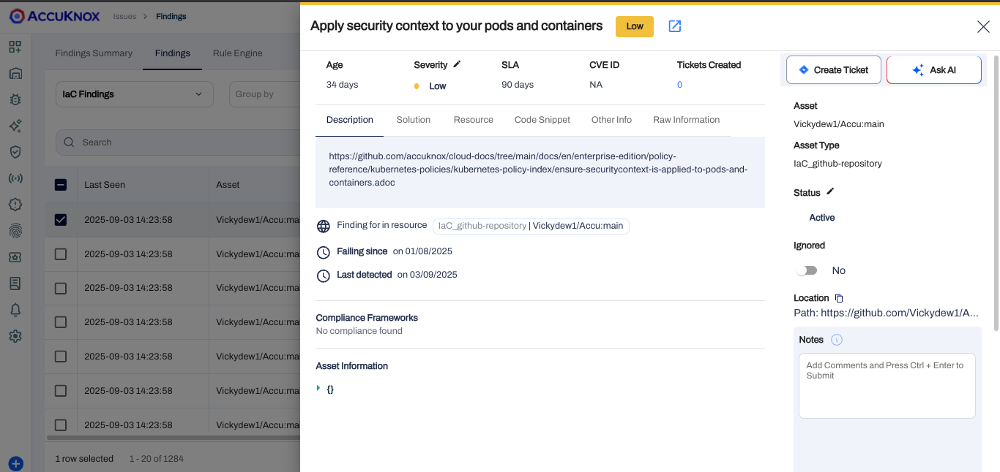

# AWS IaC Scanning

## Prerequisites

- AWS Code pipeline access

- AccuKnox UI access

## Step 1: Create the AccuKnox Token

The first step is to generate an AccuKnox token. Open AccuKnox, Go to Settings > Tokens and click on the Create button.


Give your token a name and click on the Generate button.



 Once you have generated the token, click on the copy button and take note of it. It will be required to be configured as a secret in the pipeline. Also, copy the Tenant ID and take note of it.


Copy this token, go to AWS secrets manager create a secret with key `AK_TOKEN,` and paste the value. Create another secret with the key `TENANT_ID`, and paste its value.


## Step 2: Create a label

In AccuKnox, labels are used to group similar types of assets together. To create a label, navigate to Settings > Labels and click on the Create Label button. Give your label a name and a filename prefix. Note the label and click on the save button.


## Step 3: Create the pipeline

Add this content to your buildspec file. Configure the variables `CSPM_URL`, `TARGET_URL`, `TENANT_ID` and `LABEL`.

```yaml
version: 0.2

env:
  variables:
    shell: bash
    CSPM_URL: cspm.demo.accuknox.com
    TENANT_ID: "167"
    LABEL: "AWSIAC"
    REPOSITORY: 'https://github.com/th3-v3ng34nc3/terragoat-iac'
    BRANCH: 'Main'

  secrets-manager:
    AK_TOKEN: "AK_TOKEN:AK_TOKEN"

phases:
  install:
    runtime-versions:
      python: 3.8
    commands:
      - echo Clonning the repo
      - git clone https://github.com/th3-v3ng34nc3/terragoat-iac.git /tmp/AccuKnox_Iac

  pre_build:
    commands:
      - echo Installing Checkov...
      - pip install checkov
      - echo Starting Checkov scan...

  build:
    commands:

      - echo Running Checkov...
      - checkov -d /tmp/AccuKnox_Iac --output json > /tmp/checkov_report.json || true

  post_build:
    commands:
      - echo Checkov scan complete.
      - echo Manipulating JSON report...
      - |
        if [ -z "${REPOSITORY}" ] || [ -z "${BRANCH}" ]; then
          echo "Error: REPOSITORY and BRANCH environment variables must be set"
          exit 1
        fi

        # Read the Checkov report into a JSON array if it isn't already in one
        if jq -e . /tmp/checkov_report.json > /dev/null 2>&1; then
          echo "File is valid JSON"
        else
          echo "[" > /tmp/results.json
          cat /tmp/checkov_report.json >> /tmp/results.json
          echo "]" >> /tmp/results.json
          mv /tmp/results.json /tmp/checkov_report.json
        fi

        # Add repo and branch details
        jq --arg repoLink "${REPOSITORY}" --arg branch "${BRANCH}" \
          '. += [{"details": {"repo": $repoLink, "branch": $branch}}]' \
          /tmp/checkov_report.json > /tmp/results.json && \
        mv /tmp/results.json /tmp/checkov_report.json

      - cat /tmp/checkov_report.json
      - echo Uploading report.json to CSPM endpoint...
      - |
        curl --location --request POST "https://${CSPM_URL}/api/v1/artifact/?tenant_id=${TENANT_ID}&label_id=$LABEL&data_type=IAC&save_to_s3=true" \
          --header "Tenant-Id: $TENANT_ID" \
          --header "Authorization: Bearer $AK_TOKEN" \
          --form "file=@/tmp/checkov_report.json"

artifacts:
  files:
    - checkov_report.json
  discard-paths: yes

cache:
  paths:
    - /root/.cache/pip/**/*
```

Once you have added the above buildspec file and pushed it to the repository, it will trigger the CI/CD pipeline. And you will see a screen like this.


## Step 4: View the findings

To see all of your IaC Scan findings, navigate to AccuKnox > Issues > Findings and select the IaC Findings


Click on any finding to get more details. You can also click on the Create Ticket button to create a ticket.


