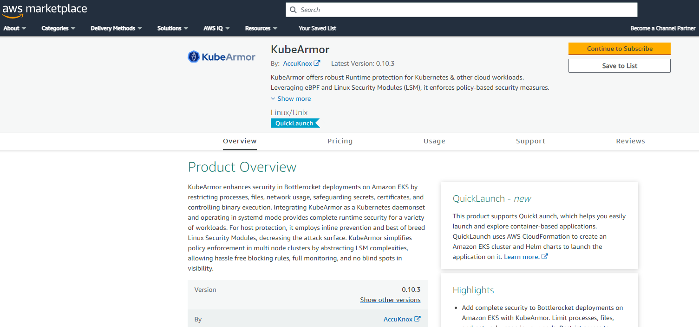

**Step 1:** Get KubeArmor’s latest version from AWS Marketplace

<a href="https://aws.amazon.com/marketplace/pp/prodview-5npox4ixz64qk#pdp-pricing" target="_blank">AWS KubeArmor Market place Subscription</a>



[**Note:** Since KubeArmor is Open Source software pricing is $0]


[**Note:** By Clicking  Accept Terms you are Accepting the  End User License Agreement(EULA)]

Download EULA from: <a href="images/aws-kubearmor-eula.pdf" target="_blank">End User License Agreement</a>

**Step 2:** Configure Software > Select fulfillment option “Helm chart” and continue


**Step 3:** Set Launch target to “Amazon Managed Kubernetes”


**Step 4:** Select launch options

1. If you have an EKS cluster ready, > Select "Launch on Existing Cluster" .
2. If you do not have an EKS cluster > Create an EKS cluster by following these steps: <a href="https://docs.aws.amazon.com/eks/latest/userguide/create-cluster.html" target="_blank">AWS User Guide to Create a Cluster</a>


**Step 5:** Access the EKS using any CLI (Powershell, EC2, Putty, etc.)

If kubectl does not exist, install it following the given link:
<a href="https://docs.aws.amazon.com/eks/latest/userguide/install-kubectl.html" target="_blank">AWS User Guide to Install kubectl</a>

**Step 6:** Login to the EKS Cluster using the below command

```sh
aws eks --region <regionname> update-kubeconfig --name <cluster-name>
```

Example:

```sh
[root@ip-172-31-15-181 ~]# aws eks --region us-east-2 update-kubeconfig --name revalidation-kA-MP
Added new context arn:aws:eks:us-east-2:172721035794:cluster/revalidation-kA-MP to /root/.kube/config
```

**Step 7:** Create the required Service Account and Namespace

Copy the command in Step 1 from the instruction and replace it with the RoleARN with EKSClusterRole that already exists. Also specify a namespace name and service account name as required.


```sh
kubectl create namespace <ENTER_NAMESPACE_HERE>

eksctl create iamserviceaccount \
    --name <ENTER_SERVICE_ACCOUNT_NAME_HERE> \
    --namespace <ENTER_NAMESPACE_HERE> \
    --cluster <ENTER_YOUR_CLUSTER_NAME_HERE> \
    --attach-role-arn <ENTER_ROLE_ARN_HERE> \
    --approve \
    --override-existing-serviceaccounts
```

Example:

```sh
[root@ip-172-31-15-181 ~]# kubectl create namespace ns1re1

eksctl create iamserviceaccount \
    --name iamserviceaccountre123 \
    --namespace ns1re1 \
    --cluster revalidation-kA-MP \
    --attach-role-arn arn:aws:iam::172721035794:role/eksrole \
    --approve \
    --override-existing-serviceaccounts
namespace/ns1re1 created
2023-08-02 05:20:58 [ℹ]  1 iamserviceaccount (ns1re1/iamserviceaccountre123) was included (based on the include/exclude rules)
2023-08-02 05:20:58 [!]  metadata of serviceaccounts that exist in Kubernetes will be updated, as --override-existing-serviceaccounts was set
2023-08-02 05:20:58 [ℹ]  1 task: { create serviceaccount "ns1re1/iamserviceaccountre123" }
2023-08-02 05:20:58 [ℹ]  created serviceaccount "ns1re1/iamserviceaccountre123"
[root@ip-172-31-15-181 ~]#
```

**Step 8:** Install KubeArmor via Helm Chart

**Step 8.1:** Helm is required to be installed on local system

Follow this link to install Helm if not installed: <a href="https://docs.aws.amazon.com/eks/latest/userguide/helm.html" target="_blank">AWS User Guide to Install Helm</a>

**Step 8.2:** Install kubearmor via Helm Chart

Copy and run the command shown in Step 2 of the instructions. [Note: Remember to replace the namespace with the correct namespace as specified in the command of Step 1]


```sh
export HELM_EXPERIMENTAL_OCI=1

aws ecr get-login-password \
    --region us-east-1 | helm registry login \
    --username AWS \
    --password-stdin 709825985650.dkr.ecr.us-east-1.amazonaws.com

mkdir awsmp-chart && cd awsmp-chart

helm pull oci://709825985650.dkr.ecr.us-east-1.amazonaws.com/accuknox/kubearmor --version 0.10.3

tar xf $(pwd)/* && find $(pwd) -maxdepth 1 -type f -delete

helm install kubearmor \
    --namespace <ENTER_NAMESPACE_HERE> ./*
```

Example:

```sh
[root@ip-172-31-15-181 awsmp-chart]# export HELM_EXPERIMENTAL_OCI=1

aws ecr get-login-password \
    --region us-east-1 | helm registry login \
    --username AWS \
    --password-stdin 709825985650.dkr.ecr.us-east-1.amazonaws.com

mkdir awsmp-chart && cd awsmp-chart

helm pull oci://709825985650.dkr.ecr.us-east-1.amazonaws.com/accuknox/kubearmor --version 0.10.3

tar xf $(pwd)/* && find $(pwd) -maxdepth 1 -type f -delete

helm install kubearmor \
    --namespace ns1re1 ./*
Login Succeeded
Pulled: 709825985650.dkr.ecr.us-east-1.amazonaws.com/accuknox/kubearmor:0.10.3
Digest: sha256:3aab82a89f1302f7a8b91e2c138806593d5c4e4e8695a19204c388d3ce2e87b7
NAME: kubearmor
LAST DEPLOYED: Wed Aug  2 05:27:10 2023
NAMESPACE: ns1re1
STATUS: deployed
REVISION: 1
TEST SUITE: None
```

**Step 8.3:** Check if KubeArmor has been deployed and running using the following command:

```sh
kubectl get ns
kubectl get pods <ENTER_NAMESPACE_HERE>
```

Example:

```sh
[root@ip-172-31-15-181 awsmp-chart]# kubectl get ns
NAME              STATUS   AGE
default           Active   20h
kube-node-lease   Active   20h
kube-public       Active   20h
kube-system       Active   20h
ns1re             Active   17m
ns1re1            Active   11m
[root@ip-172-31-15-181 awsmp-chart]# kubectl get pods -n ns1re1
NAME                                    READY   STATUS    RESTARTS   AGE
kubearmor-controller-6dbbb8b69f-8w6jz   2/2     Running   0          5m6s
kubearmor-f88ss                         1/1     Running   0          5m6s
kubearmor-relay-5df7df7678-tk2xz        1/1     Running   0          5m6s
kubearmor-xwdxd                         1/1     Running   0          5m6s
```

**Step 9:** Install Karmor CLI to be able to interact with KubeArmor

Use the following command:
```sh
curl -sfL http://get.kubearmor.io/ | sudo sh -s -- -b /usr/local/bin
```

**Step 10:** Follow the steps in the link below to execute a Sample use-case

[KubeArmor Demo Scenario Use Cases](https://help.accuknox.com/getting-started/open-source/#3-demo-scenario-use-cases)

KubeArmor is an open-source sandbox project of AccuKnox which was donated to <a href="https://www.cncf.io/projects/kubearmor/" target="_blank">CNCF-Cloud Native Computing Foundation</a>
To contribute to the project, access the <a href="https://github.com/kubearmor/KubeArmor" target="_blank">Github page</a>. Learn more about KubeArmor <a href="https://kubearmor.io/" target="_blank">here</a>

- - -
[SCHEDULE DEMO](https://www.accuknox.com/contact-us){ .md-button .md-button--primary }