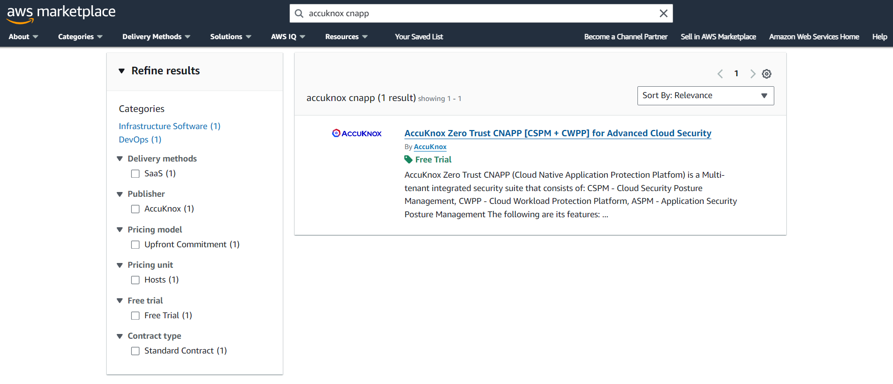
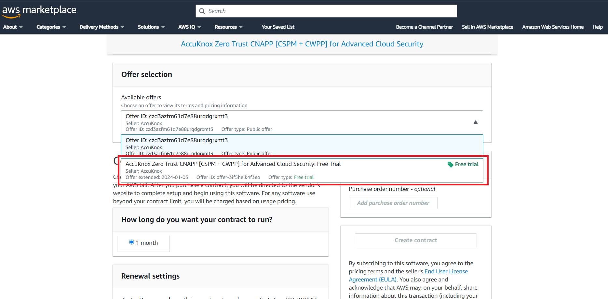
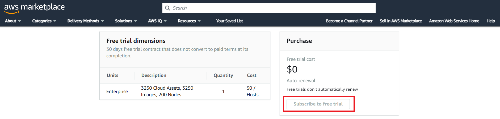
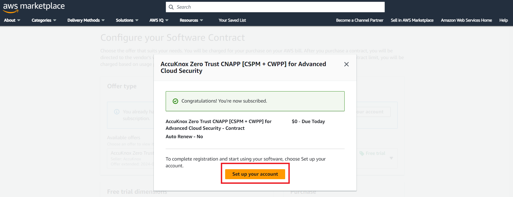
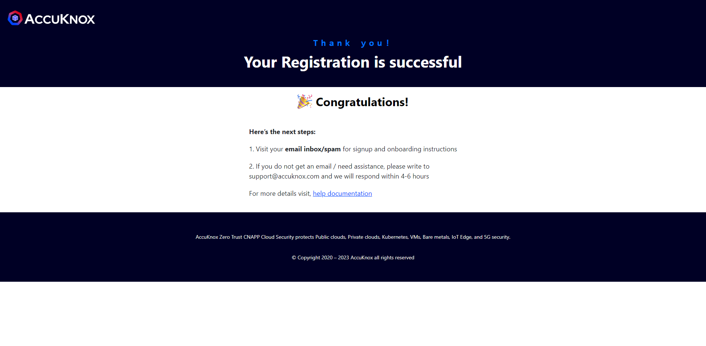
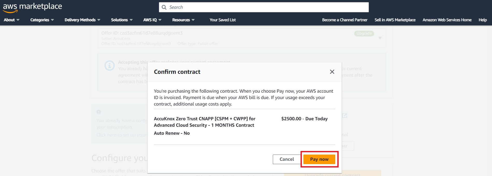

# AWS Marketplace - User Playbook

This document illustrates the process of subscribing to AccuKnox via AWS Marketplace, encompassing the necessary actions within the marketplace, the subscription and access workflow, the post-registration access acquisition, and the subsequent steps following access attainment.

## Steps for Users on AWS Marketplace

The following steps cater to users who:

1. Desire to get a free trial from the marketplace.

2. Desire to subscribe to existing public offers available in the marketplace.

3. Need a private offer tailored to specific dimensions.

4. Seek a recurring plan for public offers.

## Case 1:  Trying AccuKnox CNAPP with Free Trial

**Step 1:** The user initiates the process by searching for AccuKnox CNAPP on the marketplace

**Step 2:** After reviewing our offerings, the user proceeds to locate the **Try for free** option.

**Step 3:** Within this section, they can choose one of the two available offers - Choose the Free trial

**Step 4:** The free trial lasts for 30 days and cannot be renewed. Click on **Subscribe to Free Trial**

**Step 5:** Once the contract is confirmed as completed, the user will receive a prompt to **Set Up Your Account** for SaaS access.

!!! info "NOTE"
    **If they desire a custom solution beyond the provided offers, they have the option to contact AccuKnox support to discuss alternative possibilities. Contact: <support@accuknox.com>**

**Step 6:** Clicking this button redirects the user to a registration page, where they provide their information, including their name, phone number, organization name, and email address.

**Step 7:** This information is forwarded to AccuKnox Support, and after verification by our support team, a confirmation email is sent.

**Step 8:** At this juncture, we strongly recommend scheduling a DEMO with AccuKnox to assist the customer with the onboarding steps and gain a deeper understanding of our features.

**Step 9:** Shortly after configuring a tenant for the customer, we will send them an invitation to access the SaaS platform and leverage its security features.

!!! info "NOTE"
    **The free trial subscription on the marketplace is only available to the user for a month. After one month, we will be revoking all access of the user to our Saas Platform. Hence, Before the end of the monthly subscription, we will notify the user. If user still wants to continue using the platform they can refer to case 3 & case 4.**

## Case 2: Purchasing AccuKnox Subscription on AWS

**Step 1:** The user initiates the process by searching for AccuKnox CNAPP on the marketplace

**Step 2:** After reviewing our offerings, the user proceeds to locate the **View purchase options** button.

**Step 3:** Within this section, they can choose one of the two available offers - Choose the Public Offer

**Step 4:** Select one of the Contract options based on the Assets usage(Refer [How to count my Assets](../resources/count-assets.md)). The contract period is one month and the user can optionally select the auto-renew option.

**Note:** If they desire a custom solution beyond the provided offers, they have the option to contact AccuKnox support to discuss alternative possibilities. Contact: <support@accuknox.com>

**Step 5:** Upon selecting an offer, they will be prompted to accept the contract, which triggers the payment process and the amount is automatically billed to their AWS account.

**Step 6:** Once the contract is confirmed as completed, the user will receive a prompt to **Set Up Your Account** for SaaS access.

**Follow Steps 6 to 9 from [Case 1](#repeat-steps) complete the registration process and gain access to the SaaS platform.**

!!! info "NOTE"
    **The subscription is based on usage and you can upgrade your contract when usage increases. The contract is valid for a month and needs to be renewed after the one month period. The user can set up auto renew to automate the renewal process and continue using the platform.**

## Case 3: Custom Subscription Purchase after Demo

To proceed in this process, the customer should have a good understanding of the platform since these initial steps should have already been completed:

- Introduction to AccuKnox CNAPP
- Live Platform Demo, Covering Various Use Cases
- Proof of Concept (POC) Conducted in Their Environment

**Step 1:** Following discussions about licensing and pricing, we can tailor a private offer specifically for the organization to meet their requirements.

**Step 2:** This private offer will be associated with a particular AWS account, so the organization must provide their AWS account number.

**Step 3:** After creating and obtaining approval from AWS for the private offer, it will be listed on the marketplace for the provided AWS account.

**Step 4:** The customer should then log in to that AWS account, search for AccuKnox CNAPP on the marketplace, and locate the private offer to initiate the contract signing.

**Step 5:** Once the contract is confirmed and completed, the user will be prompted to **Set Up Your Account** for SaaS access.

**Follow Steps 6 to 9 from [Case 1](#repeat-steps) complete the registration process and gain access to the SaaS platform.**

## Case 4: Continuing from Trial to Full Subscription

The Trial Offer listed on the MarketPlace is one time and available to a user only for a single month. This offer is meant for trial purposes only.

**Option 1:** If the user wants to continue using the product they can contact the support team and we will create a Private Offer that adheres to our policies and works best for you.

After the Private Offer is created, User can refer to **Case 3** to see the next steps.

**Option 2:** The user also has the option to select one of the public offers available from the marketplace to continue the subscription.

If the user is satisfied with the Public Offers, they can refer to **Case 2** for the next steps.

## Next Steps Post-Subscription

Upon confirmation of the contract and subscription, AccuKnox Support will contact the customer via the email address provided during registration to acknowledge their subscription.

Following this, the AccuKnox team will proceed to provision a dedicated tenant and subsequently share the access credentials with the customer. This access will include a username and a temporary password for accessing the <a href="https://app.accuknox.com" target="_blank">AccuKnox SaaS platform</a>. Upon initial login, users will be prompted to configure multi-factor authentication (MFA) for enhanced security.

Once MFA setup is complete, users can refer to the provided <a href="https://docs.google.com/presentation/d/1U_VIYkG4jKkNb8ekADqrtuA9bndIFW2rXYAlOb5P0ac/edit#slide=id.g27ec8db4c89_1_0" target="_blank">playbook</a> for onboarding, enabling them to fully leverage all the features of the SaaS platform.

- - -
[SCHEDULE DEMO](https://www.accuknox.com/contact-us){ .md-button .md-button--primary }
